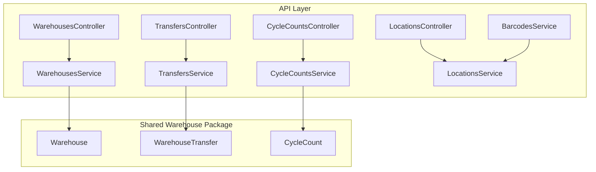
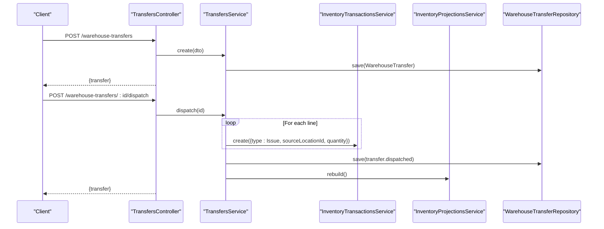
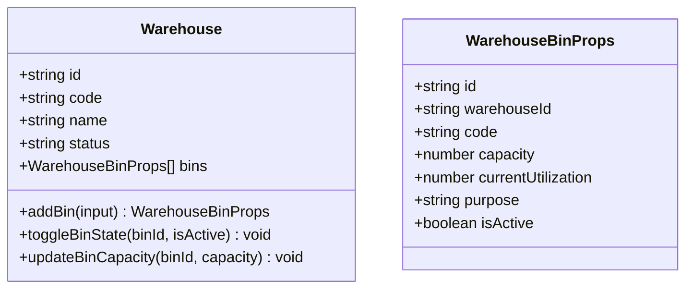
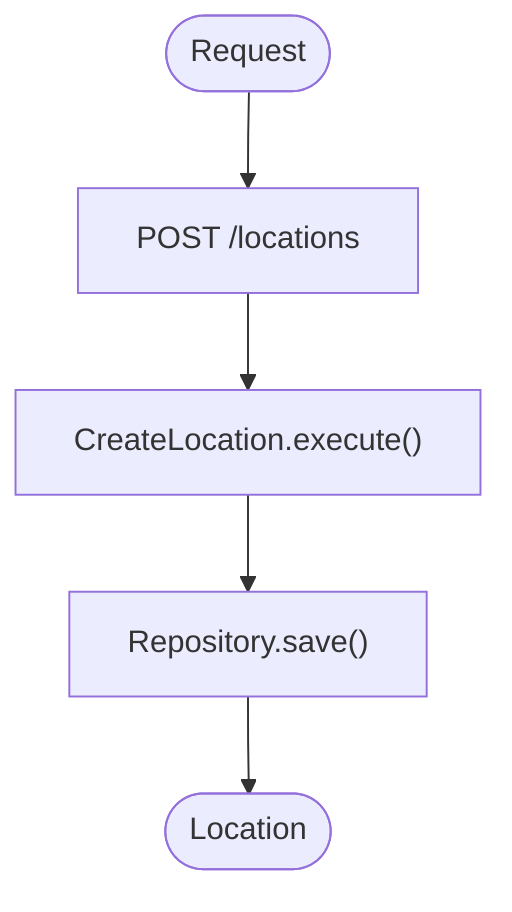
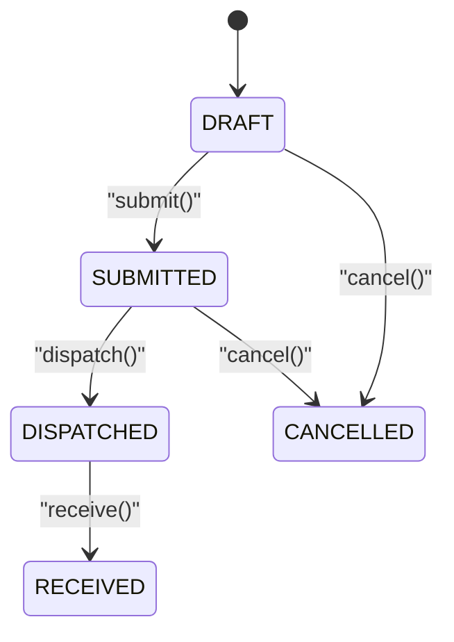
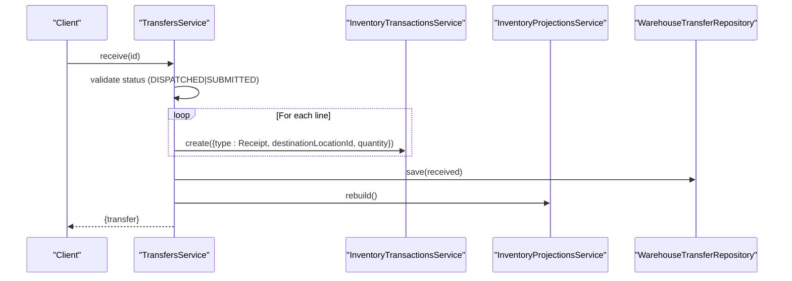
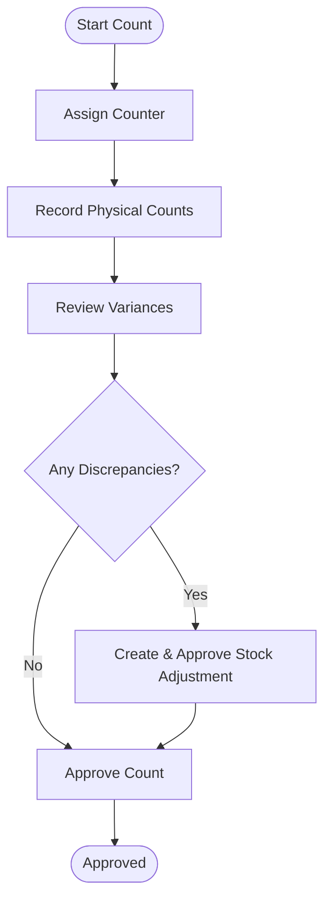
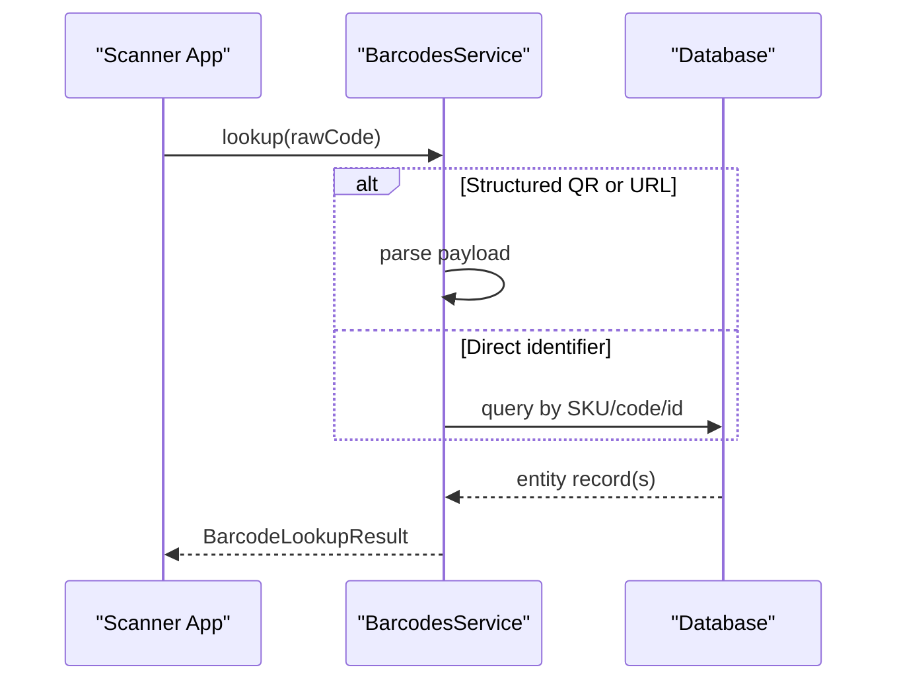
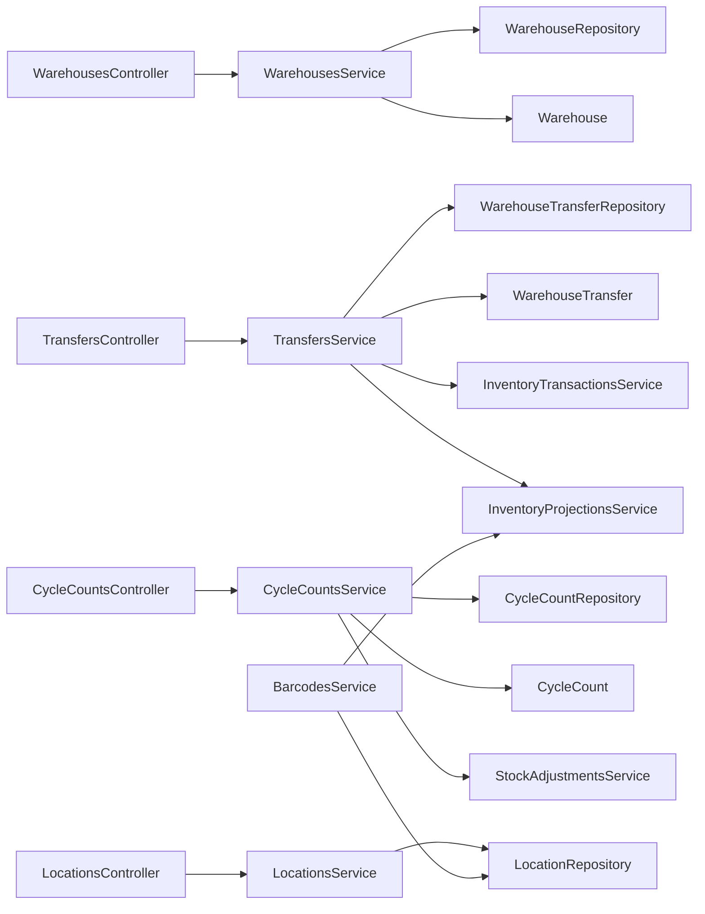

# Warehouse Domain

<cite>
**Referenced Files in This Document**
- [warehouse.ts](file://packages/warehouse/src/warehouses/warehouse.ts)
- [warehouse-transfer.ts](file://packages/warehouse/src/transfers/warehouse-transfer.ts)
- [cycle-count.ts](file://packages/warehouse/src/cycle-counts/cycle-count.ts)
- [index.ts](file://packages/warehouse/src/index.ts)
- [warehouses.controller.ts](file://apps/api/src/warehouses/warehouses.controller.ts)
- [warehouses.service.ts](file://apps/api/src/warehouses/warehouses.service.ts)
- [locations.controller.ts](file://apps/api/src/locations/locations.controller.ts)
- [locations.service.ts](file://apps/api/src/locations/locations.service.ts)
- [warehouse-transfers.controller.ts](file://apps/api/src/warehouse-transfers/warehouse-transfers.controller.ts)
- [warehouse-transfers.service.ts](file://apps/api/src/warehouse-transfers/warehouse-transfers.service.ts)
- [cycle-counts.controller.ts](file://apps/api/src/cycle-counts/cycle-counts.controller.ts)
- [cycle-counts.service.ts](file://apps/api/src/cycle-counts/cycle-counts.service.ts)
- [stock-counts.controller.ts](file://apps/api/src/stock-counts/stock-counts.controller.ts)
- [barcodes.service.ts](file://apps/api/src/barcodes/barcodes.service.ts)
</cite>

## Table of Contents
1. Introduction
2. Project Structure
3. Core Components
4. Architecture Overview
5. Detailed Component Analysis
6. Dependency Analysis
7. Performance Considerations
8. Troubleshooting Guide
9. Conclusion

## Introduction
This document explains the Warehouse Domain implementation across the API layer and the shared warehouse package. It covers how warehouses, bins, locations, transfers, cycle counts, and barcode scanning are modeled and orchestrated. It also documents business rules for stock movements, transfer approvals, physical count reconciliation, and integration points with inventory transactions and projections.

## Project Structure
The warehouse domain is split between:
- A shared package that defines domain models (Warehouse, WarehouseTransfer, CycleCount) and their invariants.
- An API layer that exposes controllers and services to orchestrate workflows using those models and integrate with other domains (inventory transactions, projections, stock adjustments).

**Diagram sources**
- [warehouses.controller.ts:1-38](file://apps/api/src/warehouses/warehouses.controller.ts#L1-L38)
- [warehouses.service.ts:1-62](file://apps/api/src/warehouses/warehouses.service.ts#L1-L62)
- [warehouse.ts:1-140](file://packages/warehouse/src/warehouses/warehouse.ts#L1-L140)
- [warehouse-transfers.controller.ts:1-86](file://apps/api/src/warehouse-transfers/warehouse-transfers.controller.ts#L1-L86)
- [warehouse-transfers.service.ts:1-242](file://apps/api/src/warehouse-transfers/warehouse-transfers.service.ts#L1-L242)
- [warehouse-transfer.ts:1-222](file://packages/warehouse/src/transfers/warehouse-transfer.ts#L1-L222)
- [cycle-counts.controller.ts:1-96](file://apps/api/src/cycle-counts/cycle-counts.controller.ts#L1-L96)
- [cycle-counts.service.ts:1-210](file://apps/api/src/cycle-counts/cycle-counts.service.ts#L1-L210)
- [cycle-count.ts:1-257](file://packages/warehouse/src/cycle-counts/cycle-count.ts#L1-L257)
- [locations.controller.ts:1-53](file://apps/api/src/locations/locations.controller.ts#L1-L53)
- [locations.service.ts:1-53](file://apps/api/src/locations/locations.service.ts#L1-L53)
- [barcodes.service.ts:1-470](file://apps/api/src/barcodes/barcodes.service.ts#L1-L470)

**Section sources**
- [index.ts:1-6](file://packages/warehouse/src/index.ts#L1-L6)

## Core Components
- Warehouse and Bins: The Warehouse model encapsulates a warehouse entity with a collection of bins. Each bin has code, capacity, purpose, and active state. Business rules enforce non-negative capacity and normalized codes.
- Locations: Hierarchical location management via the inventory domain’s LocationRepository and use-cases (CreateLocation, UpdateLocation, DeleteLocation), exposed through a dedicated controller and service.
- Transfers: End-to-end workflow from draft creation to submit, dispatch, receive, cancel/delete with strict status transitions and line-item validation.
- Cycle Counts: Lifecycle from draft to assigned/counting/review/approved, with variance calculation and automatic stock adjustment generation on approval when discrepancies exist.
- Barcode Scanning: A unified lookup service supporting QR payloads, URLs, and direct identifiers for components, locations, purchase orders, work orders, and projects.

**Section sources**
- [warehouse.ts:1-140](file://packages/warehouse/src/warehouses/warehouse.ts#L1-L140)
- [locations.controller.ts:1-53](file://apps/api/src/locations/locations.controller.ts#L1-L53)
- [locations.service.ts:1-53](file://apps/api/src/locations/locations.service.ts#L1-L53)
- [warehouse-transfer.ts:1-222](file://packages/warehouse/src/transfers/warehouse-transfer.ts#L1-L222)
- [cycle-count.ts:1-257](file://packages/warehouse/src/cycle-counts/cycle-count.ts#L1-L257)
- [barcodes.service.ts:1-470](file://apps/api/src/barcodes/barcodes.service.ts#L1-L470)

## Architecture Overview
The API layer delegates domain logic to shared models while coordinating cross-domain operations:
- Transfer dispatch posts outbound ledger entries; receiving posts inbound entries; cancellation may post compensating receipts.
- Cycle count approval can generate and approve a stock adjustment to reconcile variances.
- Barcode scanning integrates with inventory projections and hierarchical locations to enrich scan results.

**Diagram sources**
- [warehouse-transfers.controller.ts:1-86](file://apps/api/src/warehouse-transfers/warehouse-transfers.controller.ts#L1-L86)
- [warehouse-transfers.service.ts:135-169](file://apps/api/src/warehouse-transfers/warehouse-transfers.service.ts#L135-L169)

**Section sources**
- [warehouse-transfers.service.ts:31-53](file://apps/api/src/warehouse-transfers/warehouse-transfers.service.ts#L31-L53)
- [warehouse-transfers.service.ts:135-169](file://apps/api/src/warehouse-transfers/warehouse-transfers.service.ts#L135-L169)
- [warehouse-transfers.service.ts:171-199](file://apps/api/src/warehouse-transfers/warehouse-transfers.service.ts#L171-L199)
- [warehouse-transfers.service.ts:201-229](file://apps/api/src/warehouse-transfers/warehouse-transfers.service.ts#L201-L229)

## Detailed Component Analysis

### Warehouse and Bin Management
- Creation enforces required code normalization and default ACTIVE status.
- Adding bins validates capacity and assigns defaults (purpose, utilization).
- Bin state toggling and capacity updates are persisted via repository.

**Diagram sources**
- [warehouse.ts:1-140](file://packages/warehouse/src/warehouses/warehouse.ts#L1-L140)

**Section sources**
- [warehouses.controller.ts:1-38](file://apps/api/src/warehouses/warehouses.controller.ts#L1-L38)
- [warehouses.service.ts:18-60](file://apps/api/src/warehouses/warehouses.service.ts#L18-L60)
- [warehouse.ts:66-134](file://packages/warehouse/src/warehouses/warehouse.ts#L66-L134)

### Location Hierarchy and Management
- CRUD operations for locations are exposed via controller and delegated to use-case classes backed by a repository.
- Error handling uses domain-specific not-found exceptions.

**Diagram sources**
- [locations.controller.ts:24-27](file://apps/api/src/locations/locations.controller.ts#L24-L27)
- [locations.service.ts:29-31](file://apps/api/src/locations/locations.service.ts#L29-L31)

**Section sources**
- [locations.controller.ts:1-53](file://apps/api/src/locations/locations.controller.ts#L1-L53)
- [locations.service.ts:1-53](file://apps/api/src/locations/locations.service.ts#L1-L53)

### Warehouse Transfers: Business Rules and Workflow
- Draft creation validates distinct source/destination and requires at least one line before submission.
- Status machine: DRAFT → SUBMITTED → DISPATCHED → RECEIVED or CANCELLED.
- Dispatch posts Issue transactions to source; Receive posts Receipt transactions to destination; Cancel may post compensating receipts if already dispatched.
- After significant changes, inventory projections are rebuilt.

**Diagram sources**
- [warehouse-transfer.ts:179-216](file://packages/warehouse/src/transfers/warehouse-transfer.ts#L179-L216)

**Diagram sources**
- [warehouse-transfers.service.ts:171-199](file://apps/api/src/warehouse-transfers/warehouse-transfers.service.ts#L171-L199)

**Section sources**
- [warehouse-transfers.controller.ts:26-84](file://apps/api/src/warehouse-transfers/warehouse-transfers.controller.ts#L26-L84)
- [warehouse-transfers.service.ts:31-92](file://apps/api/src/warehouse-transfers/warehouse-transfers.service.ts#L31-L92)
- [warehouse-transfers.service.ts:118-133](file://apps/api/src/warehouse-transfers/warehouse-transfers.service.ts#L118-L133)
- [warehouse-transfers.service.ts:135-169](file://apps/api/src/warehouse-transfers/warehouse-transfers.service.ts#L135-L169)
- [warehouse-transfers.service.ts:171-199](file://apps/api/src/warehouse-transfers/warehouse-transfers.service.ts#L171-L199)
- [warehouse-transfers.service.ts:201-240](file://apps/api/src/warehouse-transfers/warehouse-transfers.service.ts#L201-L240)
- [warehouse-transfer.ts:99-130](file://packages/warehouse/src/transfers/warehouse-transfer.ts#L99-L130)
- [warehouse-transfer.ts:132-177](file://packages/warehouse/src/transfers/warehouse-transfer.ts#L132-L177)
- [warehouse-transfer.ts:179-216](file://packages/warehouse/src/transfers/warehouse-transfer.ts#L179-L216)

### Cycle Counting and Physical Count Reconciliation
- Lifecycle: DRAFT → ASSIGNED → COUNTING → REVIEW → APPROVED or CANCELLED.
- Variance computed per line; approval generates a stock adjustment for discrepancies and approves it to post immutable inventory transactions.
- Summary endpoint aggregates matching, shortage, surplus, and total difference.

**Diagram sources**
- [cycle-counts.service.ts:156-193](file://apps/api/src/cycle-counts/cycle-counts.service.ts#L156-L193)
- [cycle-count.ts:190-243](file://packages/warehouse/src/cycle-counts/cycle-count.ts#L190-L243)

**Section sources**
- [cycle-counts.controller.ts:28-94](file://apps/api/src/cycle-counts/cycle-counts.controller.ts#L28-L94)
- [cycle-counts.service.ts:39-81](file://apps/api/src/cycle-counts/cycle-counts.service.ts#L39-L81)
- [cycle-counts.service.ts:119-154](file://apps/api/src/cycle-counts/cycle-counts.service.ts#L119-L154)
- [cycle-counts.service.ts:156-193](file://apps/api/src/cycle-counts/cycle-counts.service.ts#L156-L193)
- [cycle-count.ts:99-128](file://packages/warehouse/src/cycle-counts/cycle-count.ts#L99-L128)
- [cycle-count.ts:130-161](file://packages/warehouse/src/cycle-counts/cycle-count.ts#L130-L161)
- [cycle-count.ts:181-243](file://packages/warehouse/src/cycle-counts/cycle-count.ts#L181-L243)

### Barcode Scanning Integration
- Supports structured QR payloads, URL-encoded parameters, and direct identifiers.
- Resolves entities across components, locations, purchase orders, work orders, and projects.
- Enriches results with location paths and inventory projection data.

**Diagram sources**
- [barcodes.service.ts:55-149](file://apps/api/src/barcodes/barcodes.service.ts#L55-L149)
- [barcodes.service.ts:151-270](file://apps/api/src/barcodes/barcodes.service.ts#L151-L270)
- [barcodes.service.ts:380-403](file://apps/api/src/barcodes/barcodes.service.ts#L380-L403)

**Section sources**
- [barcodes.service.ts:55-149](file://apps/api/src/barcodes/barcodes.service.ts#L55-L149)
- [barcodes.service.ts:151-270](file://apps/api/src/barcodes/barcodes.service.ts#L151-L270)
- [barcodes.service.ts:380-403](file://apps/api/src/barcodes/barcodes.service.ts#L380-L403)
- [barcodes.service.ts:405-468](file://apps/api/src/barcodes/barcodes.service.ts#L405-L468)

### Stock Counts (Full Physical Inventory)
- Provides endpoints to create, assign users, add lines, submit, approve, post, and cancel full stock counts.
- Integrates with the same lifecycle patterns as cycle counts but scoped to entire warehouses or broader scopes.

**Section sources**
- [stock-counts.controller.ts:1-58](file://apps/api/src/stock-counts/stock-counts.controller.ts#L1-L58)

## Dependency Analysis
- Controllers depend on services for request handling and DTO mapping.
- Services depend on:
  - Shared warehouse models for domain invariants and state machines.
  - Repositories for persistence.
  - Cross-domain services:
    - InventoryTransactionsService for posting ledger entries during transfers.
    - InventoryProjectionsService to refresh projections after impactful operations.
    - StockAdjustmentsService to reconcile cycle count discrepancies.

**Diagram sources**
- [warehouses.service.ts:1-62](file://apps/api/src/warehouses/warehouses.service.ts#L1-L62)
- [warehouse-transfers.service.ts:1-29](file://apps/api/src/warehouse-transfers/warehouse-transfers.service.ts#L1-L29)
- [cycle-counts.service.ts:1-37](file://apps/api/src/cycle-counts/cycle-counts.service.ts#L1-L37)
- [locations.service.ts:1-27](file://apps/api/src/locations/locations.service.ts#L1-L27)
- [barcodes.service.ts:1-19](file://apps/api/src/barcodes/barcodes.service.ts#L1-L19)

**Section sources**
- [warehouse-transfers.service.ts:17-29](file://apps/api/src/warehouse-transfers/warehouse-transfers.service.ts#L17-L29)
- [cycle-counts.service.ts:19-37](file://apps/api/src/cycle-counts/cycle-counts.service.ts#L19-L37)
- [locations.service.ts:1-27](file://apps/api/src/locations/locations.service.ts#L1-L27)
- [barcodes.service.ts:1-19](file://apps/api/src/barcodes/barcodes.service.ts#L1-L19)

## Performance Considerations
- Batch operations: Prefer batch label generation and batch transfer line processing where possible to reduce round-trips.
- Projection rebuilds: Triggered after transfer dispatch/receive; ensure they run asynchronously if volumes are large.
- Barcode lookups: Use indexed fields (SKU, codes, IDs) and limit result sets to minimize database load.
- Capacity checks: Validate bin capacities early to avoid costly downstream operations.

[No sources needed since this section provides general guidance]

## Troubleshooting Guide
Common errors and their triggers:
- Identical source and destination locations in transfers: validated at creation/update and header update.
- Invalid status transitions: enforced in transfer and cycle count state machines.
- Negative quantities or invalid counted quantities: rejected during line addition and count recording.
- Not found exceptions: thrown when entities cannot be located by ID or code.

Remediation tips:
- Ensure transfers have distinct locations and at least one valid line before submitting.
- Follow allowed state transitions when moving transfers or cycle counts forward.
- Validate input values (quantities, codes) before invoking domain methods.
- Use exception filters in controllers to normalize error responses.

**Section sources**
- [warehouse-transfers.service.ts:31-36](file://apps/api/src/warehouse-transfers/warehouse-transfers.service.ts#L31-L36)
- [warehouse-transfers.service.ts:55-74](file://apps/api/src/warehouse-transfers/warehouse-transfers.service.ts#L55-L74)
- [warehouse-transfer.ts:99-102](file://packages/warehouse/src/transfers/warehouse-transfer.ts#L99-L102)
- [warehouse-transfer.ts:132-140](file://packages/warehouse/src/transfers/warehouse-transfer.ts#L132-L140)
- [warehouse-transfer.ts:179-216](file://packages/warehouse/src/transfers/warehouse-transfer.ts#L179-L216)
- [cycle-counts.service.ts:57-63](file://apps/api/src/cycle-counts/cycle-counts.service.ts#L57-L63)
- [cycle-count.ts:130-145](file://packages/warehouse/src/cycle-counts/cycle-count.ts#L130-L145)
- [cycle-count.ts:190-210](file://packages/warehouse/src/cycle-counts/cycle-count.ts#L190-L210)
- [locations.service.ts:45-50](file://apps/api/src/locations/locations.service.ts#L45-L50)

## Conclusion
The Warehouse Domain provides robust modeling for warehouses, bins, locations, transfers, and cycle counts with clear state machines and business rules. The API layer orchestrates these models with inventory transactions and projections to maintain accurate stock levels and support efficient warehouse operations. Barcode scanning integrates seamlessly to accelerate workflows across the system.