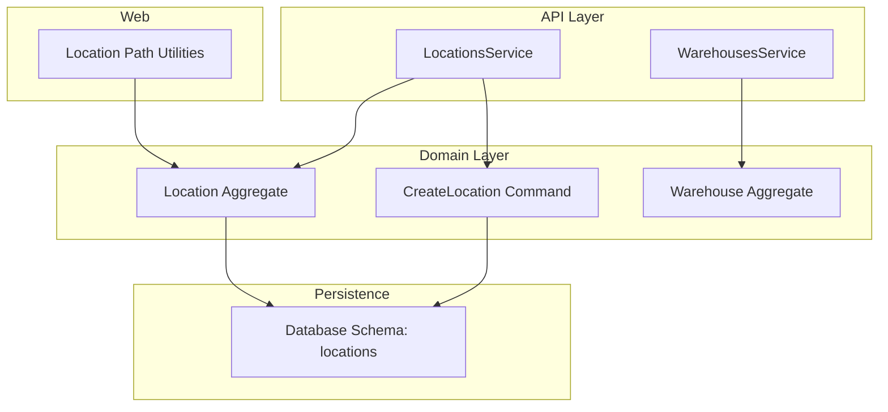
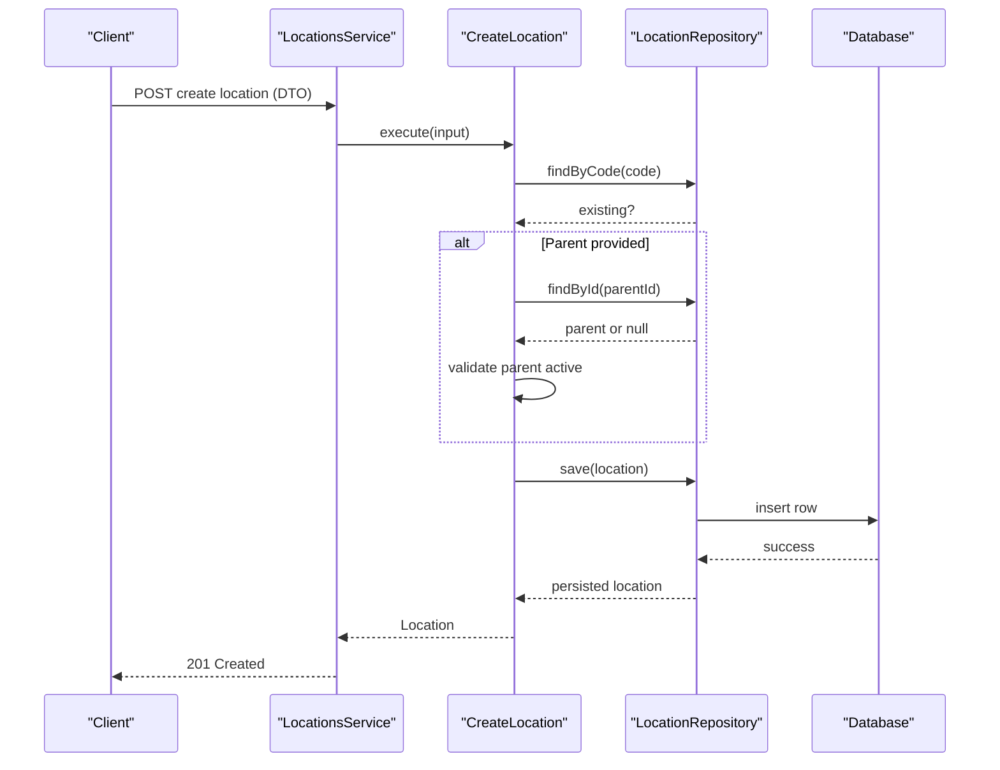
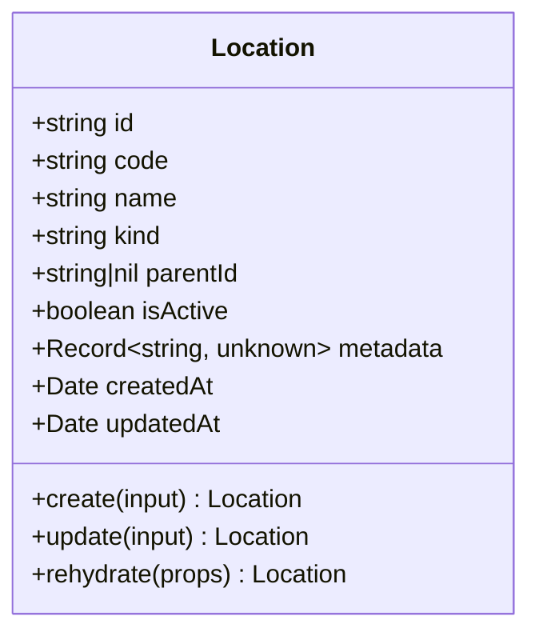
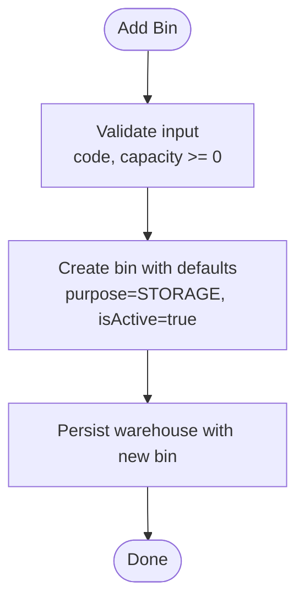
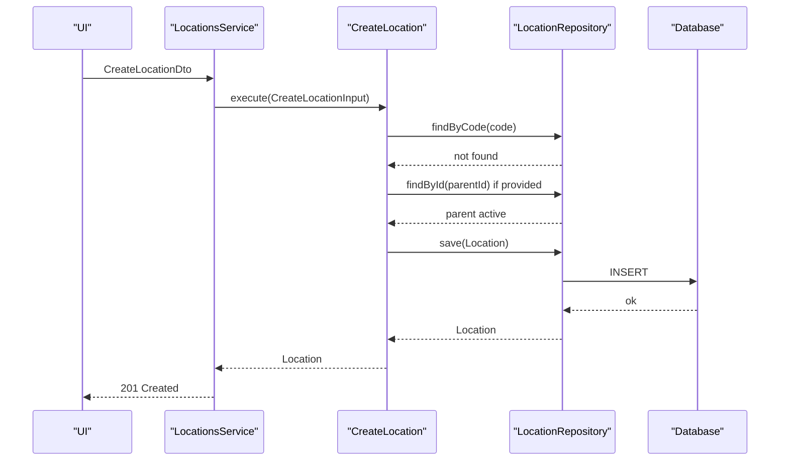
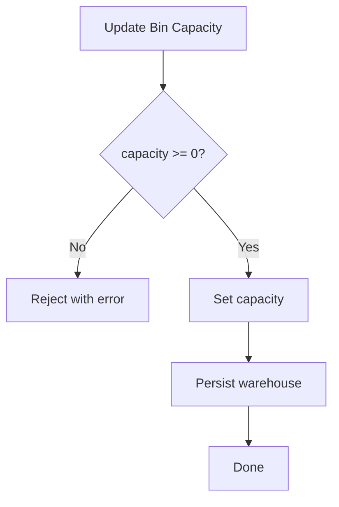
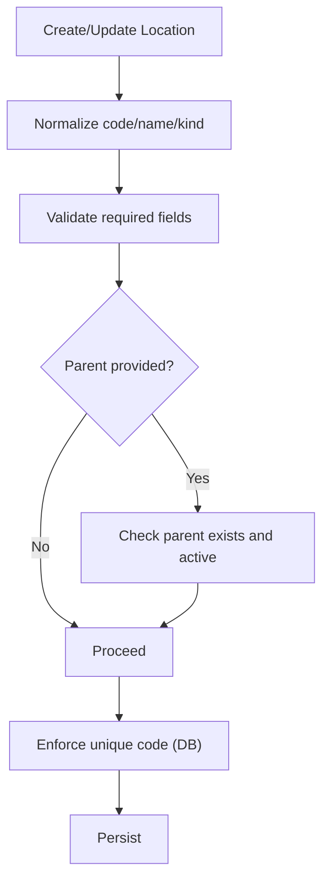
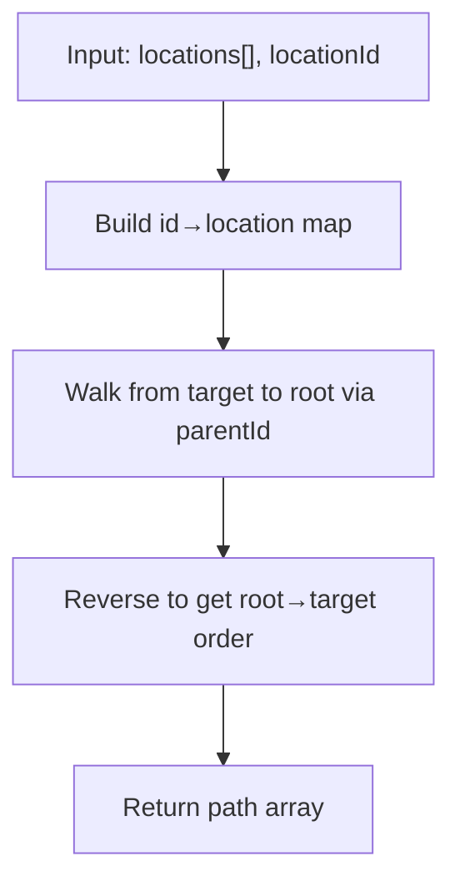
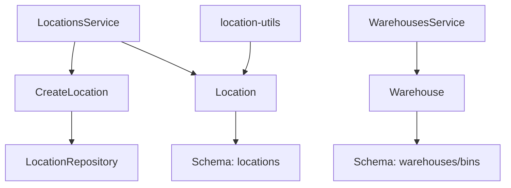

# Warehouse Structure & Locations

<cite>
**Referenced Files in This Document**
- [0021-warehouse-structure-and-bin-locations.md](file://docs/rfcs/0021-warehouse-structure-and-bin-locations.md)
- [location.ts](file://packages/inventory/src/locations/location.ts)
- [create-location.ts](file://packages/inventory/src/locations/create-location.ts)
- [locations.ts](file://packages/database/src/schema/locations.ts)
- [locations.service.ts](file://apps/api/src/locations/locations.service.ts)
- [create-location.dto.ts](file://apps/api/src/locations/create-location.dto.ts)
- [update-location.dto.ts](file://apps/api/src/locations/update-location.dto.ts)
- [warehouse.ts](file://packages/warehouse/src/warehouses/warehouse.ts)
- [warehouses.service.ts](file://apps/api/src/warehouses/warehouses.service.ts)
- [dtos.ts](file://apps/api/src/warehouses/dtos.ts)
- [location-utils.ts](file://apps/web/src/lib/location-utils.ts)
</cite>

## Table of Contents
1. Introduction
2. Project Structure
3. Core Components
4. Architecture Overview
5. Detailed Component Analysis
6. Dependency Analysis
7. Performance Considerations
8. Troubleshooting Guide
9. Conclusion

## Introduction
This document explains how the system models physical warehouse spaces and manages hierarchical locations and bins. It covers:
- The 6-level hierarchy defined by design: Warehouse → Zone → Aisle → Rack → Shelf → Bin
- How generic location trees are modeled with parent-child relationships for flexible spatial organization
- Bin capacity, utilization, and operational purpose management
- Creation workflows, validation rules, naming conventions, and integration points with inventory tracking

The goal is to help both technical and non-technical readers understand how physical spaces are represented, created, validated, and used across the application.

## Project Structure
The warehouse and location features span multiple layers:
- API layer exposes endpoints and orchestrates services
- Domain layer defines aggregates (Warehouse, Location) and commands
- Database schema defines persistent structures and indexes
- Web utilities render human-readable location paths from hierarchical data

**Diagram sources**
- [locations.service.ts:1-53](file://apps/api/src/locations/locations.service.ts#L1-L53)
- [create-location.ts:1-41](file://packages/inventory/src/locations/create-location.ts#L1-L41)
- [location.ts:1-149](file://packages/inventory/src/locations/location.ts#L1-L149)
- [locations.ts:1-56](file://packages/database/src/schema/locations.ts#L1-L56)
- [warehouse.ts:1-140](file://packages/warehouse/src/warehouses/warehouse.ts#L1-L140)
- [location-utils.ts:1-43](file://apps/web/src/lib/location-utils.ts#L1-L43)

**Section sources**
- [locations.service.ts:1-53](file://apps/api/src/locations/locations.service.ts#L1-L53)
- [create-location.ts:1-41](file://packages/inventory/src/locations/create-location.ts#L1-L41)
- [location.ts:1-149](file://packages/inventory/src/locations/location.ts#L1-L149)
- [locations.ts:1-56](file://packages/database/src/schema/locations.ts#L1-L56)
- [warehouse.ts:1-140](file://packages/warehouse/src/warehouses/warehouse.ts#L1-L140)
- [location-utils.ts:1-43](file://apps/web/src/lib/location-utils.ts#L1-L43)

## Core Components
- Location aggregate: Encapsulates code, name, kind, parent-child links, active state, metadata, and timestamps. Provides factory creation and update methods that enforce normalization and invariants.
- CreateLocation command: Validates uniqueness of codes, ensures parent exists and is active, then persists via repository.
- Warehouse aggregate: Represents a facility and owns bins with capacity, utilization, purpose, and lifecycle state. Supports adding bins, toggling state, and updating capacity.
- API services: Expose CRUD operations for locations and warehouses; orchestrate domain logic and persistence.
- Database schema: Defines the locations table with unique code index, parent reference, and useful indexes for queries.
- Web utilities: Build readable location paths from hierarchical data for UI display.

Key responsibilities:
- Validation and normalization at the domain boundary
- Enforcing business rules (e.g., parent must be active)
- Maintaining consistent naming and state transitions
- Providing clear APIs for clients to manage physical spaces

**Section sources**
- [location.ts:1-149](file://packages/inventory/src/locations/location.ts#L1-L149)
- [create-location.ts:1-41](file://packages/inventory/src/locations/create-location.ts#L1-L41)
- [warehouse.ts:1-140](file://packages/warehouse/src/warehouses/warehouse.ts#L1-L140)
- [locations.service.ts:1-53](file://apps/api/src/locations/locations.service.ts#L1-L53)
- [locations.ts:1-56](file://packages/database/src/schema/locations.ts#L1-L56)
- [location-utils.ts:1-43](file://apps/web/src/lib/location-utils.ts#L1-L43)

## Architecture Overview
The architecture separates concerns across layers:
- API controllers/services accept DTOs and delegate to domain commands/aggregates
- Domain aggregates encapsulate business rules and state
- Repositories abstract persistence to the database schema
- Web utilities consume domain models to present hierarchical paths

**Diagram sources**
- [locations.service.ts:1-53](file://apps/api/src/locations/locations.service.ts#L1-L53)
- [create-location.ts:1-41](file://packages/inventory/src/locations/create-location.ts#L1-L41)
- [locations.ts:1-56](file://packages/database/src/schema/locations.ts#L1-L56)

## Detailed Component Analysis

### Location Hierarchy and Tree Model
- The Location aggregate supports arbitrary depth through a parentId field, enabling flexible hierarchies beyond the fixed warehouse levels.
- Creation normalizes code (uppercase), name (trimmed), and kind (lowercase), enforcing required fields and generating IDs and timestamps.
- Updates preserve invariants while allowing optional changes to code, name, kind, parent, active state, and metadata.
- The database enforces unique codes and indexes for efficient lookups by parent and kind.

**Diagram sources**
- [location.ts:1-149](file://packages/inventory/src/locations/location.ts#L1-L149)

**Section sources**
- [location.ts:1-149](file://packages/inventory/src/locations/location.ts#L1-L149)
- [locations.ts:1-56](file://packages/database/src/schema/locations.ts#L1-L56)

### Bin Management within Warehouses
- The Warehouse aggregate owns a list of bins with properties including capacity, current utilization, purpose, and active state.
- Adding a bin validates capacity (non-negative) and sets defaults (purpose storage, active true).
- Bin state can be toggled and capacity updated; changes persist on save.
- Design RFC specifies a six-level hierarchy (Warehouse → Zone → Aisle → Rack → Shelf → Bin) and operational purposes for bins.

**Diagram sources**
- [warehouse.ts:1-140](file://packages/warehouse/src/warehouses/warehouse.ts#L1-L140)
- [dtos.ts:1-50](file://apps/api/src/warehouses/dtos.ts#L1-L50)

**Section sources**
- [warehouse.ts:1-140](file://packages/warehouse/src/warehouses/warehouse.ts#L1-L140)
- [dtos.ts:1-50](file://apps/api/src/warehouses/dtos.ts#L1-L50)
- [0021-warehouse-structure-and-bin-locations.md:1-207](file://docs/rfcs/0021-warehouse-structure-and-bin-locations.md#L1-L207)

### Location Creation Workflow
- API service composes a CreateLocation command that checks code uniqueness and parent validity before creating and saving the location.
- DTOs define request shape and validation constraints for code, name, kind, optional parent, and metadata.

**Diagram sources**
- [locations.service.ts:1-53](file://apps/api/src/locations/locations.service.ts#L1-L53)
- [create-location.ts:1-41](file://packages/inventory/src/locations/create-location.ts#L1-L41)
- [create-location.dto.ts:1-33](file://apps/api/src/locations/create-location.dto.ts#L1-L33)
- [locations.ts:1-56](file://packages/database/src/schema/locations.ts#L1-L56)

**Section sources**
- [locations.service.ts:1-53](file://apps/api/src/locations/locations.service.ts#L1-L53)
- [create-location.ts:1-41](file://packages/inventory/src/locations/create-location.ts#L1-L41)
- [create-location.dto.ts:1-33](file://apps/api/src/locations/create-location.dto.ts#L1-L33)

### Spatial Relationships and Inventory Positioning
- Bins map to inventory locations when stock moves; the warehouse module never updates the inventory ledger directly.
- The design ensures separation: warehouse defines physical addresses; inventory tracks quantities per location.

**Diagram sources**
- [0021-warehouse-structure-and-bin-locations.md:134-138](file://docs/rfcs/0021-warehouse-structure-and-bin-locations.md#L134-L138)

**Section sources**
- [0021-warehouse-structure-and-bin-locations.md:134-138](file://docs/rfcs/0021-warehouse-structure-and-bin-locations.md#L134-L138)

### Capacity Management and Utilization
- Bin capacity is enforced to be non-negative during creation and updates.
- Current utilization is tracked alongside capacity to support capacity planning and putaway decisions.
- Operational purposes guide where items should be placed (e.g., receiving, production, shipping, quality hold).

**Diagram sources**
- [warehouse.ts:124-134](file://packages/warehouse/src/warehouses/warehouse.ts#L124-L134)
- [dtos.ts:40-49](file://apps/api/src/warehouses/dtos.ts#L40-L49)

**Section sources**
- [warehouse.ts:87-134](file://packages/warehouse/src/warehouses/warehouse.ts#L87-L134)
- [dtos.ts:24-49](file://apps/api/src/warehouses/dtos.ts#L24-L49)

### Naming Conventions and Validation Rules
- Codes are normalized to uppercase and trimmed; names are trimmed; kinds are lowercased.
- Required fields enforced at creation and update; inactive parents cannot have children.
- Unique codes enforced at the database level.

**Diagram sources**
- [location.ts:64-105](file://packages/inventory/src/locations/location.ts#L64-L105)
- [create-location.ts:12-39](file://packages/inventory/src/locations/create-location.ts#L12-L39)
- [locations.ts:13-51](file://packages/database/src/schema/locations.ts#L13-L51)

**Section sources**
- [location.ts:64-138](file://packages/inventory/src/locations/location.ts#L64-L138)
- [create-location.ts:12-39](file://packages/inventory/src/locations/create-location.ts#L12-L39)
- [locations.ts:13-51](file://packages/database/src/schema/locations.ts#L13-L51)

### UI Integration: Building Human-Readable Paths
- Web utility builds an ordered path from root to target using parent references, handling cycles safely and returning sensible defaults when missing.
- Useful for displaying breadcrumb-like navigation in the UI.

**Diagram sources**
- [location-utils.ts:7-32](file://apps/web/src/lib/location-utils.ts#L7-L32)

**Section sources**
- [location-utils.ts:1-43](file://apps/web/src/lib/location-utils.ts#L1-L43)

## Dependency Analysis
- API services depend on domain commands/aggregates and repositories.
- Domain aggregates depend on core identity generation and custom errors.
- Database schema provides constraints and indexes that support performance and integrity.
- Web utilities depend on domain models to compute derived views (paths).

**Diagram sources**
- [locations.service.ts:1-53](file://apps/api/src/locations/locations.service.ts#L1-L53)
- [create-location.ts:1-41](file://packages/inventory/src/locations/create-location.ts#L1-L41)
- [location.ts:1-149](file://packages/inventory/src/locations/location.ts#L1-L149)
- [warehouse.ts:1-140](file://packages/warehouse/src/warehouses/warehouse.ts#L1-L140)
- [locations.ts:1-56](file://packages/database/src/schema/locations.ts#L1-L56)
- [location-utils.ts:1-43](file://apps/web/src/lib/location-utils.ts#L1-L43)

**Section sources**
- [locations.service.ts:1-53](file://apps/api/src/locations/locations.service.ts#L1-L53)
- [create-location.ts:1-41](file://packages/inventory/src/locations/create-location.ts#L1-L41)
- [location.ts:1-149](file://packages/inventory/src/locations/location.ts#L1-L149)
- [warehouse.ts:1-140](file://packages/warehouse/src/warehouses/warehouse.ts#L1-L140)
- [locations.ts:1-56](file://packages/database/src/schema/locations.ts#L1-L56)
- [location-utils.ts:1-43](file://apps/web/src/lib/location-utils.ts#L1-L43)

## Performance Considerations
- Unique index on location code prevents duplicate scans and ensures fast uniqueness checks.
- Indexes on parentId and kind support common queries for tree traversal and filtering.
- Keeping hierarchy shallow where possible reduces path-building overhead in the UI.
- Avoid unnecessary rehydration of large trees; fetch only needed nodes for specific operations.

[No sources needed since this section provides general guidance]

## Troubleshooting Guide
Common issues and resolutions:
- Duplicate location code: Occurs when attempting to create a location with an existing code. Ensure code uniqueness or update existing records.
- Missing or inactive parent: Creating a child under a non-existent or inactive parent fails. Verify parent existence and active status before linking.
- Invalid bin capacity: Negative capacity values are rejected. Use zero or positive values when defining or updating bin capacity.
- Not found errors: When retrieving locations or warehouses by ID, ensure IDs exist and are valid.

**Section sources**
- [create-location.ts:12-39](file://packages/inventory/src/locations/create-location.ts#L12-L39)
- [location.ts:64-138](file://packages/inventory/src/locations/location.ts#L64-L138)
- [warehouse.ts:87-134](file://packages/warehouse/src/warehouses/warehouse.ts#L87-L134)
- [locations.service.ts:45-51](file://apps/api/src/locations/locations.service.ts#L45-L51)

## Conclusion
The system models physical warehouse spaces through two complementary mechanisms:
- A flexible location tree with parent-child relationships for general spatial organization
- A structured warehouse aggregate with bins that capture capacity, utilization, and operational purpose

Design principles emphasize strong validation, normalization, and clear separation between physical addressing (warehouse) and inventory accounting (ledger). These patterns enable scalable, maintainable, and user-friendly management of warehouse layouts and bin-level tracking.

[No sources needed since this section summarizes without analyzing specific files]