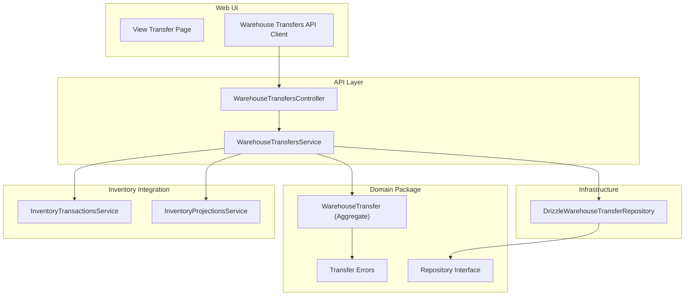
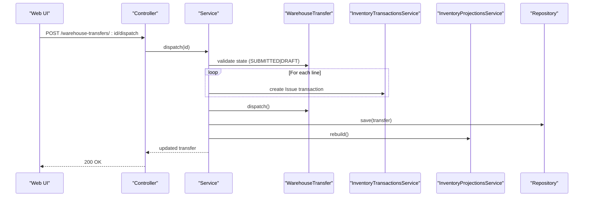
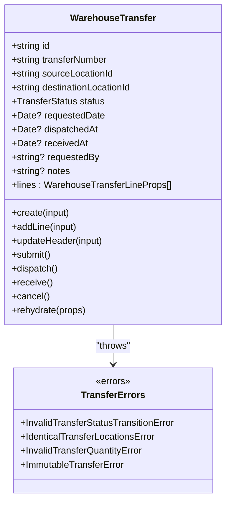
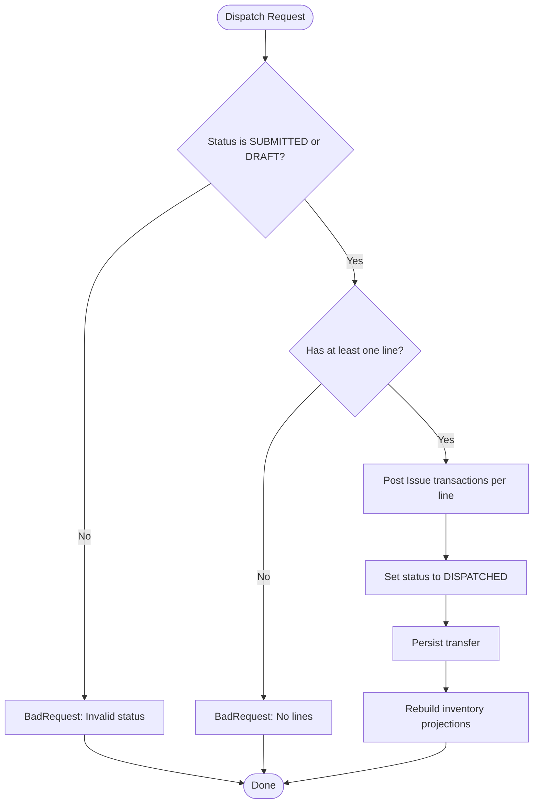
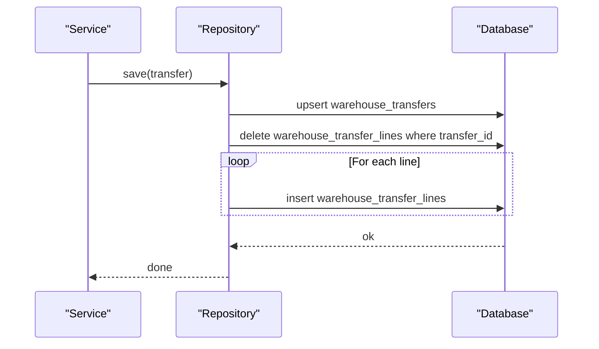
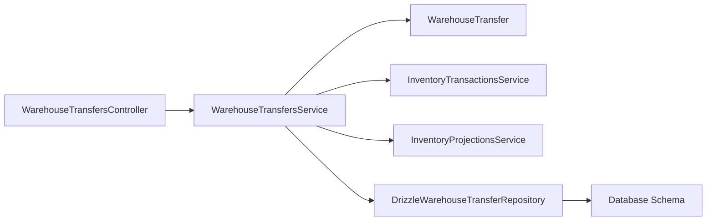

# Warehouse Transfers

<cite>
**Referenced Files in This Document**
- [warehouse-transfers.controller.ts](file://apps/api/src/warehouse-transfers/warehouse-transfers.controller.ts)
- [warehouse-transfers.service.ts](file://apps/api/src/warehouse-transfers/warehouse-transfers.service.ts)
- [dtos.ts](file://apps/api/src/warehouse-transfers/dtos.ts)
- [warehouse-transfer.ts](file://packages/warehouse/src/transfers/warehouse-transfer.ts)
- [transfer.errors.ts](file://packages/warehouse/src/transfers/transfer.errors.ts)
- [warehouse-transfer.repository.ts](file://packages/warehouse/src/transfers/warehouse-transfer.repository.ts)
- [drizzle-warehouse-transfer.repository.ts](file://apps/api/src/infrastructure/repositories/drizzle-warehouse-transfer.repository.ts)
- [0024-warehouse-transfers.md](file://docs/rfcs/0024-warehouse-transfers.md)
- [page.tsx](file://apps/web/app/warehouse-transfers/[id]/page.tsx)
- [warehouse-transfers-api.ts](file://apps/web/lib/api/warehouse-transfers-api.ts)
</cite>

## Table of Contents
1. [Introduction](#introduction)
2. [Project Structure](#project-structure)
3. [Core Components](#core-components)
4. [Architecture Overview](#architecture-overview)
5. [Detailed Component Analysis](#detailed-component-analysis)
6. [Dependency Analysis](#dependency-analysis)
7. [Performance Considerations](#performance-considerations)
8. [Troubleshooting Guide](#troubleshooting-guide)
9. [Conclusion](#conclusion)
10. [Appendices](#appendices)

## Introduction
This document explains the complete lifecycle of warehouse transfer operations: creation, approval workflows, execution tracking, and completion. It covers transfer types, routing logic, status transitions, business rules for approvals and conflict resolution, and integration with inventory systems. Concrete examples reference code paths for creating transfers, handling multi-location movements, and executing automated decisions such as dispatching and receiving stock.

## Project Structure
The warehouse transfer feature spans API controllers/services, a domain model package, and a Drizzle-based repository implementation. The web UI exposes actions to submit, dispatch, receive, cancel, and delete transfers.

**Diagram sources**
- [warehouse-transfers.controller.ts:21-85](file://apps/api/src/warehouse-transfers/warehouse-transfers.controller.ts#L21-L85)
- [warehouse-transfers.service.ts:22-29](file://apps/api/src/warehouse-transfers/warehouse-transfers.service.ts#L22-L29)
- [warehouse-transfer.ts:68-221](file://packages/warehouse/src/transfers/warehouse-transfer.ts#L68-L221)
- [transfer.errors.ts:1-32](file://packages/warehouse/src/transfers/transfer.errors.ts#L1-L32)
- [warehouse-transfer.repository.ts:1-20](file://packages/warehouse/src/transfers/warehouse-transfer.repository.ts#L1-L20)
- [drizzle-warehouse-transfer.repository.ts:48-190](file://apps/api/src/infrastructure/repositories/drizzle-warehouse-transfer.repository.ts#L48-L190)

**Section sources**
- [warehouse-transfers.controller.ts:21-85](file://apps/api/src/warehouse-transfers/warehouse-transfers.controller.ts#L21-L85)
- [warehouse-transfers.service.ts:22-29](file://apps/api/src/warehouse-transfers/warehouse-transfers.service.ts#L22-L29)
- [warehouse-transfer.ts:68-221](file://packages/warehouse/src/transfers/warehouse-transfer.ts#L68-L221)
- [drizzle-warehouse-transfer.repository.ts:48-190](file://apps/api/src/infrastructure/repositories/drizzle-warehouse-transfer.repository.ts#L48-L190)

## Core Components
- Controller: Exposes REST endpoints for create, list, get, update, add line, submit, dispatch, receive, cancel, and delete.
- Service: Orchestrates workflow, enforces business rules, integrates with inventory transactions and projections, and persists state via repository.
- Domain Model: Encapsulates transfer state machine, line items, and validation rules; throws domain errors for invalid transitions or data.
- Repository: Implements persistence using Drizzle ORM, including number generation, filtering, and saving lines atomically.
- Web UI: Provides user flows to submit, dispatch, receive, and cancel transfers; displays linked inventory transactions.

Key responsibilities:
- Create transfer with distinct source and destination locations and at least one line item before submission.
- Submit to move from draft to submitted state.
- Dispatch to issue outbound inventory and mark as dispatched.
- Receive to post inbound inventory and mark as received.
- Cancel to revert or compensate depending on current state.

**Section sources**
- [warehouse-transfers.controller.ts:21-85](file://apps/api/src/warehouse-transfers/warehouse-transfers.controller.ts#L21-L85)
- [warehouse-transfers.service.ts:31-240](file://apps/api/src/warehouse-transfers/warehouse-transfers.service.ts#L31-L240)
- [warehouse-transfer.ts:99-216](file://packages/warehouse/src/transfers/warehouse-transfer.ts#L99-L216)
- [drizzle-warehouse-transfer.repository.ts:48-190](file://apps/api/src/infrastructure/repositories/drizzle-warehouse-transfer.repository.ts#L48-L190)
- [page.tsx:158-199](file://apps/web/app/warehouse-transfers/[id]/page.tsx#L158-L199)

## Architecture Overview
The system follows a layered architecture with clear separation between presentation (web), application (controller/service), domain (aggregate), and infrastructure (repository). Inventory integration is performed by dedicated services to ensure auditability and projection consistency.

**Diagram sources**
- [warehouse-transfers.controller.ts:66-69](file://apps/api/src/warehouse-transfers/warehouse-transfers.controller.ts#L66-L69)
- [warehouse-transfers.service.ts:135-169](file://apps/api/src/warehouse-transfers/warehouse-transfers.service.ts#L135-L169)
- [warehouse-transfer.ts:192-199](file://packages/warehouse/src/transfers/warehouse-transfer.ts#L192-L199)
- [drizzle-warehouse-transfer.repository.ts:131-176](file://apps/api/src/infrastructure/repositories/drizzle-warehouse-transfer.repository.ts#L131-L176)

## Detailed Component Analysis

### Domain Model: WarehouseTransfer
The aggregate enforces immutable states after receipt/cancellation, validates quantities, and prevents identical source/destination locations. It defines the state machine and line management.

**Diagram sources**
- [warehouse-transfer.ts:68-221](file://packages/warehouse/src/transfers/warehouse-transfer.ts#L68-L221)
- [transfer.errors.ts:1-32](file://packages/warehouse/src/transfers/transfer.errors.ts#L1-L32)

**Section sources**
- [warehouse-transfer.ts:99-216](file://packages/warehouse/src/transfers/warehouse-transfer.ts#L99-L216)
- [transfer.errors.ts:1-32](file://packages/warehouse/src/transfers/transfer.errors.ts#L1-L32)

### Application Service: Workflow Orchestration
The service coordinates state transitions, validates preconditions, posts inventory transactions, and rebuilds projections.

- Create: Validates distinct locations, generates transfer number, creates aggregate, saves.
- Update: Only allowed in DRAFT; validates header changes and replaces lines.
- Add Line: Only allowed in DRAFT; validates quantity > 0.
- Submit: Moves to SUBMITTED; requires at least one line.
- Dispatch: Requires SUBMITTED or DRAFT; posts Issue transactions per line; marks DISPATCHED; rebuilds projections.
- Receive: Requires DISPATCHED or SUBMITTED; posts Receipt transactions per line; marks RECEIVED; rebuilds projections.
- Cancel: Prevents cancellation if RECEIVED or CANCELLED; if DISPATCHED, posts compensating receipts back to source; marks CANCELLED.
- Delete: Only DRAFT.

**Diagram sources**
- [warehouse-transfers.service.ts:135-169](file://apps/api/src/warehouse-transfers/warehouse-transfers.service.ts#L135-L169)

**Section sources**
- [warehouse-transfers.service.ts:31-240](file://apps/api/src/warehouse-transfers/warehouse-transfers.service.ts#L31-L240)

### Repository: Persistence and Numbering
The repository implements queries, atomic save of header and lines, and transfer number generation.

- findById/findByTransferNumber: Loads transfer and lines, maps to domain.
- findMany: Filters by source/destination location, status, and search text; orders by created date.
- save: Upserts header; deletes old lines; inserts new lines.
- generateNextTransferNumber: Produces WT-{year}-{sequential}.

**Diagram sources**
- [drizzle-warehouse-transfer.repository.ts:131-176](file://apps/api/src/infrastructure/repositories/drizzle-warehouse-transfer.repository.ts#L131-L176)

**Section sources**
- [drizzle-warehouse-transfer.repository.ts:48-190](file://apps/api/src/infrastructure/repositories/drizzle-warehouse-transfer.repository.ts#L48-L190)
- [warehouse-transfer.repository.ts:1-20](file://packages/warehouse/src/transfers/warehouse-transfer.repository.ts#L1-L20)

### API Endpoints and DTOs
Endpoints expose full CRUD plus workflow actions. DTOs enforce validation constraints for create/update/add-line operations.

- Endpoints: POST create, GET list, GET by id, PUT update, POST add line, POST submit, POST dispatch, POST receive, POST cancel, DELETE by id.
- DTOs: TransferLineDto, CreateWarehouseTransferDto, UpdateWarehouseTransferDto, AddTransferLineDto.

**Section sources**
- [warehouse-transfers.controller.ts:21-85](file://apps/api/src/warehouse-transfers/warehouse-transfers.controller.ts#L21-L85)
- [dtos.ts:12-83](file://apps/api/src/warehouse-transfers/dtos.ts#L12-L83)

### Web UI Actions
The UI provides confirm dialogs and calls to submit, dispatch, receive, and cancel transfers. It also loads linked inventory transactions for traceability.

**Section sources**
- [page.tsx:158-199](file://apps/web/app/warehouse-transfers/[id]/page.tsx#L158-L199)
- [warehouse-transfers-api.ts:76-121](file://apps/web/lib/api/warehouse-transfers-api.ts#L76-L121)

## Dependency Analysis
- Controller depends on Service for all operations.
- Service depends on:
  - Domain Aggregate (WarehouseTransfer) for state transitions and validations.
  - InventoryTransactionsService to post Issue/Receipt transactions.
  - InventoryProjectionsService to rebuild projections after changes.
  - Repository interface implemented by Drizzle repository for persistence.
- Repository depends on database schema and query helpers.

**Diagram sources**
- [warehouse-transfers.controller.ts:21-85](file://apps/api/src/warehouse-transfers/warehouse-transfers.controller.ts#L21-L85)
- [warehouse-transfers.service.ts:22-29](file://apps/api/src/warehouse-transfers/warehouse-transfers.service.ts#L22-L29)
- [drizzle-warehouse-transfer.repository.ts:48-190](file://apps/api/src/infrastructure/repositories/drizzle-warehouse-transfer.repository.ts#L48-L190)

**Section sources**
- [warehouse-transfers.module.ts:1-23](file://apps/api/src/warehouse-transfers/warehouse-transfers.module.ts#L1-L23)
- [warehouse-transfers.service.ts:22-29](file://apps/api/src/warehouse-transfers/warehouse-transfers.service.ts#L22-L29)

## Performance Considerations
- Batched line processing: Dispatch and receive iterate over lines to post transactions; consider batching inventory transactions where supported to reduce round-trips.
- Projection rebuild: After dispatch and receive, projections are rebuilt; schedule or throttle rebuilds if high throughput is expected.
- Query optimization: findMany supports filtering by source/destination/status and search; indexes exist for transfer_number, source_location_id, and destination_location_id to improve performance.
- Atomic saves: Repository deletes and re-inserts lines per save; for large transfers, consider batched inserts to minimize writes.

[No sources needed since this section provides general guidance]

## Troubleshooting Guide
Common issues and resolutions:
- Identical source and destination: Validation error thrown during create/update; ensure distinct locations.
- Invalid status transition: Attempting to submit/dispatch/receive/cancel from an invalid state; check current status and allowed transitions.
- Missing lines: Cannot submit or dispatch without at least one line; add lines before workflow actions.
- Immutable transfer: Cannot edit or cancel after RECEIVED or CANCELLED; review state history.
- Compensation on cancel: If cancelling a DISPATCHED transfer, compensating receipts are posted back to source; verify inventory adjustments.

**Section sources**
- [transfer.errors.ts:1-32](file://packages/warehouse/src/transfers/transfer.errors.ts#L1-L32)
- [warehouse-transfers.service.ts:31-240](file://apps/api/src/warehouse-transfers/warehouse-transfers.service.ts#L31-L240)
- [warehouse-transfer.ts:99-216](file://packages/warehouse/src/transfers/warehouse-transfer.ts#L99-L216)

## Conclusion
The warehouse transfer module provides a robust, stateful workflow for moving inventory between locations. It enforces strict business rules, integrates cleanly with inventory transaction and projection services, and offers comprehensive API and UI support for managing transfers end-to-end. Future enhancements can include advanced routing and optimization algorithms for bin selection and batch processing improvements.

[No sources needed since this section summarizes without analyzing specific files]

## Appendices

### Status Transitions and Business Rules
- States: DRAFT → SUBMITTED → DISPATCHED → RECEIVED; any non-terminal state can be CANCELLED except RECEIVED/CANCELLED.
- Rules:
  - Source and destination must be distinct.
  - Quantities must be strictly positive.
  - Only DRAFT transfers can be edited or deleted.
  - Submit requires at least one line.
  - Dispatch posts Issue transactions; Receive posts Receipt transactions; both rebuild projections.
  - Cancel may post compensating receipts if already dispatched.

**Section sources**
- [warehouse-transfer.ts:179-216](file://packages/warehouse/src/transfers/warehouse-transfer.ts#L179-L216)
- [warehouse-transfers.service.ts:128-240](file://apps/api/src/warehouse-transfers/warehouse-transfers.service.ts#L128-L240)
- [0024-warehouse-transfers.md:105-111](file://docs/rfcs/0024-warehouse-transfers.md#L105-L111)

### API Reference Summary
- POST /warehouse-transfers: Create transfer
- GET /warehouse-transfers: List transfers (filters: sourceLocationId, destinationLocationId, status, search)
- GET /warehouse-transfers/:id: Get transfer details
- PUT /warehouse-transfers/:id: Update transfer (DRAFT only)
- POST /warehouse-transfers/:id/lines: Add line (DRAFT only)
- POST /warehouse-transfers/:id/submit: Submit transfer
- POST /warehouse-transfers/:id/dispatch: Dispatch transfer
- POST /warehouse-transfers/:id/receive: Receive transfer
- POST /warehouse-transfers/:id/cancel: Cancel transfer
- DELETE /warehouse-transfers/:id: Delete transfer (DRAFT only)

**Section sources**
- [warehouse-transfers.controller.ts:21-85](file://apps/api/src/warehouse-transfers/warehouse-transfers.controller.ts#L21-L85)
- [warehouse-transfers-api.ts:76-121](file://apps/web/lib/api/warehouse-transfers-api.ts#L76-L121)

### Data Model Notes
- Transfer number format: WT-{year}-{sequential}
- Tables: warehouse_transfers, warehouse_transfer_lines
- Indexes: unique transfer_number, indexes on source_location_id and destination_location_id

**Section sources**
- [drizzle-warehouse-transfer.repository.ts:182-190](file://apps/api/src/infrastructure/repositories/drizzle-warehouse-transfer.repository.ts#L182-L190)
- [0024-warehouse-transfers.md:151-175](file://docs/rfcs/0024-warehouse-transfers.md#L151-L175)