# Overall System Design

<cite>
**Referenced Files in This Document**
- [README.md](file://README.md)
- [ARCHITECTURE.md](file://docs/architecture/ARCHITECTURE.md)
- [compose.yml](file://compose.yml)
- [compose.prod.yml](file://compose.prod.yml)
- [compose.local.yml](file://compose.local.yml)
- [apps/api/src/main.ts](file://apps/api/src/main.ts)
- [apps/api/src/app.module.ts](file://apps/api/src/app.module.ts)
- [apps/api/src/worker.ts](file://apps/api/src/worker.ts)
- [apps/ml/app/main.py](file://apps/ml/app/main.py)
- [apps/web/package.json](file://apps/web/package.json)
</cite>

## Table of Contents
1. [Introduction](#introduction)
2. [Project Structure](#project-structure)
3. [Core Components](#core-components)
4. [Architecture Overview](#architecture-overview)
5. [Detailed Component Analysis](#detailed-component-analysis)
6. [Dependency Analysis](#dependency-analysis)
7. [Performance Considerations](#performance-considerations)
8. [Troubleshooting Guide](#troubleshooting-guide)
9. [Conclusion](#conclusion)

## Introduction
Ananya ERP is a modern operations platform covering inventory, procurement, manufacturing, warehouse operations, projects, sales, finance, CRM, service, MRP, reporting, authentication/RBAC, documents, imports, and administrator-managed Data Packs. The system follows a modular monolith architecture with Domain-Driven Design principles: business capabilities are organized as independent domain modules inside a single deployable application, while the frontend, API, background worker, ML microservice, and database run as separate Docker services.

At a high level, the browser communicates with a Next.js Web application, which calls a NestJS REST API. The API coordinates domain logic, persistence through PostgreSQL, and optional machine learning through a Python FastAPI microservice. A separate Worker process shares the same NestJS application context for background tasks and exposes its own health endpoint.

**Section sources**
- [README.md:1-10](file://README.md#L1-L10)
- [README.md:275-297](file://README.md#L275-L297)

## Project Structure
The repository is organized into applications, shared packages, infrastructure configuration, documentation, tests, and deployment assets:

- `apps/web`: Next.js frontend application.
- `apps/api`: NestJS backend containing controllers, services, modules, repositories, authentication, and the worker entrypoint.
- `apps/ml`: Python/FastAPI ML microservice providing component intelligence, attribute suggestions, duplicate detection, datasheet extraction, and model training control endpoints.
- `packages/*`: Shared TypeScript packages including domain models, shared utilities, linting configuration, and database schema/migrations.
- `docker/*`: Production Dockerfiles for Web, API, Worker, and ML.
- `compose.yml`, `compose.local.yml`, `compose.prod.yml`: Docker Compose stack definitions.
- `docs/`: Architecture, RFCs, development, standards, and operational documentation.
- `tests/`: End-to-end, accessibility, fixture, and page-object tests.

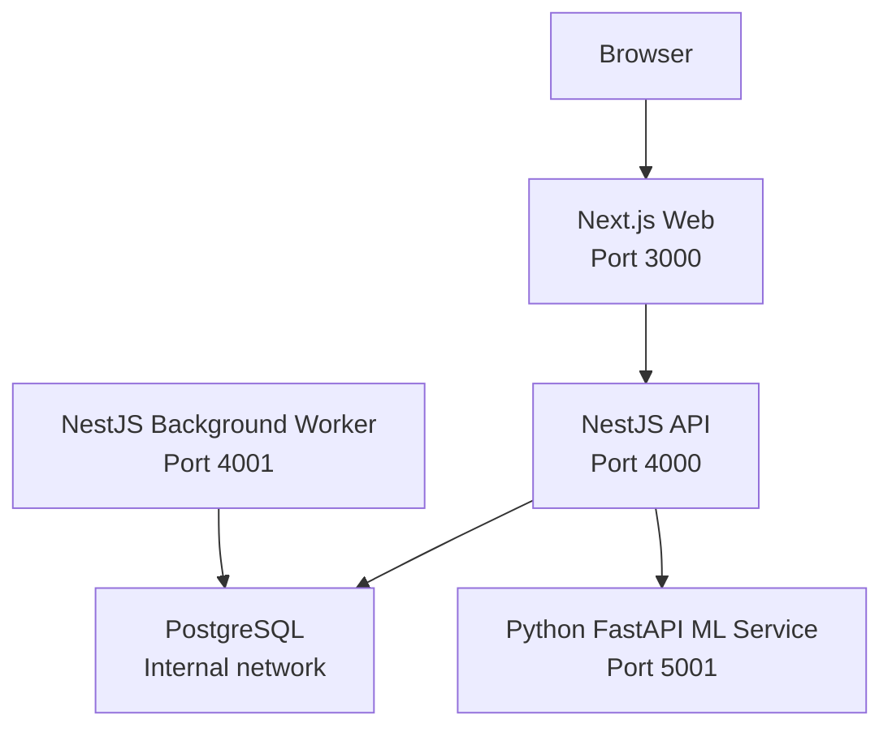

**Diagram sources**
- [compose.yml:18-173](file://compose.yml#L18-L173)
- [apps/web/package.json:1-55](file://apps/web/package.json#L1-L55)
- [apps/api/src/main.ts:11-41](file://apps/api/src/main.ts#L11-L41)
- [apps/ml/app/main.py:60-87](file://apps/ml/app/main.py#L60-L87)

**Section sources**
- [README.md:275-297](file://README.md#L275-L297)
- [compose.yml:1-14](file://compose.yml#L1-L14)

## Core Components
Ananya’s runtime consists of five primary components:

| Component | Technology | Responsibility | Public Exposure |
|---|---|---|---|
| Web | Next.js, React, Tailwind CSS, Zod | User interface, client-side validation, navigation, and direct calls to the public API | Yes, via reverse proxy |
| API | NestJS, TypeScript | REST endpoints, authentication/RBAC, domain orchestration, persistence, ML integration, import/export, notifications | Yes, via reverse proxy |
| Worker | NestJS (headless application context) | Background task processing and periodic checks; lightweight HTTP health server | No, internal only |
| ML | Python FastAPI | Component classification, manufacturer resolution, duplicate detection, datasheet extraction, attribute intelligence, model training control plane | Optional, internal or exposed depending on profile |
| Database | PostgreSQL 16 | Durable relational data, migrations, uploads volume | Internal only |

The Web application is built with Next.js and depends on workspace packages such as `@ananya/inventory`. It does not directly access PostgreSQL; it communicates with the API over HTTP using a browser-reachable `API_PUBLIC_URL`.

The API bootstraps a NestJS application, enables CORS, applies global exception filters, logging interceptors, and strict validation pipes, then listens on port 4000. Its root module imports many feature modules, including authentication, users, roles, permissions, security audit, search, documents, notifications, settings, attributes, and ML.

The Worker starts a separate NestJS application context without exposing business endpoints. It provides a simple `/health` HTTP endpoint and runs a periodic background loop.

The ML service defines FastAPI routes for health, readiness, component intelligence, attribute intelligence, and ML operations. It eagerly loads lightweight models at startup and exposes both public-facing inference endpoints and internal training/deployment control endpoints.

PostgreSQL is configured with environment-driven credentials, persistent volumes, and a health check used by other services.

**Section sources**
- [apps/web/package.json:1-55](file://apps/web/package.json#L1-L55)
- [apps/api/src/main.ts:11-41](file://apps/api/src/main.ts#L11-L41)
- [apps/api/src/app.module.ts:82-165](file://apps/api/src/app.module.ts#L82-L165)
- [apps/api/src/worker.ts:9-72](file://apps/api/src/worker.ts#L9-L72)
- [apps/ml/app/main.py:60-101](file://apps/ml/app/main.py#L60-L101)
- [apps/ml/app/main.py:103-256](file://apps/ml/app/main.py#L103-L256)
- [apps/ml/app/main.py:258-488](file://apps/ml/app/main.py#L258-L488)
- [compose.yml:19-173](file://compose.yml#L19-L173)

## Architecture Overview
Ananya uses a layered, domain-first design within a modular monolith:

- Clients can be Web, mobile, CLI, or automated consumers.
- The API layer handles requests, validation, authorization, and orchestration.
- Domain packages contain business rules, invariants, workflows, and domain errors.
- Repository interfaces abstract persistence.
- Infrastructure implements persistence against PostgreSQL and external services.

Dependencies point downward. Business logic does not depend on NestJS, Next.js, Drizzle, or PostgreSQL directly. This supports long-term maintainability, framework independence, and potential future evolution toward more explicit boundaries.

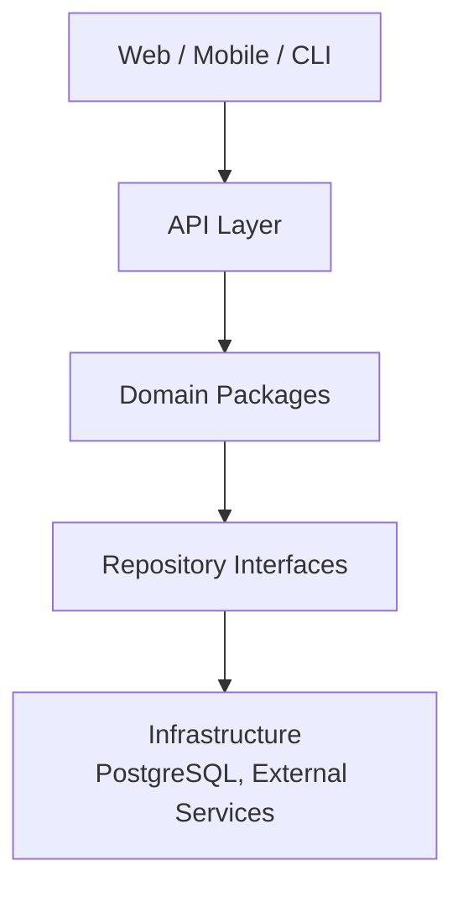

**Diagram sources**
- [ARCHITECTURE.md:33-59](file://docs/architecture/ARCHITECTURE.md#L33-L59)

### System Boundaries and High-Level Interactions
The Docker Compose stack defines clear boundaries:

- **Browser**: Accesses the Web application over HTTPS through a reverse proxy.
- **Web**: Serves the Next.js application and calls the public API URL configured at build/runtime.
- **API**: Exposes REST endpoints, authenticates users, enforces permissions, persists data, and optionally calls the ML service.
- **Worker**: Runs background tasks using the same NestJS application context but exposes only a health endpoint.
- **ML**: Provides CPU-first machine learning features and model operations.
- **PostgreSQL**: Stores all durable application state.

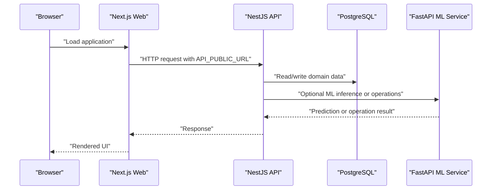

**Diagram sources**
- [compose.yml:10-13](file://compose.yml#L10-L13)
- [compose.yml:41-72](file://compose.yml#L41-L72)
- [compose.yml:120-148](file://compose.yml#L120-L148)
- [compose.yml:150-173](file://compose.yml#L150-L173)
- [apps/api/src/main.ts:11-41](file://apps/api/src/main.ts#L11-L41)
- [apps/ml/app/main.py:82-101](file://apps/ml/app/main.py#L82-L101)

### Deployment Topology
In production:

- The Web image is built with the configured `API_PUBLIC_URL`.
- Published images are pulled from GitHub Container Registry.
- The API waits for the ML service when the ML profile is active, but ML is opt-in and degrades gracefully if unavailable.
- PostgreSQL data and uploaded files are persisted in Docker volumes.

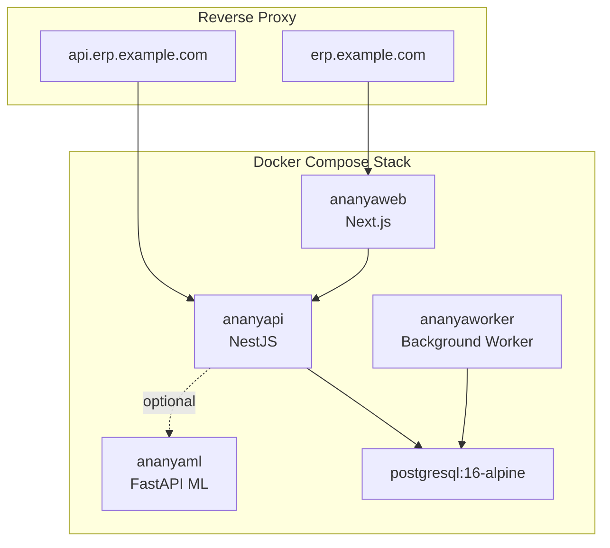

**Diagram sources**
- [README.md:89-101](file://README.md#L89-L101)
- [compose.prod.yml:1-47](file://compose.prod.yml#L1-L47)
- [compose.yml:19-173](file://compose.yml#L19-L173)

**Section sources**
- [ARCHITECTURE.md:17-59](file://docs/architecture/ARCHITECTURE.md#L17-L59)
- [README.md:275-297](file://README.md#L275-L297)
- [compose.yml:1-14](file://compose.yml#L1-L14)
- [compose.prod.yml:1-47](file://compose.prod.yml#L1-L47)

## Detailed Component Analysis

### Web Application
The Web application is a Next.js project that serves the user interface. It depends on workspace packages such as `@ananya/inventory` and includes UI, form, chart, scanner, and domain-specific components. In production, the Web container receives `API_PUBLIC_URL`, which must be a browser-reachable URL rather than an internal Docker service name.

Key responsibilities:
- Rendering pages and layouts.
- Handling client-side state and validation.
- Calling the public API.
- Supporting PWA-related assets and theme providers.

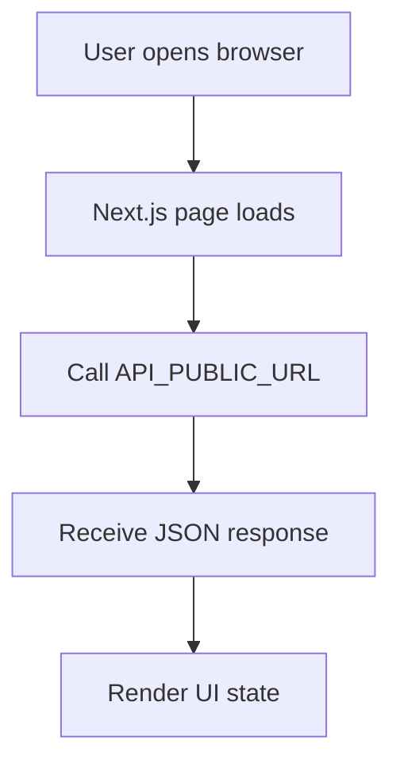

**Diagram sources**
- [apps/web/package.json:1-55](file://apps/web/package.json#L1-L55)
- [compose.yml:120-148](file://compose.yml#L120-L148)

**Section sources**
- [apps/web/package.json:1-55](file://apps/web/package.json#L1-L55)
- [compose.yml:120-148](file://compose.yml#L120-L148)

### NestJS API
The API is the central orchestrator. Its bootstrap sets up CORS, global exception handling, logging, and strict DTO validation. The root module imports many feature modules, indicating a rich set of business domains including inventory, procurement, manufacturing, finance, CRM, service, planning, reporting, and administration.

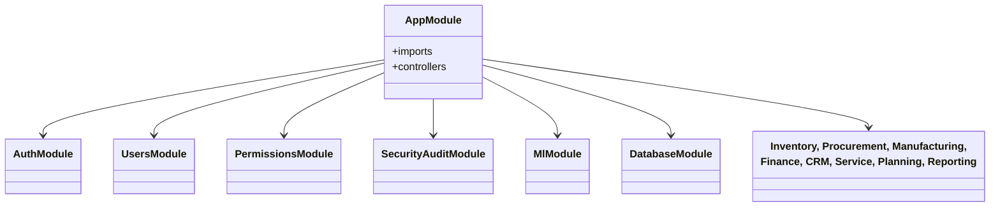

**Diagram sources**
- [apps/api/src/app.module.ts:1-80](file://apps/api/src/app.module.ts#L1-L80)
- [apps/api/src/app.module.ts:82-165](file://apps/api/src/app.module.ts#L82-L165)

Authentication and authorization are implemented through:
- An authentication controller and service.
- Permission guards.
- Role and permission modules.
- Security audit tracking.
- Request-scoped authenticated user information attached during authorization.

Validation occurs at the API boundary using NestJS validation pipes with whitelist enforcement.

**Section sources**
- [apps/api/src/main.ts:11-41](file://apps/api/src/main.ts#L11-L41)
- [apps/api/src/app.module.ts:82-165](file://apps/api/src/app.module.ts#L82-L165)
- [apps/api/src/auth/permission.guard.ts:13-75](file://apps/api/src/auth/permission.guard.ts#L13-L75)

### Background Worker
The Worker is a separate NestJS process that initializes the application context for background processing. It exposes a minimal HTTP server for health checks and runs a periodic interval for background tasks such as notifications, scheduled workflows, and cleanup.

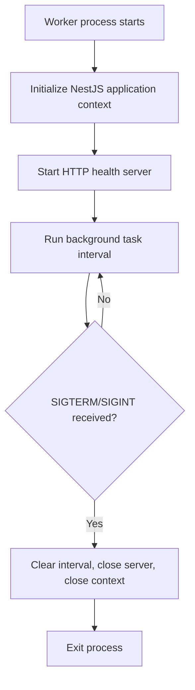

**Diagram sources**
- [apps/api/src/worker.ts:9-72](file://apps/api/src/worker.ts#L9-L72)

**Section sources**
- [apps/api/src/worker.ts:9-72](file://apps/api/src/worker.ts#L9-L72)
- [compose.yml:89-118](file://compose.yml#L89-L118)

### ML Microservice
The ML service is a FastAPI application focused on CPU-first machine learning for component intelligence. It loads lightweight models eagerly and exposes:

- Health and readiness endpoints.
- Category prediction and batch prediction.
- Manufacturer resolution.
- Duplicate detection.
- Datasheet extraction.
- Attribute intelligence endpoints for bindings, category attributes, component attributes, enum values, duplicates, and library audits.
- ML operations endpoints for training runs, model registry, deployment, rollback, reload, and dataset overview.

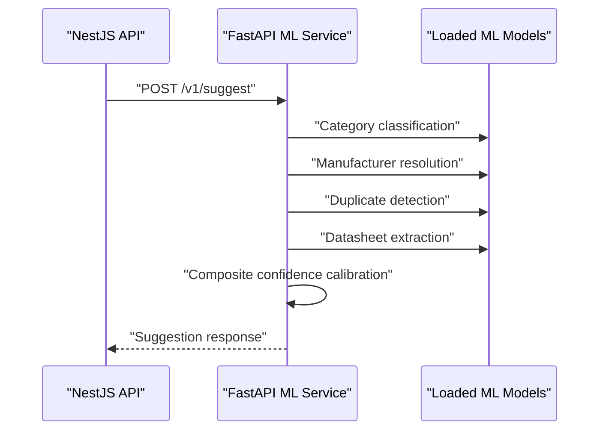

**Diagram sources**
- [apps/ml/app/main.py:154-256](file://apps/ml/app/main.py#L154-L256)
- [apps/ml/app/main.py:60-101](file://apps/ml/app/main.py#L60-L101)

The ML operations endpoints are documented as an internal surface called only by the authenticated NestJS API. They enforce constraints such as exactly one active training run, no automatic promotion, eligibility checks for deployment, and rollback safety.

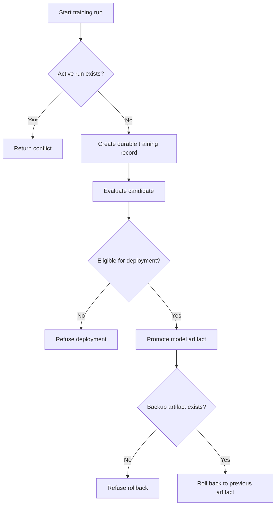

**Diagram sources**
- [apps/ml/app/main.py:363-488](file://apps/ml/app/main.py#L363-L488)

**Section sources**
- [apps/ml/app/main.py:60-101](file://apps/ml/app/main.py#L60-L101)
- [apps/ml/app/main.py:103-256](file://apps/ml/app/main.py#L103-L256)
- [apps/ml/app/main.py:258-488](file://apps/ml/app/main.py#L258-L488)

### PostgreSQL Database
PostgreSQL is the durable storage layer. It is configured through environment variables, uses a named volume for persistence, and includes a health check. The API and Worker connect to it using `DATABASE_URL`. A migration service runs separately to apply schema changes.

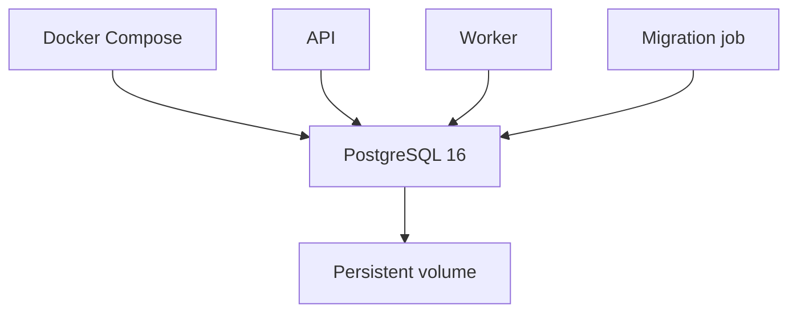

**Diagram sources**
- [compose.yml:19-40](file://compose.yml#L19-L40)
- [compose.yml:74-87](file://compose.yml#L74-L87)
- [compose.yml:89-118](file://compose.yml#L89-L118)

**Section sources**
- [compose.yml:19-40](file://compose.yml#L19-L40)
- [compose.yml:74-87](file://compose.yml#L74-L87)
- [compose.yml:89-118](file://compose.yml#L89-L118)

## Dependency Analysis
The system has clear service-level dependencies:

- The Web depends on the public API URL.
- The API depends on PostgreSQL and optionally on the ML service.
- The Worker depends on PostgreSQL.
- The ML service is optional and can be enabled through Docker profiles.
- The migration job depends on PostgreSQL.

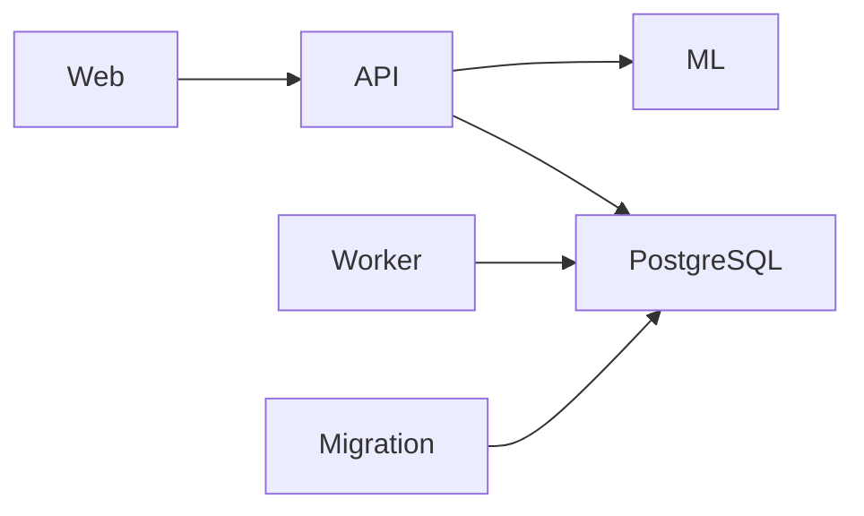

**Diagram sources**
- [compose.yml:41-72](file://compose.yml#L41-L72)
- [compose.yml:74-87](file://compose.yml#L74-L87)
- [compose.yml:89-118](file://compose.yml#L89-L118)
- [compose.yml:120-148](file://compose.yml#L120-L148)
- [compose.yml:150-173](file://compose.yml#L150-L173)

### Module-Level Dependencies Inside the API
The API’s root module imports many feature modules, showing strong cohesion around domain areas and shared cross-cutting concerns:

- Authentication, users, roles, permissions, and security audit.
- Inventory, procurement, manufacturing, warehouse, and planning.
- Finance, CRM, service, projects, and reporting.
- Documents, notifications, settings, preferences, data packs, attributes, and ML.

This structure supports the modular monolith approach: each capability is encapsulated in its own module while remaining part of one NestJS application.

**Section sources**
- [apps/api/src/app.module.ts:1-80](file://apps/api/src/app.module.ts#L1-L80)
- [apps/api/src/app.module.ts:82-165](file://apps/api/src/app.module.ts#L82-L165)

## Performance Considerations
Several aspects influence performance and scalability:

- **Service separation**: Web, API, Worker, ML, and PostgreSQL are isolated containers, allowing independent scaling where appropriate.
- **Optional ML integration**: The ML service is opt-in. When disabled or unavailable, the API degrades gracefully, keeping core functionality operational.
- **Health checks**: All major services expose health endpoints, enabling orchestrators to detect failures and avoid routing traffic to unhealthy instances.
- **Background processing**: The Worker separates long-running or periodic tasks from the request path, reducing API latency.
- **Database persistence**: PostgreSQL data is stored in a named volume, supporting reliable backups and upgrades.
- **Uploads persistence**: Uploaded files are mounted into API and Worker containers through a shared volume.

Scalability considerations include:

- Running multiple API replicas behind a load balancer.
- Scaling the Worker independently based on background workload.
- Enabling the ML service only when intelligent features are needed.
- Using a reverse proxy for HTTPS termination and routing.
- Ensuring `API_PUBLIC_URL` is reachable by browsers, not just internal services.

[No sources needed since this section provides general guidance]

## Troubleshooting Guide
Common operational issues and their likely causes:

| Symptom | Likely Cause | Recommended Action |
|---|---|---|
| PostgreSQL is not healthy | Wrong password, disk space exhaustion, or database not ready | Check `POSTGRES_PASSWORD`, disk space, and database logs |
| Migration fails | Database not healthy or connection misconfiguration | Verify database health and migration command output |
| API is unavailable | Missing JWT secret, database connectivity issue, or CORS misconfiguration | Check API logs, `JWT_SECRET`, database connectivity, and `CORS_ORIGIN` |
| Web is unavailable | Reverse proxy not routing correctly | Confirm reverse proxy routes to `WEB_PORT` |
| Browser cannot call the API | `API_PUBLIC_URL` is not browser-reachable | Use a public URL, not a Docker service name |
| Data Packs fail to install | Migrations did not complete successfully | Check API logs and confirm migrations ran first |

Operational commands include checking service status, viewing logs, backing up PostgreSQL, and backing up uploaded files.

**Section sources**
- [README.md:162-190](file://README.md#L162-L190)
- [README.md:139-160](file://README.md#L139-L160)
- [compose.yml:31-40](file://compose.yml#L31-L40)
- [compose.yml:61-72](file://compose.yml#L61-L72)
- [compose.yml:107-118](file://compose.yml#L107-L118)
- [compose.yml:137-148](file://compose.yml#L137-L148)
- [compose.yml:162-173](file://compose.yml#L162-L173)

## Conclusion
Ananya ERP is a modular monolith with clear architectural boundaries. The Next.js Web application provides the user interface, the NestJS API orchestrates domain logic and persistence, the Worker handles background tasks, the Python ML service provides optional intelligence, and PostgreSQL stores durable state. The Docker Compose stack makes local development and production deployment straightforward, while the domain-first design keeps business logic independent of frameworks and infrastructure.

For future evolution, the existing patterns support gradual decomposition, stronger service-to-service authentication, observability enhancements, and horizontal scaling of stateless services while preserving PostgreSQL as the source of truth.

[No sources needed since this section summarizes without analyzing specific files]