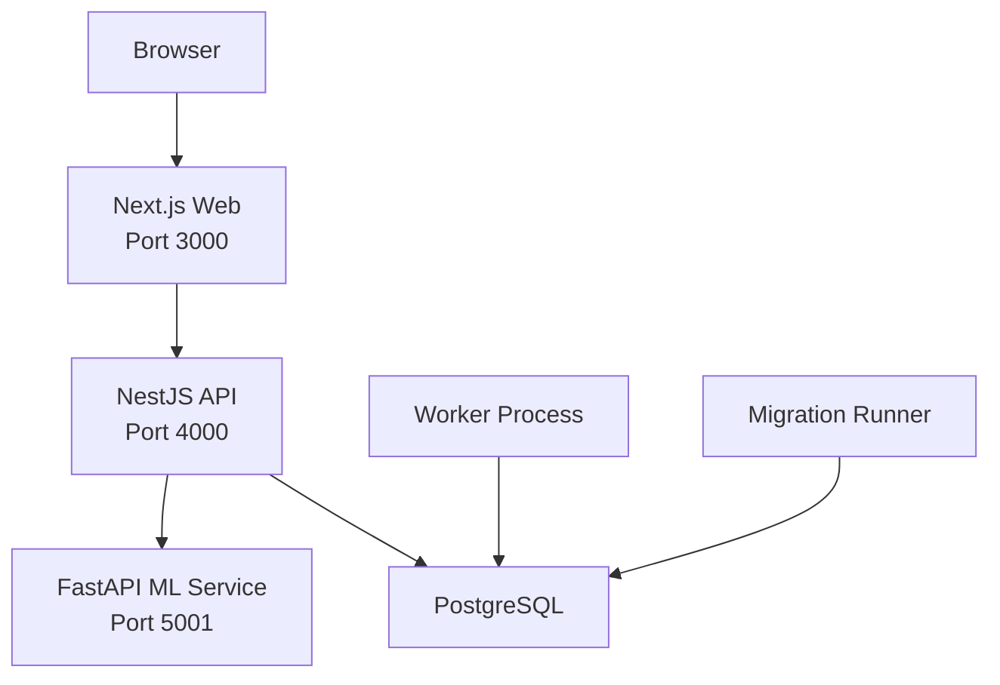
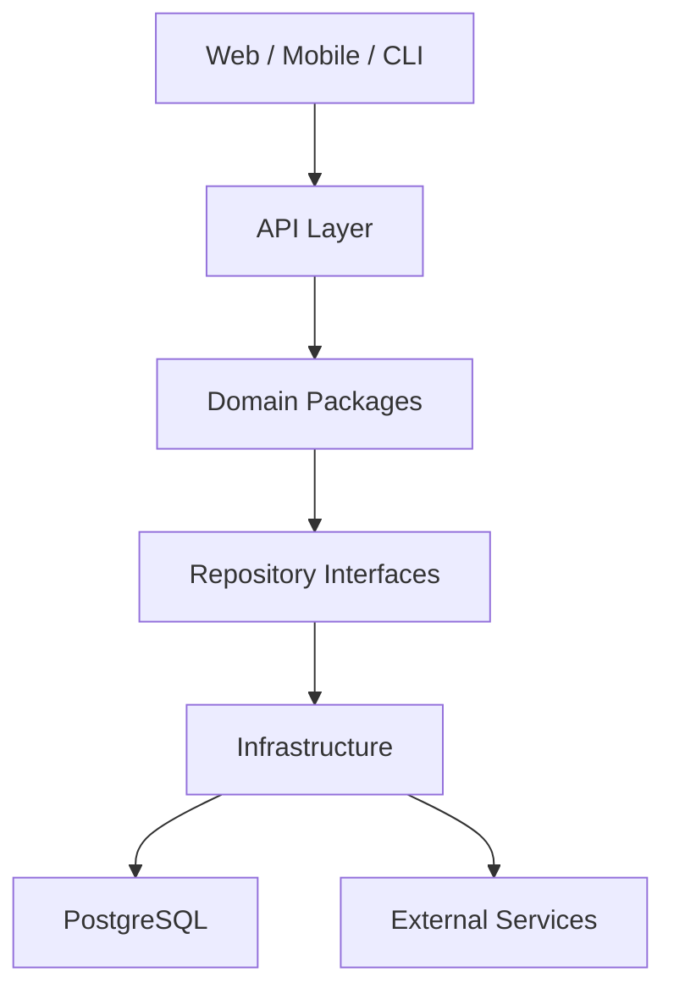
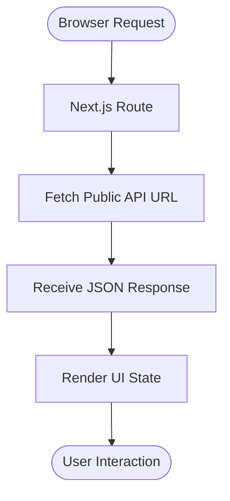
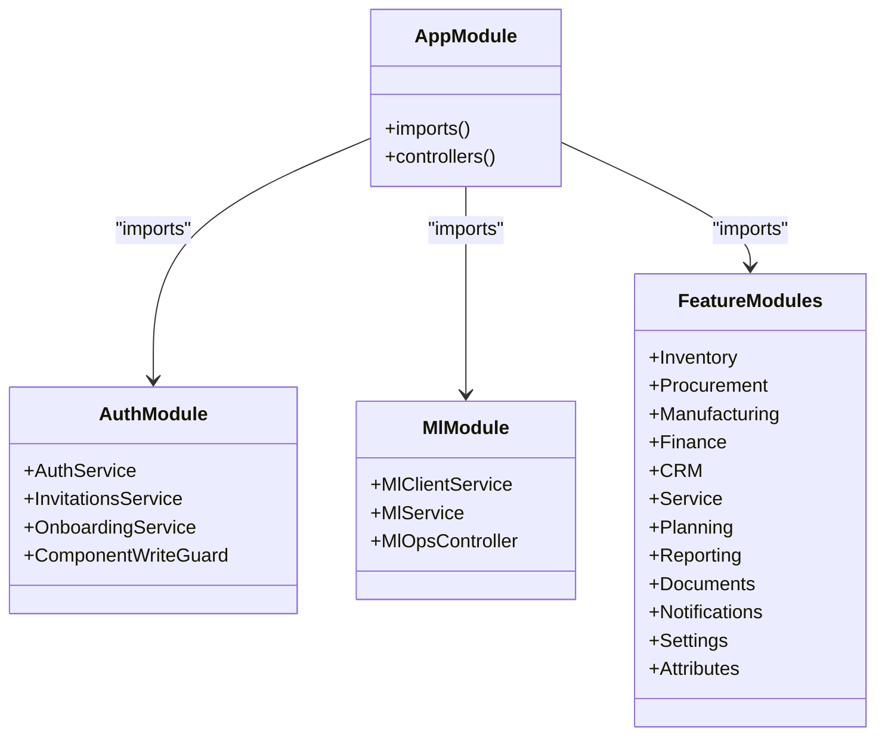
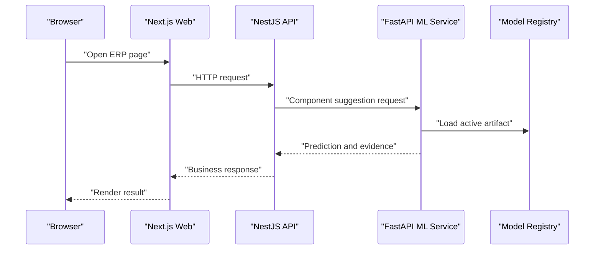
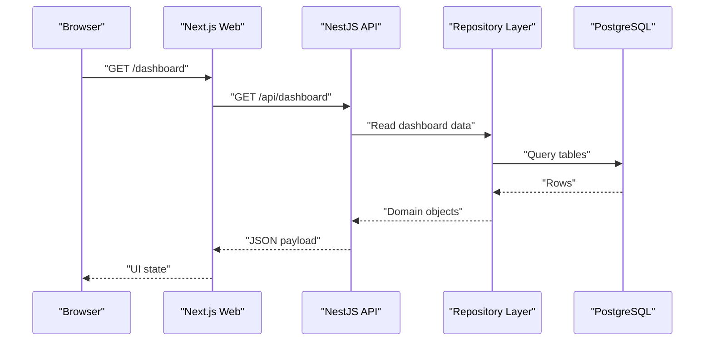
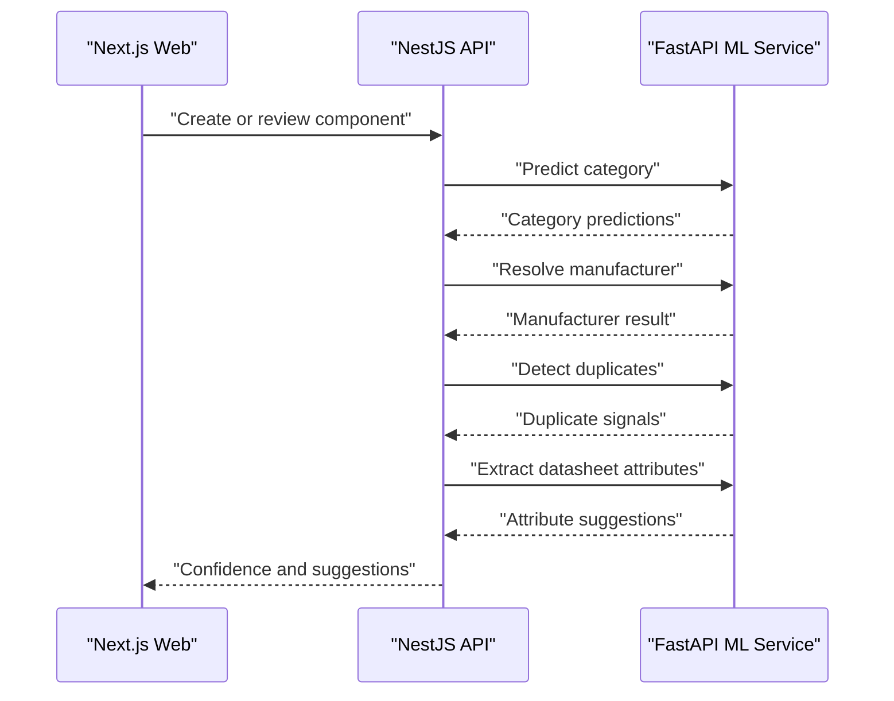
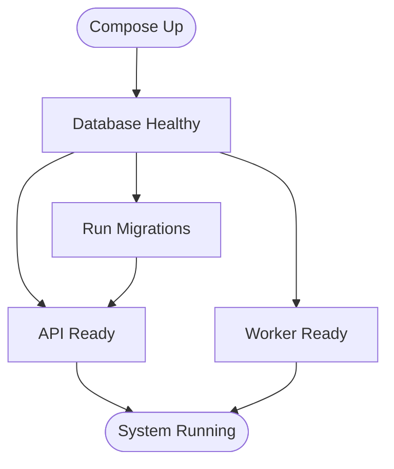
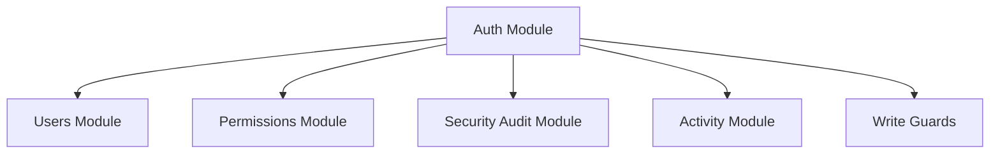
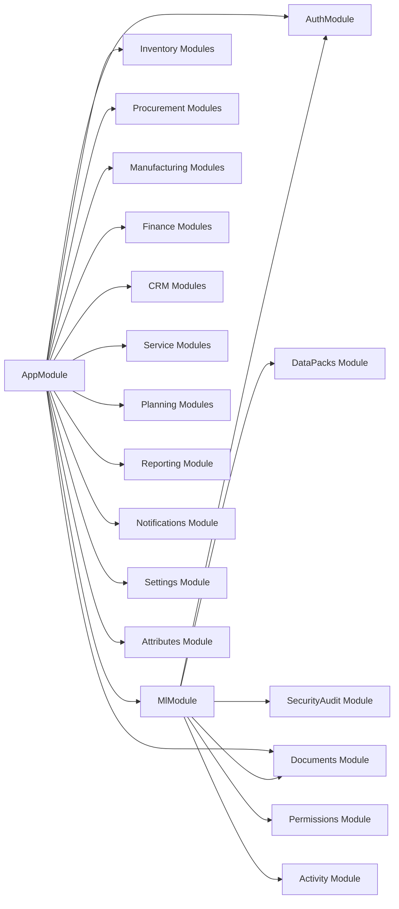

# System Architecture

<cite>
**Referenced Files in This Document**
- [compose.yml](file://compose.yml)
- [compose.local.yml](file://compose.local.yml)
- [compose.prod.yml](file://compose.prod.yml)
- [apps/api/src/main.ts](file://apps/api/src/main.ts)
- [apps/api/src/app.module.ts](file://apps/api/src/app.module.ts)
- [apps/api/src/auth/auth.module.ts](file://apps/api/src/auth/auth.module.ts)
- [apps/api/src/ml/ml.module.ts](file://apps/api/src/ml/ml.module.ts)
- [apps/web/next.config.mjs](file://apps/web/next.config.mjs)
- [docker/Dockerfile.api](file://docker/Dockerfile.api)
- [docker/Dockerfile.web](file://docker/Dockerfile.web)
- [docker/Dockerfile.ml](file://docker/Dockerfile.ml)
- [apps/ml/app/main.py](file://apps/ml/app/main.py)
- [docs/architecture/ARCHITECTURE.md](file://docs/architecture/ARCHITECTURE.md)
</cite>

## Table of Contents
1. [Introduction](#introduction)
2. [Project Structure](#project-structure)
3. [Core Components](#core-components)
4. [Architecture Overview](#architecture-overview)
5. [Detailed Component Analysis](#detailed-component-analysis)
6. [Dependency Analysis](#dependency-analysis)
7. [Performance Considerations](#performance-considerations)
8. [Troubleshooting Guide](#troubleshooting-guide)
9. [Conclusion](#conclusion)

## Introduction
Ananya ERP is a modular monolith enterprise resource planning system that separates frontend, backend API, machine learning microservice, and shared domain packages while remaining deployable as a cohesive stack. The design follows Domain-Driven Design principles: business capabilities are encapsulated in independent modules and domain packages, infrastructure concerns such as databases and external services are isolated behind repository interfaces, and cross-cutting concerns like authentication, validation, logging, and monitoring are applied at the application layer.

The system exposes:
- A Next.js web application for browser-based user interaction.
- A NestJS API server for HTTP endpoints, authorization, orchestration, and persistence.
- A Python FastAPI ML microservice for component intelligence, attribute suggestions, duplicate detection, manufacturer resolution, datasheet extraction, and model operations.
- A PostgreSQL database for durable state.
- Optional worker and migration processes for background jobs and schema management.

This document explains the technology stack, component interactions, data flows, integration patterns, system boundaries, scalability considerations, deployment topology, and how the applications layer, domain packages, and infrastructure components relate to each other.

## Project Structure
At a high level, the repository is organized into:
- `apps/web`: Next.js frontend application.
- `apps/api`: NestJS backend API with feature modules.
- `apps/ml`: Python FastAPI ML service.
- `packages/*`: Shared TypeScript domain and infrastructure packages.
- `docker/*`: Multi-stage Dockerfiles for hardened production images.
- `compose*.yml`: Docker Compose definitions for local, production, and base stack configuration.
- `docs/architecture`: Architectural documentation and RFCs.

**Diagram sources**
- [compose.yml:10-14](file://compose.yml#L10-L14)
- [compose.yml:41-71](file://compose.yml#L41-L71)
- [compose.yml:89-118](file://compose.yml#L89-L118)
- [compose.yml:120-148](file://compose.yml#L120-L148)
- [compose.yml:150-173](file://compose.yml#L150-L173)

**Section sources**
- [compose.yml:1-205](file://compose.yml#L1-L205)
- [compose.local.yml:1-44](file://compose.local.yml#L1-L44)
- [compose.prod.yml:1-47](file://compose.prod.yml#L1-L47)

## Core Components
Ananya’s core runtime consists of four primary services plus supporting processes:

| Component | Technology | Role | Ports | Key Behaviors |
|---|---|---|---:|---|
| Web | Next.js (standalone) | User interface, client-side routing, static assets, PWA support | 3000 | Builds standalone output; configured with public API URL; health endpoint under `/api/health`. |
| API | NestJS | HTTP API, authentication, authorization, domain orchestration, repository access, ML client | 4000 | Global CORS, exception filter, logging interceptor, validation pipe; composes many feature modules. |
| ML | Python FastAPI | Component intelligence, attribute intelligence, duplicate detection, manufacturer resolution, datasheet extraction, training control plane | 5001 | Eagerly loads lightweight models; exposes operational endpoints for training runs and model deployments. |
| Database | PostgreSQL 16 | Durable relational storage | 5432 | Health-checked; accessed by API, worker, and migration runner. |
| Worker | Node.js process | Background job execution | 4001 | Optional profile; health endpoint under `/health`; shares uploads volume with API. |
| Migration | Node.js script | Schema migration runner | N/A | Runs once per deployment or on demand. |

**Section sources**
- [compose.yml:19-205](file://compose.yml#L19-L205)
- [docker/Dockerfile.web:1-89](file://docker/Dockerfile.web#L1-L89)
- [docker/Dockerfile.api:1-93](file://docker/Dockerfile.api#L1-L93)
- [docker/Dockerfile.ml:1-60](file://docker/Dockerfile.ml#L1-L60)

## Architecture Overview
Ananya follows a layered, domain-first modular monolith architecture. The layers are:

1. **Web / Mobile / CLI clients**: Browser-based UI built with Next.js.
2. **API Layer**: NestJS controllers, guards, interceptors, services, and feature modules.
3. **Domain Packages**: Framework-independent business logic, validation, invariants, workflows, and domain errors.
4. **Repository Interfaces**: Contracts used by domain logic.
5. **Infrastructure**: Drizzle-based repositories, PostgreSQL, file storage, and external services such as the ML microservice.

Dependencies point downward. Business rules do not depend on NestJS, Next.js, Drizzle, or PostgreSQL directly. Infrastructure provides implementations for repository interfaces defined by the domain.

**Diagram sources**
- [docs/architecture/ARCHITECTURE.md:33-59](file://docs/architecture/ARCHITECTURE.md#L33-L59)

**Section sources**
- [docs/architecture/ARCHITECTURE.md:1-145](file://docs/architecture/ARCHITECTURE.md#L1-L145)

## Detailed Component Analysis

### Web Application
The Next.js web application is built in standalone mode and served from a hardened container image. It communicates directly with the public API URL rather than internal Docker service names. The build pipeline injects `NEXT_PUBLIC_API_URL` so the browser can reach the API through an externally routable address.

Key characteristics:
- Standalone output for efficient runtime.
- Unoptimized images for container compatibility.
- Service-worker headers for PWA behavior.
- Health check path exposed for container orchestration.

**Diagram sources**
- [apps/web/next.config.mjs:1-30](file://apps/web/next.config.mjs#L1-L30)
- [compose.yml:120-148](file://compose.yml#L120-L148)

**Section sources**
- [apps/web/next.config.mjs:1-30](file://apps/web/next.config.mjs#L1-L30)
- [docker/Dockerfile.web:1-89](file://docker/Dockerfile.web#L1-L89)
- [compose.yml:120-148](file://compose.yml#L120-L148)

### Backend API
The NestJS API is the central orchestrator. Bootstrap configuration enables CORS, global exception filtering, HTTP logging, and strict request validation. The root module imports dozens of feature modules covering inventory, procurement, manufacturing, finance, CRM, service, planning, reporting, documents, notifications, settings, attributes, and ML integration.

Cross-cutting behaviors include:
- CORS origin configuration from environment variables.
- Global exception filter for consistent error handling.
- Logging interceptor for request/response tracing.
- Validation pipe enforcing DTO contracts.

**Diagram sources**
- [apps/api/src/app.module.ts:1-166](file://apps/api/src/app.module.ts#L1-L166)
- [apps/api/src/auth/auth.module.ts:1-34](file://apps/api/src/auth/auth.module.ts#L1-L34)
- [apps/api/src/ml/ml.module.ts:1-104](file://apps/api/src/ml/ml.module.ts#L1-L104)

**Section sources**
- [apps/api/src/main.ts:1-42](file://apps/api/src/main.ts#L1-L42)
- [apps/api/src/app.module.ts:1-166](file://apps/api/src/app.module.ts#L1-L166)
- [apps/api/src/auth/auth.module.ts:1-34](file://apps/api/src/auth/auth.module.ts#L1-L34)

### ML Microservice
The ML microservice is a CPU-first FastAPI application exposing classification, manufacturer resolution, duplicate detection, datasheet extraction, attribute intelligence, and model operations endpoints. Lightweight models are eagerly loaded during startup, and readiness checks report which models are available.

Important operational notes:
- Training control-plane endpoints are intended for internal use by the authenticated NestJS API.
- Deployment safety rules prevent unsafe promotions and enforce evaluation criteria.
- Model registry and dataset snapshots are managed within the service.

**Diagram sources**
- [apps/ml/app/main.py:60-101](file://apps/ml/app/main.py#L60-L101)
- [apps/ml/app/main.py:103-256](file://apps/ml/app/main.py#L103-L256)
- [apps/ml/app/main.py:363-488](file://apps/ml/app/main.py#L363-L488)

**Section sources**
- [apps/ml/app/main.py:1-488](file://apps/ml/app/main.py#L1-L488)
- [docker/Dockerfile.ml:1-60](file://docker/Dockerfile.ml#L1-L60)

### Data Flows and Integration Patterns

#### Web-to-API Flow
The browser requests pages and data from the Next.js application. The web app calls the public API URL configured at build time. The API validates input, enforces authentication and permissions, executes domain logic, persists state through repositories, and returns structured responses.

**Diagram sources**
- [compose.yml:10-14](file://compose.yml#L10-L14)
- [compose.yml:41-71](file://compose.yml#L41-L71)
- [compose.yml:120-148](file://compose.yml#L120-L148)

#### ML-Assisted Component Intelligence Flow
When creating or reviewing components, the API may call the ML service to classify categories, resolve manufacturers, detect duplicates, extract attributes, and compute confidence levels.

**Diagram sources**
- [apps/ml/app/main.py:103-256](file://apps/ml/app/main.py#L103-L256)
- [apps/api/src/ml/ml.module.ts:1-104](file://apps/api/src/ml/ml.module.ts#L1-L104)

#### Worker and Migration Processes
The worker process runs background tasks and shares persistent volumes with the API. The migration runner executes schema migrations against PostgreSQL before or alongside application startup.

**Diagram sources**
- [compose.yml:74-118](file://compose.yml#L74-L118)
- [compose.yml:15-39](file://compose.yml#L15-L39)

**Section sources**
- [compose.yml:74-118](file://compose.yml#L74-L118)

### Authentication, Authorization, and Security Audit
Authentication and authorization are implemented inside the API. The auth module composes user management, permissions, security audit, activity tracking, and write guards. Guards protect sensitive operations, and the security audit module records important actions.

**Diagram sources**
- [apps/api/src/auth/auth.module.ts:1-34](file://apps/api/src/auth/auth.module.ts#L1-L34)

**Section sources**
- [apps/api/src/auth/auth.module.ts:1-34](file://apps/api/src/auth/auth.module.ts#L1-L34)

### Cross-Cutting Concerns
- **CORS**: Configured at bootstrap using environment variables.
- **Validation**: Global validation pipe enforces DTO contracts.
- **Logging**: HTTP logging interceptor captures request lifecycle information.
- **Exception Handling**: Global exception filter standardizes error responses.
- **Health Checks**: Each service defines health endpoints for container orchestration.

**Section sources**
- [apps/api/src/main.ts:11-38](file://apps/api/src/main.ts#L11-L38)
- [compose.yml:61-71](file://compose.yml#L61-L71)
- [compose.yml:107-118](file://compose.yml#L107-L118)
- [compose.yml:137-148](file://compose.yml#L137-L148)
- [compose.yml:162-173](file://compose.yml#L162-L173)

## Dependency Analysis
The NestJS API composes many feature modules and integrates with ML, database, authentication, permissions, documents, and activity tracking. The ML module depends on data packs, security audit, documents, auth, permissions, activity, and ML operations components.

**Diagram sources**
- [apps/api/src/app.module.ts:1-166](file://apps/api/src/app.module.ts#L1-L166)
- [apps/api/src/ml/ml.module.ts:1-104](file://apps/api/src/ml/ml.module.ts#L1-L104)

**Section sources**
- [apps/api/src/app.module.ts:1-166](file://apps/api/src/app.module.ts#L1-L166)
- [apps/api/src/ml/ml.module.ts:1-104](file://apps/api/src/ml/ml.module.ts#L1-L104)

## Performance Considerations
- **Container Hardening**: Multi-stage builds prune source files and test suites, install only production dependencies, and run as non-root users.
- **Standalone Web Build**: Next.js standalone output reduces runtime overhead.
- **ML Model Loading**: Lightweight models are eagerly loaded to reduce first-request latency.
- **Health Probes**: Services expose health endpoints for orchestrators to avoid routing traffic to unhealthy instances.
- **Optional ML Profile**: The ML service can be disabled gracefully; the API remains functional without ML features.

Recommendations:
- Keep ML features opt-in in production unless required.
- Use separate profiles for worker and ML services to scale them independently.
- Monitor ML readiness and API dependency on ML health when enabling the ML profile.
- Ensure `API_PUBLIC_URL` is correctly set for the browser-facing API endpoint.

**Section sources**
- [docker/Dockerfile.api:1-93](file://docker/Dockerfile.api#L1-L93)
- [docker/Dockerfile.web:1-89](file://docker/Dockerfile.web#L1-L89)
- [docker/Dockerfile.ml:1-60](file://docker/Dockerfile.ml#L1-L60)
- [compose.yml:150-173](file://compose.yml#L150-L173)
- [compose.prod.yml:15-19](file://compose.prod.yml#L15-L19)

## Troubleshooting Guide
Common issues and resolutions:

| Symptom | Likely Cause | Resolution |
|---|---|---|
| Browser cannot reach API | `API_PUBLIC_URL` points to internal Docker hostname | Set `API_PUBLIC_URL` to a browser-routable URL. |
| API fails CORS errors | Missing or incorrect `CORS_ORIGIN` | Configure `CORS_ORIGIN` to allow the web origin. |
| ML features unavailable | ML service not started or unhealthy | Start ML profile and verify `/ready` endpoint. |
| Worker not running | Worker profile not enabled | Run compose with worker profile or all profile. |
| Migrations fail | Database not healthy or connection misconfigured | Verify PostgreSQL health and `DATABASE_URL`. |
| Web health check fails | Next.js server not ready | Check standalone build output and port exposure. |

Operational checks:
- Verify API health at `/health`.
- Verify worker health at `/health`.
- Verify web health at `/api/health`.
- Verify ML health at `/health` and readiness at `/ready`.

**Section sources**
- [compose.yml:41-71](file://compose.yml#L41-L71)
- [compose.yml:89-118](file://compose.yml#L89-L118)
- [compose.yml:120-148](file://compose.yml#L120-L148)
- [compose.yml:150-173](file://compose.yml#L150-L173)
- [apps/api/src/main.ts:14-38](file://apps/api/src/main.ts#L14-L38)

## Conclusion
Ananya ERP uses a modular monolith architecture grounded in Domain-Driven Design. The Next.js web application interacts with a NestJS API that orchestrates domain logic, persistence, and optional ML-assisted intelligence. The ML microservice provides specialized CPU-first capabilities and a controlled training and deployment surface. PostgreSQL stores durable state, while worker and migration processes extend operational capability. The Docker Compose stack defines clear system boundaries, health checks, and deployment profiles, enabling scalable, maintainable, and secure operation across development and production environments.