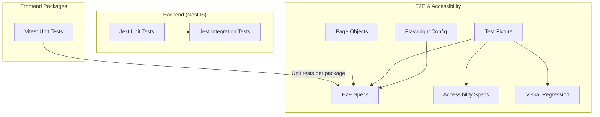
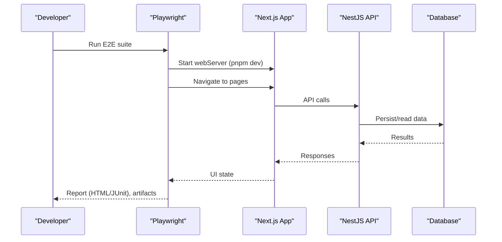
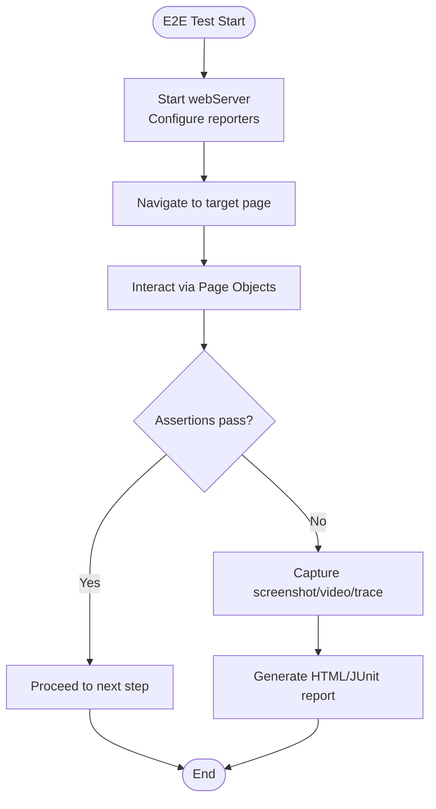
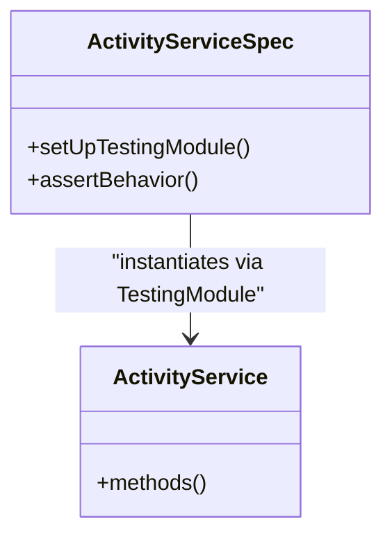
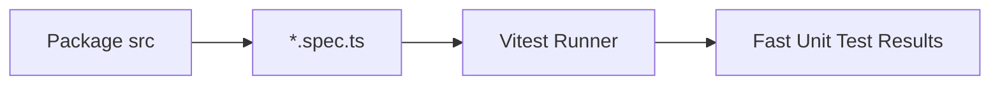
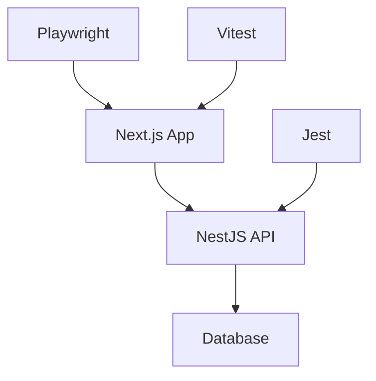

# Testing Strategy

<cite>
**Referenced Files in This Document**
- [playwright.config.ts](file://playwright.config.ts)
- [test.fixture.ts](file://tests/fixtures/test.fixture.ts)
- [LoginPage.ts](file://tests/page-objects/LoginPage.ts)
- [login.spec.ts](file://tests/e2e/authentication/login.spec.ts)
- [auth-state-machine.spec.ts](file://tests/e2e/auth-state-machine.spec.ts)
- [accessibility.spec.ts](file://tests/accessibility/accessibility.spec.ts)
- [visual-regression.spec.ts](file://tests/e2e/visual-regression.spec.ts)
- [jest-e2e.json](file://apps/api/test/jest-e2e.json)
- [package.json (API)](file://apps/api/package.json)
- [activity.service.spec.ts](file://apps/api/src/activity/activity.service.spec.ts)
- [vitest.config.ts (packages/core)](file://packages/core/vitest.config.ts)
- [testing.md](file://docs/testing.md)
- [TESTING.md](file://docs/development/TESTING.md)
</cite>

## Table of Contents
1. Introduction
2. Project Structure
3. Core Components
4. Architecture Overview
5. Detailed Component Analysis
6. Dependency Analysis
7. Performance Considerations
8. Troubleshooting Guide
9. Conclusion
10. Appendices

## Introduction
This document defines the comprehensive testing strategy for Ananya ERP across unit, integration, end-to-end (E2E), and accessibility testing. It explains how Playwright is used for E2E tests, Vitest for frontend package unit tests, and Jest for backend unit and integration tests. It also covers test data management, mocking strategies, CI considerations, performance and visual regression testing, and guidance for maintenance, debugging, and improving coverage.

## Project Structure
The testing setup spans multiple layers:
- E2E and accessibility tests are centralized under tests/ with a shared fixture and page objects.
- Backend unit and integration tests live within apps/api using Jest.
- Frontend packages use Vitest for fast unit tests.
- Documentation outlines running commands and architecture.

**Diagram sources**
- [playwright.config.ts:1-51](file://playwright.config.ts#L1-L51)
- [test.fixture.ts:1-44](file://tests/fixtures/test.fixture.ts#L1-L44)
- [LoginPage.ts:1-37](file://tests/page-objects/LoginPage.ts#L1-L37)
- [login.spec.ts:1-64](file://tests/e2e/authentication/login.spec.ts#L1-L64)
- [accessibility.spec.ts:1-23](file://tests/accessibility/accessibility.spec.ts#L1-L23)
- [visual-regression.spec.ts:1-22](file://tests/e2e/visual-regression.spec.ts#L1-L22)
- [jest-e2e.json:1-11](file://apps/api/test/jest-e2e.json#L1-L11)
- [package.json (API):1-86](file://apps/api/package.json#L1-L86)
- [vitest.config.ts (packages/core):1-7](file://packages/core/vitest.config.ts#L1-L7)

**Section sources**
- [playwright.config.ts:1-51](file://playwright.config.ts#L1-L51)
- [testing.md:1-74](file://docs/testing.md#L1-L74)
- [TESTING.md:1-38](file://docs/development/TESTING.md#L1-L38)

## Core Components
- Playwright E2E framework:
  - Multi-browser projects (Chromium, Firefox, WebKit, Mobile Chrome, Mobile Safari).
  - Automatic web server startup via dev command.
  - Reports: HTML, JUnit XML; screenshots and video on failure; traces on first retry.
- Shared fixtures and Page Object Model:
  - Centralized test fixture extends base Playwright test with reusable page objects.
  - Global console error and unhandled exception listeners to fail fast.
- Jest backend testing:
  - Unit tests co-located with source as .spec.ts files.
  - Integration tests configured via a dedicated Jest config targeting integration specs.
- Vitest frontend unit tests:
  - Per-package configuration including src/**/*.spec.ts.

Practical examples:
- API endpoint tests: Use NestJS TestingModule to instantiate services and assert behavior without starting the full HTTP stack. See example service spec path.
- React component tests: Use Vitest with your preferred React testing utilities in package-level spec files.
- Business logic tests: Isolate pure functions or domain logic in unit specs under packages/*/src with Vitest.

**Section sources**
- [playwright.config.ts:1-51](file://playwright.config.ts#L1-L51)
- [test.fixture.ts:1-44](file://tests/fixtures/test.fixture.ts#L1-L44)
- [package.json (API):1-86](file://apps/api/package.json#L1-L86)
- [jest-e2e.json:1-11](file://apps/api/test/jest-e2e.json#L1-L11)
- [vitest.config.ts (packages/core):1-7](file://packages/core/vitest.config.ts#L1-L7)
- [activity.service.spec.ts:1-19](file://apps/api/src/activity/activity.service.spec.ts#L1-L19)

## Architecture Overview
The testing architecture integrates three layers:
- Unit tests validate isolated logic quickly.
- Integration tests verify interactions between modules and external boundaries.
- E2E and accessibility tests validate user flows and compliance.

**Diagram sources**
- [playwright.config.ts:44-49](file://playwright.config.ts#L44-L49)
- [login.spec.ts:1-64](file://tests/e2e/authentication/login.spec.ts#L1-L64)

## Detailed Component Analysis

### E2E Test Suite (Playwright)
- Configuration:
  - testDir set to ./tests.
  - Parallel execution enabled; retries and workers tuned for CI.
  - Reporter outputs HTML and JUnit XML; artifacts captured on failures.
  - Projects define desktop and mobile browsers.
  - webServer starts the dev server and waits for readiness.
- Fixtures and Page Objects:
  - Custom test fixture injects page objects (Login, Dashboard, Components, Settings).
  - Global error capture ensures tests fail on runtime errors.
- Example flows:
  - Authentication and security bounds: login page rendering, invalid credentials, redirects, session persistence.
  - Onboarding state machine: create organization flow auto-authenticates and navigates to dashboard.
  - Visual regression: screenshot comparisons with tolerance thresholds.
  - Accessibility: WCAG audits using axe-core.

**Diagram sources**
- [playwright.config.ts:1-51](file://playwright.config.ts#L1-L51)
- [test.fixture.ts:1-44](file://tests/fixtures/test.fixture.ts#L1-L44)
- [login.spec.ts:1-64](file://tests/e2e/authentication/login.spec.ts#L1-L64)
- [auth-state-machine.spec.ts:1-42](file://tests/e2e/auth-state-machine.spec.ts#L1-L42)
- [visual-regression.spec.ts:1-22](file://tests/e2e/visual-regression.spec.ts#L1-L22)
- [accessibility.spec.ts:1-23](file://tests/accessibility/accessibility.spec.ts#L1-L23)

**Section sources**
- [playwright.config.ts:1-51](file://playwright.config.ts#L1-L51)
- [test.fixture.ts:1-44](file://tests/fixtures/test.fixture.ts#L1-L44)
- [LoginPage.ts:1-37](file://tests/page-objects/LoginPage.ts#L1-L37)
- [login.spec.ts:1-64](file://tests/e2e/authentication/login.spec.ts#L1-L64)
- [auth-state-machine.spec.ts:1-42](file://tests/e2e/auth-state-machine.spec.ts#L1-L42)
- [visual-regression.spec.ts:1-22](file://tests/e2e/visual-regression.spec.ts#L1-L22)
- [accessibility.spec.ts:1-23](file://tests/accessibility/accessibility.spec.ts#L1-L23)

### Backend Unit and Integration Tests (Jest)
- Unit tests:
  - Co-located .spec.ts files alongside services/controllers.
  - Use NestJS TestingModule to construct providers and assert service behavior.
- Integration tests:
  - Dedicated Jest config targets integration specs under test/integration.
  - Node environment with ts-jest transformation.
- Coverage:
  - Coverage collection configured in API package JSON.

**Diagram sources**
- [activity.service.spec.ts:1-19](file://apps/api/src/activity/activity.service.spec.ts#L1-L19)
- [package.json (API):68-84](file://apps/api/package.json#L68-L84)
- [jest-e2e.json:1-11](file://apps/api/test/jest-e2e.json#L1-L11)

**Section sources**
- [package.json (API):1-86](file://apps/api/package.json#L1-L86)
- [jest-e2e.json:1-11](file://apps/api/test/jest-e2e.json#L1-L11)
- [activity.service.spec.ts:1-19](file://apps/api/src/activity/activity.service.spec.ts#L1-L19)

### Frontend Package Unit Tests (Vitest)
- Each package includes a vitest.config.ts that includes src/**/*.spec.ts.
- Ideal for testing pure business logic, formatters, utilities, and small components in isolation.

**Diagram sources**
- [vitest.config.ts (packages/core):1-7](file://packages/core/vitest.config.ts#L1-L7)

**Section sources**
- [vitest.config.ts (packages/core):1-7](file://packages/core/vitest.config.ts#L1-L7)

## Dependency Analysis
- E2E depends on:
  - Playwright configuration for browser projects and web server lifecycle.
  - Shared fixtures and page objects for consistent interactions.
- Backend tests depend on:
  - NestJS testing utilities and ts-jest for TypeScript support.
  - Integration config for end-to-end-like API tests.
- Frontend unit tests depend on:
  - Vitest configuration per package.

**Diagram sources**
- [playwright.config.ts:44-49](file://playwright.config.ts#L44-L49)
- [package.json (API):68-84](file://apps/api/package.json#L68-L84)
- [vitest.config.ts (packages/core):1-7](file://packages/core/vitest.config.ts#L1-L7)

**Section sources**
- [playwright.config.ts:1-51](file://playwright.config.ts#L1-L51)
- [package.json (API):1-86](file://apps/api/package.json#L1-L86)
- [vitest.config.ts (packages/core):1-7](file://packages/core/vitest.config.ts#L1-L7)

## Performance Considerations
- E2E performance:
  - Parallel execution enabled; workers limited in CI to reduce flakiness.
  - Retries configured for transient failures.
  - Artifacts only on failure to minimize overhead.
- Backend tests:
  - Unit tests run in-process with minimal setup for speed.
  - Integration tests have increased timeout to accommodate real interactions.
- Frontend unit tests:
  - Vitest provides fast execution for large numbers of specs.

[No sources needed since this section provides general guidance]

## Troubleshooting Guide
- E2E failures:
  - Inspect HTML reports and JUnit XML output generated by Playwright.
  - Review screenshots and videos captured on failure.
  - Use traces on first retry to diagnose timing issues.
- Runtime errors:
  - The shared fixture captures console errors and unhandled exceptions, failing tests immediately.
- Debugging tips:
  - Run headed mode to observe steps visually.
  - Use interactive UI mode for step-through debugging.
  - Narrow scope to specific suites or files.

**Section sources**
- [playwright.config.ts:5-18](file://playwright.config.ts#L5-L18)
- [test.fixture.ts:29-41](file://tests/fixtures/test.fixture.ts#L29-L41)
- [testing.md:40-63](file://docs/testing.md#L40-L63)

## Conclusion
Ananya ERP employs a layered testing strategy:
- Fast unit tests with Vitest for frontend packages and Jest for backend services.
- Robust integration tests with Jest for API boundaries.
- Comprehensive E2E and accessibility tests with Playwright covering critical user journeys, cross-browser compatibility, and WCAG compliance.
- Visual regression tests ensure UI stability over time.
Adhering to these practices will improve reliability, maintainability, and confidence in releases.

[No sources needed since this section summarizes without analyzing specific files]

## Appendices

### Running Tests Locally
- E2E and accessibility:
  - Use documented commands to run all E2E tests, UI mode, headed mode, debug mode, accessibility audits, and visual regression.
- Backend:
  - Unit tests: npm script provided in API package.
  - Integration tests: separate Jest config for integration specs.

**Section sources**
- [testing.md:40-63](file://docs/testing.md#L40-L63)
- [package.json (API):8-19](file://apps/api/package.json#L8-L19)

### Test Data Management and Mocking Strategies
- E2E:
  - Use page objects to encapsulate locators and actions.
  - Rely on the running application state; avoid hardcoding sensitive data.
- Backend:
  - Use NestJS TestingModule to isolate services and mock dependencies where necessary.
- Frontend:
  - Leverage Vitest’s module mocking capabilities to stub APIs and utilities.

**Section sources**
- [LoginPage.ts:1-37](file://tests/page-objects/LoginPage.ts#L1-L37)
- [activity.service.spec.ts:1-19](file://apps/api/src/activity/activity.service.spec.ts#L1-L19)
- [vitest.config.ts (packages/core):1-7](file://packages/core/vitest.config.ts#L1-L7)

### Continuous Integration Testing
- Playwright:
  - CI-specific settings: forbidOnly enabled, retries, single worker, JUnit XML reporter for CI consumption.
- Backend:
  - Ensure type checks, linting, build, and tests pass before merging.

**Section sources**
- [playwright.config.ts:5-12](file://playwright.config.ts#L5-L12)
- [TESTING.md:5-13](file://docs/development/TESTING.md#L5-L13)

### Improving Test Coverage
- Backend:
  - Coverage collection is configured; run coverage scripts to identify gaps.
- Frontend:
  - Add Vitest-based unit tests for new features and refactorings.
- E2E:
  - Expand coverage for critical user journeys and edge cases.

**Section sources**
- [package.json (API):68-84](file://apps/api/package.json#L68-L84)