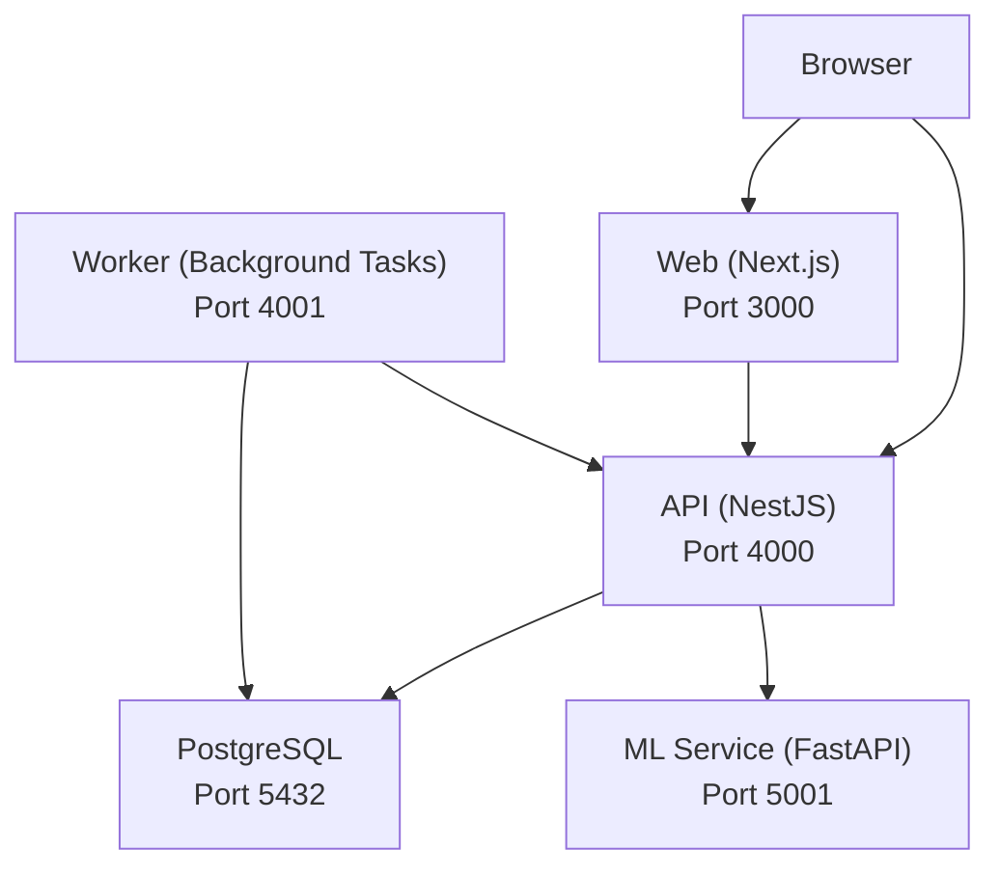
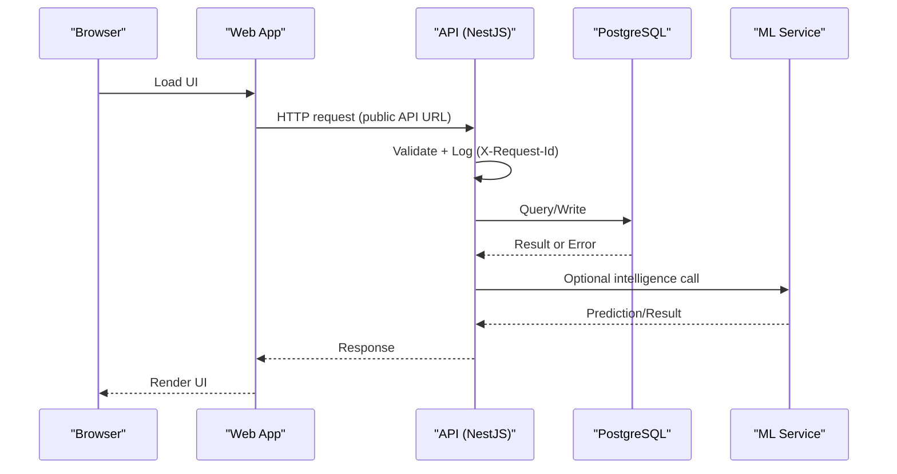
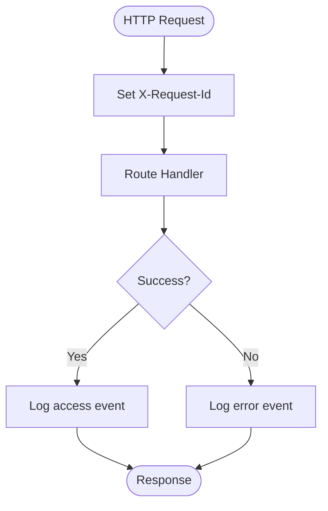
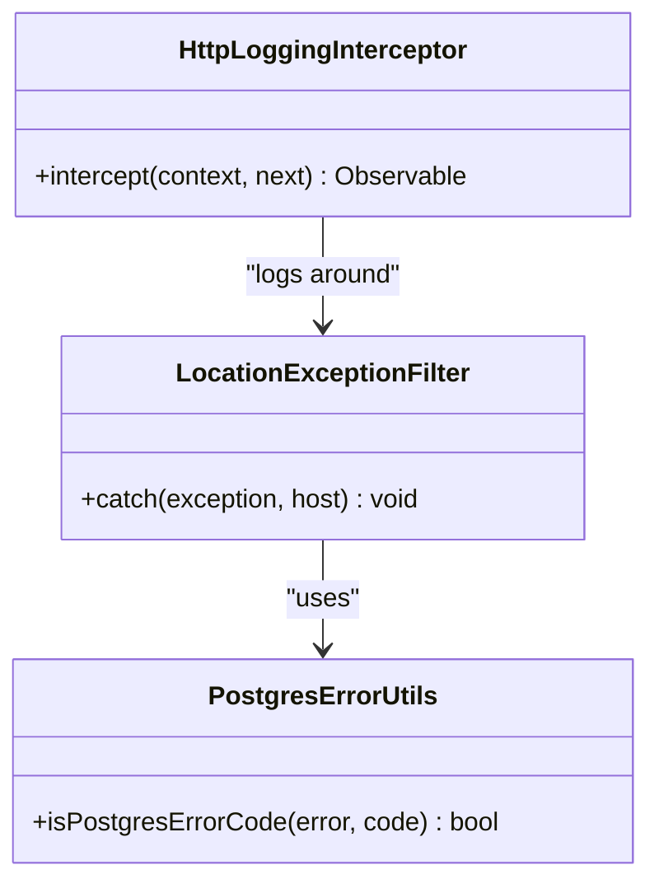
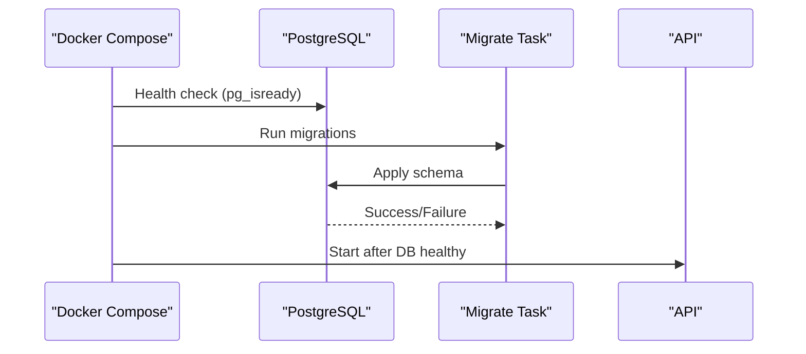
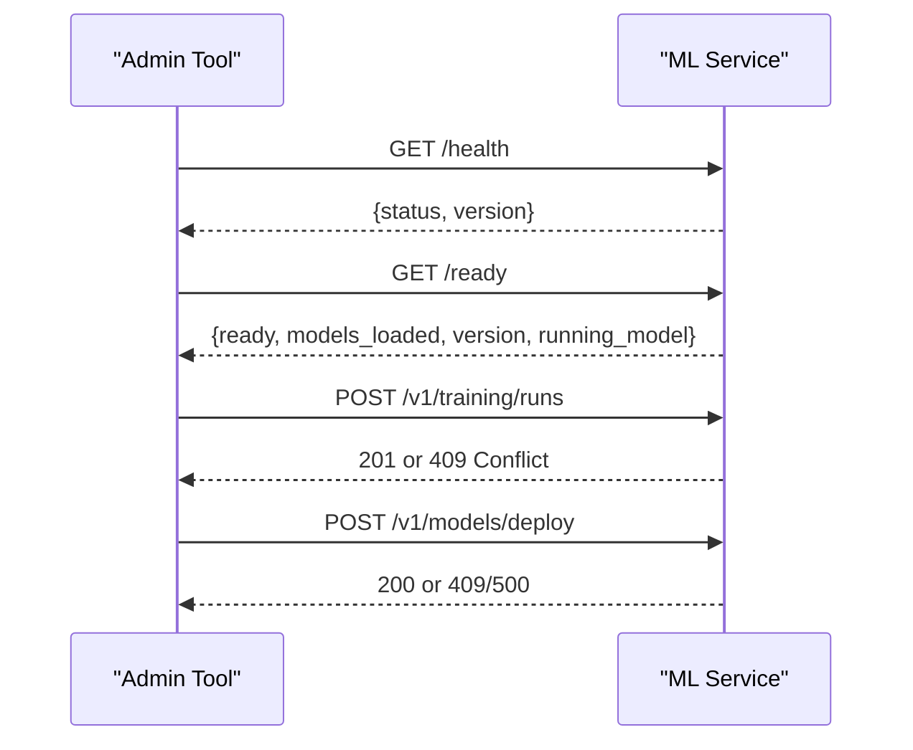
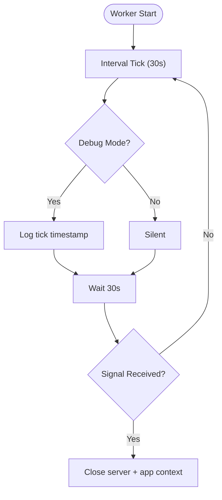
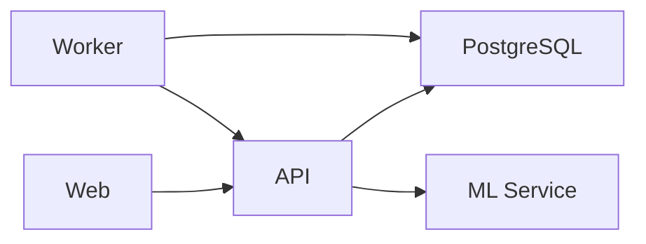

# Troubleshooting & FAQ

<cite>
**Referenced Files in This Document**
- [README.md](file://README.md)
- [compose.yml](file://compose.yml)
- [main.ts](file://apps/api/src/main.ts)
- [http-logging.interceptor.ts](file://apps/api/src/common/logging/http-logging.interceptor.ts)
- [location-exception.filter.ts](file://apps/api/src/locations/location-exception.filter.ts)
- [postgres-error.ts](file://apps/api/src/common/utils/postgres-error.ts)
- [database.module.ts](file://apps/api/src/database/database.module.ts)
- [migrate.ts](file://packages/database/src/setup/migrate.ts)
- [main.py](file://apps/ml/app/main.py)
- [worker.ts](file://apps/api/src/worker.ts)
- [apply-timeout.ts](file://apps/api/src/ml/intelligence-findings/apply-timeout.ts)
- [profiling.py](file://apps/ml/training/utils/profiling.py)
</cite>

## Table of Contents
1. Introduction
2. Project Structure
3. Core Components
4. Architecture Overview
5. Detailed Component Analysis
6. Dependency Analysis
7. Performance Considerations
8. Troubleshooting Guide
9. Conclusion
10. Appendices

## Introduction
This document provides a comprehensive troubleshooting and FAQ guide for Ananya ERP. It focuses on diagnosing and resolving common issues across installation, database connectivity, API errors, frontend issues, and performance problems. It also includes log analysis techniques, debugging tools per component (API, frontend, ML service, database), known limitations, workarounds, upgrade considerations, and capacity planning guidance.

## Project Structure
Ananya is composed of:
- Web (Next.js) served by the web container
- API (NestJS) served by the api container
- Worker (background tasks) served by the worker container
- ML Service (FastAPI) served by the ml container
- PostgreSQL database
- Migrations executed via a dedicated migrate task

The compose stack defines health checks, environment variables, ports, and dependencies between services. The README provides setup, update, backup, and troubleshooting commands.

**Diagram sources**
- [compose.yml:18-173](file://compose.yml#L18-L173)
- [README.md:275-297](file://README.md#L275-L297)

**Section sources**
- [compose.yml:18-173](file://compose.yml#L18-L173)
- [README.md:275-297](file://README.md#L275-L297)

## Core Components
- API bootstrap configures CORS, global exception filters, logging interceptor, validation pipes, and listens on a configurable port.
- ML service exposes health/readiness endpoints and model training/deployment endpoints; it eagerly loads models at startup.
- Database module exposes Drizzle connection and pool to the NestJS app.
- Migration runner applies schema migrations from the drizzle folder.
- Worker runs periodic background tasks with graceful shutdown handling.

**Section sources**
- [main.ts:11-41](file://apps/api/src/main.ts#L11-L41)
- [main.py:60-101](file://apps/ml/app/main.py#L60-L101)
- [database.module.ts:1-19](file://apps/api/src/database/database.module.ts#L1-L19)
- [migrate.ts:5-21](file://packages/database/src/setup/migrate.ts#L5-L21)
- [worker.ts:44-72](file://apps/api/src/worker.ts#L44-L72)

## Architecture Overview
The request flow typically goes:
- Browser calls Web or API directly over HTTPS via reverse proxy.
- Web calls API using the configured public API URL.
- API processes requests, validates input, logs access/errors, and interacts with PostgreSQL and optionally the ML service.
- Worker performs background jobs and uses the same application context as the API.

**Diagram sources**
- [main.ts:14-36](file://apps/api/src/main.ts#L14-L36)
- [http-logging.interceptor.ts:29-73](file://apps/api/src/common/logging/http-logging.interceptor.ts#L29-L73)
- [main.py:82-101](file://apps/ml/app/main.py#L82-L101)
- [compose.yml:41-73](file://compose.yml#L41-L73)

## Detailed Component Analysis

### API Logging and Request Tracking
- Every request receives an X-Request-Id header (from client or generated).
- Access logs include method, route, status code, duration, IP, user agent, and connection state.
- Errors are logged with name, message, stack, and status when enabled.
- Global validation pipe whitelists and transforms inputs.

**Diagram sources**
- [http-logging.interceptor.ts:29-73](file://apps/api/src/common/logging/http-logging.interceptor.ts#L29-L73)
- [http-logging.interceptor.ts:75-149](file://apps/api/src/common/logging/http-logging.interceptor.ts#L75-L149)

**Section sources**
- [main.ts:14-36](file://apps/api/src/main.ts#L14-L36)
- [http-logging.interceptor.ts:29-73](file://apps/api/src/common/logging/http-logging.interceptor.ts#L29-L73)
- [http-logging.interceptor.ts:75-149](file://apps/api/src/common/logging/http-logging.interceptor.ts#L75-L149)

### Exception Handling and Domain Errors
- Global location exception filter maps domain errors and Postgres foreign key violations to appropriate HTTP statuses and messages.
- Production order exception filter handles business rule violations with consistent error responses.

**Diagram sources**
- [location-exception.filter.ts:23-78](file://apps/api/src/locations/location-exception.filter.ts#L23-L78)
- [postgres-error.ts:34-48](file://apps/api/src/common/utils/postgres-error.ts#L34-L48)
- [http-logging.interceptor.ts:29-73](file://apps/api/src/common/logging/http-logging.interceptor.ts#L29-L73)

**Section sources**
- [location-exception.filter.ts:23-78](file://apps/api/src/locations/location-exception.filter.ts#L23-L78)
- [postgres-error.ts:34-48](file://apps/api/src/common/utils/postgres-error.ts#L34-L48)

### Database Connectivity and Migrations
- Database module exposes Drizzle db and pool to the API.
- Migration runner executes migrations from the drizzle directory and exits with non-zero status on failure.
- Compose ensures API depends on healthy DB before starting.

**Diagram sources**
- [compose.yml:19-40](file://compose.yml#L19-L40)
- [compose.yml:41-73](file://compose.yml#L41-L73)
- [migrate.ts:5-21](file://packages/database/src/setup/migrate.ts#L5-L21)

**Section sources**
- [database.module.ts:1-19](file://apps/api/src/database/database.module.ts#L1-L19)
- [migrate.ts:5-21](file://packages/database/src/setup/migrate.ts#L5-L21)
- [compose.yml:19-73](file://compose.yml#L19-L73)

### ML Service Diagnostics
- Health endpoint returns status and version.
- Readiness endpoint reports which models are loaded and their artifacts.
- Training run endpoints manage lifecycle with conflict and not-found handling.
- Model deployment and rollback endpoints enforce safety constraints.

**Diagram sources**
- [main.py:82-101](file://apps/ml/app/main.py#L82-L101)
- [main.py:383-458](file://apps/ml/app/main.py#L383-L458)

**Section sources**
- [main.py:60-101](file://apps/ml/app/main.py#L60-L101)
- [main.py:383-458](file://apps/ml/app/main.py#L383-L458)

### Worker Background Tasks
- Worker runs periodic checks and supports graceful shutdown on SIGTERM/SIGINT.
- Debug mode can emit verbose tick logs.

**Diagram sources**
- [worker.ts:44-72](file://apps/api/src/worker.ts#L44-L72)

**Section sources**
- [worker.ts:44-72](file://apps/api/src/worker.ts#L44-L72)

## Dependency Analysis
- API depends on PostgreSQL and optionally ML service.
- Web depends on API via public URL.
- Worker depends on PostgreSQL and reuses API context.
- ML service is independent but called by API for intelligence features.

**Diagram sources**
- [compose.yml:41-173](file://compose.yml#L41-L173)

**Section sources**
- [compose.yml:41-173](file://compose.yml#L41-L173)

## Performance Considerations
- API access logging captures durationMs per request; use this to identify slow routes.
- ML service execution time is included in suggest responses; monitor for latency spikes.
- ML profiling can be enabled via environment variable to collect stage-level metrics during training.
- Database statement and lock timeouts can be applied per transaction to prevent long-running queries.

Recommendations:
- Enable HTTP access logging in production to track response times and error rates.
- Use ML readiness checks to ensure models are loaded before routing traffic.
- Tune worker concurrency and intervals based on workload.
- Monitor database pool usage and query durations; adjust timeouts where necessary.

[No sources needed since this section provides general guidance]

## Troubleshooting Guide

### Installation Issues
Symptoms:
- PostgreSQL not healthy
- Migration fails
- API unavailable
- Web unavailable
- Browser cannot call API
- Data Packs fail to install

Diagnostic steps:
- Check service status and logs for all containers.
- Verify environment variables: POSTGRES_DB, POSTGRES_USER, POSTGRES_PASSWORD, JWT_SECRET, CORS_ORIGIN, API_PUBLIC_URL, WEB_PORT, API_PORT, WORKER_PORT.
- Ensure reverse proxy routes correctly to exposed ports.
- Confirm API_PUBLIC_URL is publicly reachable by the browser.

Resolution procedures:
- Fix PostgreSQL credentials or disk space issues if DB health fails.
- Re-run migrations and inspect migration output for errors.
- Restart services after correcting configuration.
- Install Data Packs after migrations succeed.

**Section sources**
- [README.md:162-190](file://README.md#L162-L190)
- [compose.yml:19-73](file://compose.yml#L19-L73)

### Database Connectivity Problems
Symptoms:
- API cannot connect to PostgreSQL
- Migrations fail
- Foreign key constraint violations

Diagnostic steps:
- Inspect API logs for connection errors.
- Verify DATABASE_URL format and credentials.
- Check Postgres logs for authentication or permission errors.
- Use pg_isready to confirm DB availability.

Resolution procedures:
- Correct DATABASE_URL and credentials.
- Ensure DB is healthy before starting API.
- For foreign key violations, review referenced entities and deletion order.

**Section sources**
- [compose.yml:41-73](file://compose.yml#L41-L73)
- [postgres-error.ts:34-48](file://apps/api/src/common/utils/postgres-error.ts#L34-L48)
- [location-exception.filter.ts:54-58](file://apps/api/src/locations/location-exception.filter.ts#L54-L58)

### API Errors
Symptoms:
- Validation errors
- Business rule violations
- Internal server errors

Diagnostic steps:
- Look for X-Request-Id in response headers; correlate with access/error logs.
- Review HTTP access logs for route, method, status, duration.
- Check domain-specific exception filters for mapped errors.

Resolution procedures:
- Fix request payloads to match validation rules.
- Address business rule violations indicated by domain exceptions.
- Investigate internal server errors via error logs and stack traces.

**Section sources**
- [http-logging.interceptor.ts:29-73](file://apps/api/src/common/logging/http-logging.interceptor.ts#L29-L73)
- [http-logging.interceptor.ts:75-149](file://apps/api/src/common/logging/http-logging.interceptor.ts#L75-L149)
- [location-exception.filter.ts:23-78](file://apps/api/src/locations/location-exception.filter.ts#L23-L78)

### Frontend Issues
Symptoms:
- Web page cannot load or render
- API calls fail from browser
- CORS errors

Diagnostic steps:
- Verify Web container health endpoint responds.
- Confirm reverse proxy routes to correct ports.
- Check CORS_ORIGIN setting matches the browser origin.
- Ensure API_PUBLIC_URL is a browser-reachable URL, not a Docker service name.

Resolution procedures:
- Update CORS_ORIGIN to allow your frontend origin.
- Configure reverse proxy to route https://erp.example.com to the web container and https://api.erp.example.com to the API container.
- Rebuild the Web image with the correct API_PUBLIC_URL if deployed via Git.

**Section sources**
- [compose.yml:120-148](file://compose.yml#L120-L148)
- [README.md:89-107](file://README.md#L89-L107)
- [README.md:180-190](file://README.md#L180-L190)

### ML Service Issues
Symptoms:
- ML endpoints return errors
- Models not ready
- Training runs conflict or fail

Diagnostic steps:
- Call /health and /ready to verify service status and model loading.
- Check training run endpoints for conflicts (409) or not found (404).
- Inspect deployment endpoints for refusal reasons or failures.

Resolution procedures:
- If models are not loaded, restart the ML service to trigger eager loading.
- Resolve training run conflicts by ensuring only one active run.
- For deployment refusals, validate evaluation reports and artifact eligibility.

**Section sources**
- [main.py:82-101](file://apps/ml/app/main.py#L82-L101)
- [main.py:383-458](file://apps/ml/app/main.py#L383-L458)

### Performance Problems
Symptoms:
- Slow API responses
- Long-running database queries
- High ML inference latency

Diagnostic steps:
- Use API access logs to identify slow routes and high-duration requests.
- Monitor ML suggest execution_time_ms for latency spikes.
- Enable ML profiling to analyze training stages.
- Apply database transaction timeouts to bound long operations.

Resolution procedures:
- Optimize slow routes and reduce payload sizes.
- Tune worker concurrency and intervals.
- Adjust database timeouts and indexes as needed.
- Scale services horizontally if necessary.

**Section sources**
- [http-logging.interceptor.ts:29-73](file://apps/api/src/common/logging/http-logging.interceptor.ts#L29-L73)
- [main.py:154-256](file://apps/ml/app/main.py#L154-L256)
- [profiling.py:158-164](file://apps/ml/training/utils/profiling.py#L158-L164)
- [apply-timeout.ts:88-124](file://apps/api/src/ml/intelligence-findings/apply-timeout.ts#L88-L124)

### Known Limitations and Workarounds
- No Redis in current Compose stack; background tasks rely on periodic polling within the worker process.
- ML service-to-service authentication is not enforced; trust network boundaries and restrict access accordingly.
- Some features require Data Packs to be installed after migrations.

Workarounds:
- Use worker profiles to enable/disable background tasks.
- Restrict ML service exposure to trusted networks.
- Always install Data Packs post-migration to provision required master data.

**Section sources**
- [README.md:287-297](file://README.md#L287-L297)
- [main.py:363-380](file://apps/ml/app/main.py#L363-L380)
- [README.md:103-108](file://README.md#L103-L108)

### Upgrade Considerations
- Upgrades apply pending migrations and rebuild the Web image with the configured API_PUBLIC_URL.
- Back up PostgreSQL and uploaded files before upgrading.
- Rollback may require restoring from backup if irreversible schema changes were applied.

**Section sources**
- [README.md:109-137](file://README.md#L109-L137)

### Capacity Planning Guidance
- Estimate storage needs for PostgreSQL data and uploaded files volume.
- Size compute resources based on expected concurrent users and ML inference load.
- Plan reverse proxy capacity for HTTPS termination and routing.
- Monitor health endpoints and logs to detect capacity bottlenecks early.

[No sources needed since this section provides general guidance]

## Conclusion
Use the structured diagnostic steps and resolution procedures above to quickly identify and resolve issues across Ananya ERP components. Leverage health endpoints, structured logs, and configuration controls to maintain system reliability and performance. Follow upgrade best practices and plan capacity proactively to support growth.

## Appendices

### Quick Commands
- Check service status and logs for all containers.
- Run migrations manually if needed.
- Start development applications locally.

**Section sources**
- [README.md:162-178](file://README.md#L162-L178)
- [README.md:235-247](file://README.md#L235-L247)