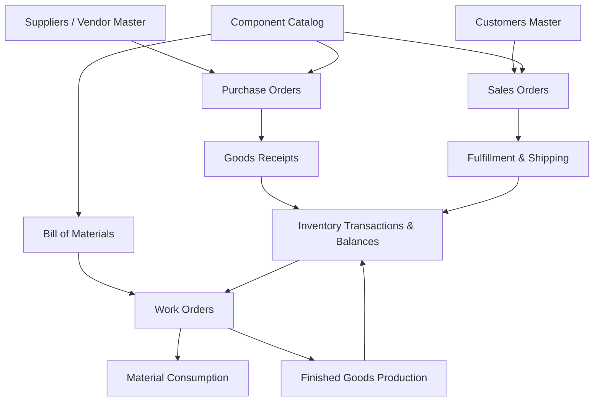

# Navigation Architecture Audit

**Target Platform**: Ananya ERP (`@ananya/web` & `@ananya/api`)  
**Sprint**: Release Candidate 1 (RC1) Stabilization Sprint  
**Document Purpose**: Comprehensive Navigation Summary & Information Architecture (IA) Audit  
**Status**: Complete Architectural Analysis (Documentation & Basis for Future IA Redesign)

---

## 1. Executive Summary

This document presents a comprehensive, repository-wide Navigation Architecture Audit for the Ananya ERP platform. The goal of this audit is to catalog, analyze, classify, and evaluate every navigation element, route, menu entry, sub-item, header action, command palette shortcut, permission guard, and structural relationship within the application shell.

### Key Audit Findings

1. **Top-Level Rail Overcrowding**: The application shell currently features **13 top-level navigation modules** rendered in the left vertical `NavigationRail`. On standard laptop screens (1080p / 13-16" displays), 13 vertical icons exceed screen height, requiring scrolling within the module selector rail itself.
2. **Structural Duplication Across Contexts**: Multiple entities appear redundantly across different modules:
   - `Suppliers` appears under both Procurement (`/suppliers`) and Inventory Master Data (`/components` supplier references).
   - `Warehouse Transfers` / `Internal Transfers` appears in both Inventory Operations (`/warehouse-transfers`) and Warehouse & Logistics (`/warehouse-transfers`).
   - `Stock Adjustments` appears in Inventory (`/stock-adjustments`) and Warehouse (`/warehouse`).
   - `Work Orders` appears in Manufacturing (`/work-orders`) and Projects & Service (`/maintenance` / `/service`).
3. **Inconsistent Module Granularity**: Some modules represent massive enterprise domains (`Inventory`, `Procurement`, `Manufacturing`), while others represent narrow sub-utilities (`Traceability`, `MRP & Planning`, `Barcodes`).
4. **Deep Context Switch Cost**: Switching between related operational workflows (e.g. from a Purchase Order in Procurement to a Goods Receipt in Inventory) forces a full top-level module context switch on the left rail.

---

## 2. Navigation Architecture Context

Ananya ERP employs a dual-panel layout shell backed by Next.js 16 App Router, React Context (`NavigationContext`), and NestJS RBAC permission guards.

```
+-----------------------------------------------------------------------------------+
|  NavigationRail  |  ContextSidebar (280px)              |  TopHeader              |
|  (60px)          |                                      |  (Breadcrumbs, Search,  |
|                  |  - Section: Quick Stats (Live APIs)  |   Scan, Theme, Bell,    |
|  [Brand Logo]    |  - Section: Quick Actions            |   User Profile)         |
|  [Dashboard]     |  - Section: Pinned                   |                         |
|  [Inventory]     |  - Section: Workspace (Nav Tree)     |                         |
|  [Procurement]   |  - Section: Settings                 |                         |
|  [Manufacturing] |                                      |                         |
|  ...             |                                      |                         |
+------------------+--------------------------------------+-------------------------+
```

### Layout Primitives & State Mechanics

1. **`NavigationRail` (`60px` fixed width)**:
   - Primary navigation selector displaying module icons (`Boxes`, `Truck`, `Factory`, `ShoppingCart`, etc.).
   - Renders app logo at top, business modules in scrollable center, settings link and user profile avatar at bottom.
   - Evaluates user permissions using `useAuth().hasPermission(module.permissions)` to dynamically filter unauthorized modules.

2. **`ContextSidebar` (`280px` expanded / `72px` collapsed width)**:
   - Contextual panel driven by active module selection (`currentModuleId`).
   - Renders 5 distinct section types:
     - `quick_stats`: Live API metrics fetched via `reportingApi` (`getInventorySummary`, `getProcurementSummary`, `getManufacturingSummary`, etc.).
     - `quick_actions`: High-frequency shortcuts (`New Component`, `Receive Stock`, `Issue Stock`, `Create PO`).
     - `pinned`: User-customized quick links stored in `localStorage`.
     - `nav`: Main module workspace tree supporting multi-level accordion nesting.
     - `settings`: Deep-link to module-specific administration tabs in `/settings`.

3. **`TopHeader` (`56px` height)**:
   - Global application header providing layout context and quick actions.
   - Components: Mobile drawer toggle, dynamic route breadcrumbs, `HeaderAction` Search/Command Palette trigger (`⌘K`), Barcode/QR Scan dialog trigger, Theme Toggle (`Sun`/`Moon`), `NotificationBell` popover, User Profile dropdown.

4. **`CommandPalette` (`⌘K` / `Ctrl+K`)**:
   - Keyboard-first global search modal wrapping `cmdk`.
   - Queries NestJS search providers (`InventorySearchProvider`, `ProcurementSearchProvider`, `ManufacturingSearchProvider`, `ProjectsSearchProvider`, `AdministrationSearchProvider`).

5. **Edge Security (`middleware.ts`)**:
   - Edge-level route protection matching `/((?!_next/static|_next/image|favicon.ico|login|forgot-password|reset-password|onboarding|setup|maintenance|api).*)`. Checks `ananya_auth_token` cookie.

---

## 3. Module Inventory

### 3.1 Overview & Dashboard Module (`dashboard`)

- **Top-Level Route**: `/`
- **Icon**: `LayoutDashboard`
- **Required Permission**: None (Authenticated User)
- **Feature Flag**: None
- **Static/Dynamic**: Dynamic (Live overview metrics)
- **Sub-Items**:
  - `Overview` (`/`): Master dashboard grid with KPI cards, activity feed, and widget grid.

### 3.2 Inventory Module (`inventory`)

- **Top-Level Route**: `/inventory`
- **Icon**: `Boxes`
- **Required Permission**: `Inventory.Read`
- **Quick Actions**: `New Component` (`/components/new`), `Receive Stock` (`/goods-receipts/new`), `Issue Stock` (`/transactions/new`), `Transfer Stock` (`/warehouse-transfers/new`)
- **Sub-Items**:
  - **Workspace Overview**: `Overview` (`/inventory`)
  - **Master Data Group**:
    - `Components` (`/components`): Component item catalog and MPN lookup.
    - `Categories` (`/categories`): Taxonomy and classification hierarchy.
    - `Manufacturers` (`/manufacturers`): Approved vendor & manufacturer directory.
    - `Locations` (`/locations`): Physical rack, shelf, and bin locations.
  - **Operations Group**:
    - `Ledger Transactions` (`/transactions`): Stock ledger audit trail.
    - `Stock Adjustments` (`/stock-adjustments`): Quantity reconciliation and write-offs.
    - `Barcode & QR Studio` (`/barcodes`): Label generation and printing.
  - **Audits & Counts Group**:
    - `Stock Counts` (`/stock-counts`): Full physical inventory counts.
    - `Cycle Counts` (`/cycle-counts`): Periodic ABC cycle counts.

### 3.3 Procurement Module (`procurement`)

- **Top-Level Route**: `/procurement`
- **Icon**: `Truck`
- **Required Permission**: `Procurement.Read`
- **Quick Actions**: `Create Purchase Order` (`/purchase-orders/new`)
- **Sub-Items**:
  - `Overview` (`/procurement`): Procurement dashboard.
  - `Suppliers` (`/suppliers`): Vendor catalog and performance tracking.
  - `Purchase Orders` (`/purchase-orders`): Purchase order lifecycle.
  - `Goods Receipts` (`/goods-receipts`): Receiving inspection and stock entry.
  - `Supplier Returns` (`/supplier-returns`): Debit notes and return shipments.
  - `Purchase Invoices` (`/purchase-invoices`): Vendor invoice matching.

### 3.4 Manufacturing Module (`manufacturing`)

- **Top-Level Route**: `/manufacturing`
- **Icon**: `Factory`
- **Required Permission**: `Manufacturing.Read`
- **Quick Actions**: `New BOM` (`/boms/new`)
- **Sub-Items**:
  - `Overview` (`/manufacturing`): Manufacturing execution dashboard.
  - `Bills of Materials (BOM)` (`/boms`): Multi-level assembly structures.
  - `Production Orders` (`/production-orders`): Master production schedule orders.
  - `Work Orders` (`/work-orders`): Shop floor execution jobs.
  - `Material Consumption` (`/material-consumption`): Raw material staging & issue.
  - `Finished Goods` (`/finished-goods`): Production completion & FG receipt.

### 3.5 Sales Module (`sales`)

- **Top-Level Route**: `/sales`
- **Icon**: `ShoppingCart`
- **Required Permission**: `Sales.Read`
- **Sub-Items**:
  - `Overview` (`/sales`): Sales pipeline and order summary.
  - `Customers` (`/customers`): Customer accounts and contact directory.
  - `Quotations` (`/quotations`): Sales quotes and estimates.
  - `Sales Orders` (`/sales-orders`): Customer order management.
  - `Fulfillment` (`/fulfillment`): Pick, pack, and ship operations.
  - `Customer Returns` (`/customer-returns`): Credit notes and RMA returns.

### 3.6 Warehouse & Logistics Module (`warehouse`)

- **Top-Level Route**: `/warehouse`
- **Icon**: `Warehouse`
- **Required Permission**: `Warehouse.Read`
- **Sub-Items**:
  - `Overview` (`/warehouse`): Facility utilization dashboard.
  - `Warehouses` (`/warehouses`): Multi-facility storage directory.
  - `Storage Bins` (`/warehouse-bins`): Bin capacity and zone mapping.
  - `Internal Transfers` (`/warehouse-transfers`): Inter-warehouse stock movement.
  - `Storage Policies` (`/warehouse-policies`): Putaway and picking rules (FIFO/LIFO/FEFO).

### 3.7 Finance Module (`finance`)

- **Top-Level Route**: `/finance`
- **Icon**: `Landmark`
- **Required Permission**: `Finance.Read`
- **Sub-Items**:
  - `Overview` (`/finance`): Financial health and cash flow summary.
  - `Chart of Accounts` (`/chart-of-accounts`): General ledger structure.
  - `Journal Entries` (`/journal-entries`): Manual journal vouchers.
  - `Accounts Receivable` (`/accounts-receivable`): Customer AR aging.
  - `Accounts Payable` (`/accounts-payable`): Vendor AP aging.
  - `Payments` (`/payments`): Inbound and outbound payment vouchers.
  - `Bank Accounts` (`/bank-accounts`): Treasury and bank registry.
  - `Bank Reconciliation` (`/bank-reconciliation`): Statement matching.

### 3.8 CRM Module (`crm`)

- **Top-Level Route**: `/crm`
- **Icon**: `Users`
- **Required Permission**: `CRM.Read`
- **Sub-Items**:
  - `Overview` (`/crm`): Lead pipeline and conversion metrics.
  - `Leads` (`/leads`): Prospect management.
  - `Accounts` (`/accounts`): Corporate client accounts.
  - `Opportunities` (`/opportunities`): Deal pipeline tracking.
  - `Activities` (`/activities`): Calls, tasks, and meeting logs.

### 3.9 Projects & Service Module (`projects`)

- **Top-Level Route**: `/projects`
- **Icon**: `FolderKanban`
- **Required Permission**: `Projects.Read`
- **Sub-Items**:
  - `Projects` (`/projects`): Project portfolio and tracking.
  - `Tasks` (`/tasks`): Project task breakdown.
  - `Timesheets` (`/time`): Time logging and labor tracking.
  - `Service Requests` (`/service`): Field service and support tickets.
  - `RMA` (`/rma`): Return Material Authorization.
  - `Warranty` (`/warranty`): Warranty claim tracking.
  - `Maintenance` (`/maintenance`): Equipment maintenance jobs.

### 3.10 MRP & Planning Module (`mrp`)

- **Top-Level Route**: `/mrp`
- **Icon**: `RotateCcw`
- **Required Permission**: `MRP.Read`
- **Sub-Items**:
  - `Overview` (`/mrp`): Planning run summary.
  - `Planning Runs` (`/mrp/runs`): Material requirement planning engine.
  - `Material Shortages` (`/mrp/materials`): Gross vs. net material deficit analysis.
  - `Purchase Recs` (`/mrp/purchases`): Automated purchase recommendations.
  - `Production Recs` (`/mrp/production`): Automated work order recommendations.
  - `Capacity Planning` (`/mrp/capacity`): Work center capacity utilization.

### 3.11 Traceability Module (`traceability`)

- **Top-Level Route**: `/batches`
- **Icon**: `FileText`
- **Required Permission**: `Inventory.Read`
- **Sub-Items**:
  - `Batches` (`/batches`): Lot/batch number tracking.
  - `Serials` (`/serials`): Unit serial number tracking.
  - `Stock Reservations` (`/reservations`): Allocated inventory holds.
  - `Demand Projections` (`/projections`): Stock depletion forecasting.

### 3.12 Reporting & Analytics Module (`reports`)

- **Top-Level Route**: `/reports`
- **Icon**: `BarChart3`
- **Required Permission**: `Reporting.Read`
- **Sub-Items**:
  - `Reports Hub` (`/reports`): Central reporting dashboard.
  - `Inventory Reports` (`/reports/inventory`): Stock valuation & turnover.
  - `Procurement Reports` (`/reports/procurement`): Spend & supplier performance.
  - `Manufacturing Reports` (`/reports/manufacturing`): Output yield & scrap analysis.
  - `Project Reports` (`/reports/projects`): Project material allocation reports.
  - `Transaction Reports` (`/reports/transactions`): Stock ledger movement analysis.

### 3.13 Administration & Settings Module (`settings`)

- **Top-Level Route**: `/settings`
- **Icon**: `Settings`
- **Required Permission**: `Administration.Security` / `Administration.Users`
- **Sub-Items**:
  - `General Settings` (`/settings`): Organization profile & branding.
  - `Notification Center` (`/notifications`): User notification preferences.
  - `Workflow Automation` (`/workflows`): Trigger-action rule builder.
  - `Activity Center` (`/activity`): User activity logs.
  - `Audit Explorer` (`/audit`): System security & entity audit logs.
  - `My Profile` (`/profile`): User account preferences & password change.
  - `Users Directory` (`/users`): User management & role assignment.
  - `Roles & Permissions` (`/roles`): Matrix RBAC configuration.
  - `Security Audit Log` (`/settings/security`): Authentication security log.

### 3.14 Hidden / Unlinked / Auxiliary Routes

These routes do not appear in the primary navigation tree but form essential detail views, creation forms, or authentication flows:

- **Authentication & Setup**: `/login`, `/forgot-password`, `/reset-password`, `/onboarding`, `/setup`
- **Entity Detail & Edit Views**:
  - `/components/[id]`, `/components/new`
  - `/categories/[id]`
  - `/manufacturers/[id]`
  - `/suppliers/[id]`
  - `/purchase-orders/[id]`, `/purchase-orders/new`
  - `/goods-receipts/[id]`, `/goods-receipts/new`
  - `/boms/[id]`, `/boms/new`
  - `/work-orders/[id]`
  - `/projects/[id]`
  - `/tasks/[id]`
  - `/users/[id]`
  - `/warehouses/[id]`
  - `/warehouse-transfers/[id]`, `/warehouse-transfers/new`
  - `/quotations/[id]`
  - `/sales-orders/[id]`
  - `/service/[id]`
  - `/cycle-counts/[id]`
  - `/transactions/new`
- **Master Reference Utilities**: `/units` (Unit of measure management)

---

## 4. Complete Navigation Tree

```
Ananya ERP System Shell
├── Dashboard (/)
│   └── Overview (/)
├── Inventory (/inventory) [Permission: Inventory.Read]
│   ├── Quick Actions: New Component, Receive Stock, Issue Stock, Transfer Stock
│   ├── Overview (/inventory)
│   ├── Master Data
│   │   ├── Components (/components)
│   │   ├── Categories (/categories)
│   │   ├── Manufacturers (/manufacturers)
│   │   └── Locations (/locations)
│   ├── Operations
│   │   ├── Ledger Transactions (/transactions)
│   │   ├── Stock Adjustments (/stock-adjustments)
│   │   └── Barcode & QR Studio (/barcodes)
│   └── Audits & Counts
│       ├── Stock Counts (/stock-counts)
│       └── Cycle Counts (/cycle-counts)
├── Procurement (/procurement) [Permission: Procurement.Read]
│   ├── Quick Actions: Create Purchase Order
│   ├── Overview (/procurement)
│   ├── Suppliers (/suppliers)
│   ├── Purchase Orders (/purchase-orders)
│   ├── Goods Receipts (/goods-receipts)
│   ├── Supplier Returns (/supplier-returns)
│   └── Purchase Invoices (/purchase-invoices)
├── Manufacturing (/manufacturing) [Permission: Manufacturing.Read]
│   ├── Quick Actions: New BOM
│   ├── Overview (/manufacturing)
│   ├── Bills of Materials (BOM) (/boms)
│   ├── Production Orders (/production-orders)
│   ├── Work Orders (/work-orders)
│   ├── Material Consumption (/material-consumption)
│   └── Finished Goods (/finished-goods)
├── Sales (/sales) [Permission: Sales.Read]
│   ├── Overview (/sales)
│   ├── Customers (/customers)
│   ├── Quotations (/quotations)
│   ├── Sales Orders (/sales-orders)
│   ├── Fulfillment (/fulfillment)
│   └── Customer Returns (/customer-returns)
├── Warehouse & Logistics (/warehouse) [Permission: Warehouse.Read]
│   ├── Overview (/warehouse)
│   ├── Warehouses (/warehouses)
│   ├── Storage Bins (/warehouse-bins)
│   ├── Internal Transfers (/warehouse-transfers)
│   └── Storage Policies (/warehouse-policies)
├── Finance (/finance) [Permission: Finance.Read]
│   ├── Overview (/finance)
│   ├── Chart of Accounts (/chart-of-accounts)
│   ├── Journal Entries (/journal-entries)
│   ├── Accounts Receivable (/accounts-receivable)
│   ├── Accounts Payable (/accounts-payable)
│   ├── Payments (/payments)
│   ├── Bank Accounts (/bank-accounts)
│   └── Bank Reconciliation (/bank-reconciliation)
├── CRM (/crm) [Permission: CRM.Read]
│   ├── Overview (/crm)
│   ├── Leads (/leads)
│   ├── Accounts (/accounts)
│   ├── Opportunities (/opportunities)
│   └── Activities (/activities)
├── Projects & Service (/projects) [Permission: Projects.Read]
│   ├── Projects (/projects)
│   ├── Tasks (/tasks)
│   ├── Timesheets (/time)
│   ├── Service Requests (/service)
│   ├── RMA (/rma)
│   ├── Warranty (/warranty)
│   └── Maintenance (/maintenance)
├── MRP & Planning (/mrp) [Permission: MRP.Read]
│   ├── Overview (/mrp)
│   ├── Planning Runs (/mrp/runs)
│   ├── Material Shortages (/mrp/materials)
│   ├── Purchase Recs (/mrp/purchases)
│   ├── Production Recs (/mrp/production)
│   └── Capacity Planning (/mrp/capacity)
├── Traceability (/batches) [Permission: Inventory.Read]
│   ├── Batches (/batches)
│   ├── Serials (/serials)
│   ├── Stock Reservations (/reservations)
│   └── Demand Projections (/projections)
├── Reporting & Analytics (/reports) [Permission: Reporting.Read]
│   ├── Reports Hub (/reports)
│   ├── Inventory Reports (/reports/inventory)
│   ├── Procurement Reports (/reports/procurement)
│   ├── Manufacturing Reports (/reports/manufacturing)
│   ├── Project Reports (/reports/projects)
│   └── Transaction Reports (/reports/transactions)
└── Settings & Administration (/settings) [Permission: Administration.Security]
    ├── General Settings (/settings)
    ├── Notification Center (/notifications)
    ├── Workflow Automation (/workflows)
    ├── Activity Center (/activity)
    ├── Audit Explorer (/audit)
    ├── My Profile (/profile)
    ├── Users Directory (/users)
    ├── Roles & Permissions (/roles)
    └── Security Audit Log (/settings/security)
```

---

## 5. Architectural Statistics

| Metric Category                               | Count  | Detail Notes                                                                                                                     |
| :-------------------------------------------- | :----- | :------------------------------------------------------------------------------------------------------------------------------- |
| **Total Top-Level Rail Modules**              | **13** | Dashboard, Inventory, Procurement, Manufacturing, Sales, Warehouse, Finance, CRM, Projects, MRP, Traceability, Reports, Settings |
| **Total Context Sidebar Sections**            | **34** | Quick Stats, Quick Actions, Pinned, Master Data, Operations, Audits, Workspace Nav                                               |
| **Total Submenu Entries**                     | **78** | Navigation links rendered across all sidebars                                                                                    |
| **Maximum Submenu Depth**                     | **2**  | Top module -> Accordion group (e.g. Master Data) -> Submenu item (e.g. Components)                                               |
| **Total Distinct App Routes**                 | **84** | Includes list, detail, creation, reporting, and settings pages                                                                   |
| **Total Detail & Form Pages (`[id]`, `new`)** | **22** | Form routes e.g. `/components/new`, `/purchase-orders/[id]`, `/boms/[id]`                                                        |
| **Total Settings & Admin Pages**              | **12** | Administration hub pages (`/settings`, `/users`, `/roles`, `/audit`, etc.)                                                       |
| **Total Public / Hidden Routes**              | **5**  | `/login`, `/forgot-password`, `/reset-password`, `/onboarding`, `/setup`                                                         |
| **Total Permission-Guarded Pages**            | **78** | Evaluated via `hasPermission()` and edge middleware                                                                              |

---

## 6. Navigation Usage & Pattern Analysis

### 6.1 Submenu Distribution Analysis

- **Large Submenu Groups** (6+ items):
  - `Finance` (8 items): Chart of Accounts, Journals, AR, AP, Payments, Banks, Recon, Overview.
  - `Settings` (9 items): General, Notifications, Workflows, Activity, Audit, Profile, Users, Roles, Security.
  - `Projects & Service` (7 items): Projects, Tasks, Timesheets, Service, RMA, Warranty, Maintenance.
  - `Manufacturing` (6 items): Overview, BOMs, Production Orders, Work Orders, Material Consumption, Finished Goods.
  - `Sales` (6 items): Overview, Customers, Quotations, Sales Orders, Fulfillment, Customer Returns.
  - `Procurement` (6 items): Overview, Suppliers, Purchase Orders, Goods Receipts, Supplier Returns, Invoices.
- **Compact Submenu Groups** (3-4 items):
  - `Traceability` (4 items): Batches, Serials, Reservations, Projections.
  - `CRM` (5 items): Overview, Leads, Accounts, Opportunities, Activities.
  - `Warehouse` (5 items): Overview, Warehouses, Storage Bins, Transfers, Policies.
- **Single-Item / Shallow Modules**:
  - `Dashboard` (1 item): Overview (`/`).

### 6.2 Redundancy & Domain Overlap Analysis

1. **Suppliers**:
   - `Suppliers` is listed as a primary menu under **Procurement** (`/suppliers`).
   - However, when creating or editing a Component under **Inventory** (`/components`), users frequently need supplier data.
2. **Transfers**:
   - `Ledger Transactions` & `Stock Adjustments` appear under **Inventory Operations** (`/transactions`, `/stock-adjustments`).
   - `Internal Transfers` appears under **Warehouse & Logistics** (`/warehouse-transfers`).
   - `Transfer Stock` action appears in **Inventory Quick Actions**.
   - _Issue_: Stock movement is fragmented between Inventory and Warehouse modules.
3. **Work Orders vs Production Orders**:
   - `Production Orders` (`/production-orders`) and `Work Orders` (`/work-orders`) both exist under **Manufacturing**.
   - `Maintenance` jobs (`/maintenance`) under **Projects & Service** also execute work-order-like routines.
4. **Accounts**:
   - `Accounts` under **CRM** (`/accounts`) represents B2B Client Organizations.
   - `Chart of Accounts` under **Finance** (`/chart-of-accounts`) represents Accounting GL Accounts.
   - `Bank Accounts` under **Finance** (`/bank-accounts`) represents Treasury Accounts.
   - _Issue_: Homonymous terminology ("Accounts") creates confusion in search and navigation.
5. **Audits & Logging**:
   - `Audit Explorer` (`/audit`) appears in **Settings**.
   - `Activity Center` (`/activity`) appears in **Settings**.
   - `Security Audit Log` (`/settings/security`) appears in **Settings**.
   - `Stock Counts` / `Cycle Counts` appear in **Inventory**.

---

## 7. Enterprise UX & Operational Density Analysis

```
+-----------------------------------------------------------------------------------+
|  OPERATIONAL DENSITY CLASSIFICATION                                              |
+-----------------------------------------------------------------------------------+
|  HIGH FREQUENCY OPERATIONAL  |  MASTER DATA / REFERENCE   |  SYSTEM & ADMIN       |
|  - Inventory (/components)    |  - Categories (/categories)|  - Users (/users)     |
|  - Purchase Orders (/po)      |  - Locations (/locations)  |  - Roles (/roles)     |
|  - Work Orders (/work-orders) |  - Manufacturers           |  - Settings           |
|  - Goods Receipts             |  - Warehouses              |  - Audit Log          |
|  - Sales Orders               |  - Chart of Accounts       |  - Workflows          |
+-----------------------------------------------------------------------------------+
```

### Module Frequency & Interaction Profile

1. **Daily Operational Tier (Core User Focus)**:
   - `Inventory` (`/components`, `/transactions`)
   - `Procurement` (`/purchase-orders`, `/goods-receipts`)
   - `Manufacturing` (`/work-orders`, `/boms`)
   - `Sales` (`/sales-orders`)
2. **Periodic / Weekly Tier**:
   - `MRP & Planning` (`/mrp`)
   - `Stock Counts & Cycle Counts` (`/stock-counts`)
   - `Reporting & Analytics` (`/reports`)
   - `Warehouse & Logistics` (`/warehouse-transfers`)
3. **Administrative & Setup Tier**:
   - `Settings & Roles` (`/settings`, `/users`, `/roles`)
   - `Traceability Setup` (`/batches`, `/serials`)
   - `Chart of Accounts Setup` (`/chart-of-accounts`)

---

## 8. Business Domain Categorization

| Module / Route              | Bounded Context Category    | Primary Entity Type    | Data Flow Dependency       |
| :-------------------------- | :-------------------------- | :--------------------- | :------------------------- |
| **`/` (Dashboard)**         | Dashboard                   | Overview Aggregates    | Reads all modules          |
| **`/components`**           | Master Data / Inventory     | Component Catalog      | Base material reference    |
| **`/categories`**           | Master Data / Inventory     | Category Hierarchy     | Component taxonomy         |
| **`/manufacturers`**        | Master Data / Inventory     | Manufacturer Directory | Approved vendor lists      |
| **`/locations`**            | Master Data / Warehouse     | Storage Location       | Component stock position   |
| **`/transactions`**         | Inventory Operations        | Stock Ledger Event     | Immutable audit log        |
| **`/stock-adjustments`**    | Inventory Operations        | Stock Reconciliation   | Balance mutation           |
| **`/barcodes`**             | Utilities / Inventory       | Label Generation       | Barcode print job          |
| **`/stock-counts`**         | Inventory Operations        | Physical Count         | Audit reconciliation       |
| **`/cycle-counts`**         | Inventory Operations        | ABC Cycle Count        | Audit reconciliation       |
| **`/suppliers`**            | Procurement / Master Data   | Vendor Record          | Purchase order target      |
| **`/purchase-orders`**      | Procurement Operations      | Purchase Order         | Triggers goods receipt     |
| **`/goods-receipts`**       | Procurement Operations      | Goods Receipt          | Mutates inventory balance  |
| **`/supplier-returns`**     | Procurement Operations      | Return Debit Note      | Decrements inventory       |
| **`/purchase-invoices`**    | Procurement / Finance       | Vendor Invoice         | AP voucher creation        |
| **`/boms`**                 | Manufacturing / Master Data | Bill of Materials      | Work order requirement     |
| **`/production-orders`**    | Manufacturing Operations    | Production Order       | Master schedule job        |
| **`/work-orders`**          | Manufacturing Operations    | Work Order Job         | Shop floor execution       |
| **`/material-consumption`** | Manufacturing Operations    | Issue Voucher          | Consumes inventory         |
| **`/finished-goods`**       | Manufacturing Operations    | Receipt Voucher        | Produces stock             |
| **`/customers`**            | Sales / Master Data         | Customer Record        | Sales order target         |
| **`/quotations`**           | Sales Operations            | Sales Quote            | Precedes sales order       |
| **`/sales-orders`**         | Sales Operations            | Sales Order            | Triggers fulfillment       |
| **`/fulfillment`**          | Sales Operations            | Shipment Dispatch      | Decrements inventory       |
| **`/warehouses`**           | Warehouse / Master Data     | Storage Facility       | Location container         |
| **`/warehouse-bins`**       | Warehouse / Master Data     | Storage Bin            | Micro-location             |
| **`/warehouse-transfers`**  | Warehouse Operations        | Inter-Bin Transfer     | Location mutation          |
| **`/chart-of-accounts`**    | Finance / Master Data       | GL Account             | Accounting baseline        |
| **`/journal-entries`**      | Finance Operations          | Journal Voucher        | Double-entry posting       |
| **`/projects`**             | Projects / Operations       | Project Record         | Material & labor container |
| **`/mrp/runs`**             | MRP / Planning              | Planning Calculation   | Generates PO & WO recs     |
| **`/reports`**              | Reporting                   | Analytics Summary      | Cross-domain reporting     |
| **`/settings`**             | Administration              | System Settings        | Platform configuration     |
| **`/users`**                | Security / Administration   | User Account           | Identity & authentication  |
| **`/roles`**                | Security / Administration   | RBAC Role              | Access control matrix      |
| **`/audit`**                | Security / Administration   | System Audit Event     | Security compliance log    |

---

## 9. Cross-Module Interdependencies

Understanding data dependencies is critical for Information Architecture redesign:



---

## 10. Permission & Security Boundary Review

- **Permission Matrix Alignment**:
  - `Inventory.Read` -> Controls `/inventory`, `/components`, `/categories`, `/manufacturers`, `/locations`, `/transactions`, `/stock-adjustments`, `/barcodes`, `/stock-counts`, `/cycle-counts`, `/batches`, `/serials`, `/reservations`.
  - `Procurement.Read` -> Controls `/procurement`, `/suppliers`, `/purchase-orders`, `/goods-receipts`, `/supplier-returns`, `/purchase-invoices`.
  - `Manufacturing.Read` -> Controls `/manufacturing`, `/boms`, `/production-orders`, `/work-orders`, `/material-consumption`, `/finished-goods`.
  - `Sales.Read` -> Controls `/sales`, `/customers`, `/quotations`, `/sales-orders`, `/fulfillment`, `/customer-returns`.
  - `Warehouse.Read` -> Controls `/warehouse`, `/warehouses`, `/warehouse-bins`, `/warehouse-transfers`, `/warehouse-policies`.
  - `Finance.Read` -> Controls `/finance`, `/chart-of-accounts`, `/journal-entries`, `/accounts-receivable`, `/accounts-payable`, `/payments`, `/bank-accounts`, `/bank-reconciliation`.
  - `CRM.Read` -> Controls `/crm`, `/leads`, `/accounts`, `/opportunities`, `/activities`.
  - `Projects.Read` -> Controls `/projects`, `/tasks`, `/time`, `/service`, `/rma`, `/warranty`, `/maintenance`.
  - `MRP.Read` -> Controls `/mrp`, `/mrp/runs`, `/mrp/materials`, `/mrp/purchases`, `/mrp/production`, `/mrp/capacity`.
  - `Reporting.Read` -> Controls `/reports` and all sub-reports.
  - `Administration.Security` / `Administration.Users` -> Controls `/settings`, `/users`, `/roles`, `/audit`, `/activity`, `/workflows`.

- **Visibility & Guard Enforcement**:
  - Top-level `NavigationRail` hides icons if user lacks module permission.
  - `SidebarItem` & `SidebarAccordion` hide submenu entries if `item.permissions` fail `hasPermission()`.
  - Next.js Edge `middleware.ts` enforces unauthenticated session redirection to `/login`.

---

## 11. Navigation Health & IA Bottlenecks

### Identified Vulnerabilities & Usability Friction

1. **Rail Overload (13 Top-Level Modules)**:
   - 13 module icons force vertical scrolling in the primary left rail on standard desktop displays.
2. **Context Switching Overhead**:
   - Performing a standard receiving workflow (Purchase Order -> Goods Receipt -> Putaway -> Stock Check) requires jumping across 3 separate rail modules (**Procurement**, **Inventory**, **Warehouse**).
3. **Master Data Fragmentation**:
   - Master data is scattered across modules:
     - Component master under Inventory.
     - Vendor master under Procurement.
     - Customer master under Sales.
     - Storage Location master under Inventory.
     - Warehouse master under Warehouse.
     - GL Account master under Finance.
   - _Impact_: Users struggle to locate master setup tables.
4. **Nesting Concealment**:
   - Essential daily tools like `Stock Adjustments` or `Cycle Counts` are buried under `Master Data` or `Audits & Counts` accordion groups inside the inventory sidebar.

---

## 12. Strategic Recommendations for Future IA Redesign

_(Note: These recommendations are for planning purposes only and are NOT implemented in this turn.)_

### 12.1 Module Consolidation (13 Modules -> 5 Core Domains)

To eliminate left rail scrolling and streamline context switches, group the 13 top-level modules into **5 primary business domains**:

1. **Operations & Materials** (Combines `Inventory`, `Warehouse & Logistics`, `Traceability`):
   - Items: Components, Categories, Stock Balances, Stock Movements, Warehouses, Locations, Transfers, Batches & Serials.
2. **Supply Chain & Commerce** (Combines `Procurement`, `Sales`, `CRM`):
   - Items: Suppliers, Purchase Orders, Receipts, Customers, Sales Orders, Quotations, Leads.
3. **Production & Execution** (Combines `Manufacturing`, `MRP & Planning`):
   - Items: BOMs, Work Orders, Production Schedule, Material Staging, MRP Engine.
4. **Projects & Services** (Combines `Projects`, `Service`, `Maintenance`):
   - Items: Project Portfolio, Tasks, Timesheets, Service Tickets, Maintenance Jobs.
5. **Intelligence & System** (Combines `Finance`, `Reporting`, `Settings`):
   - Items: Financial Ledger, Reports Hub, System Administration, Users & Roles.

### 12.2 Structural Separation of Operational vs. Setup Views

- Separate daily **Transactional Workflows** (PO creation, Stock receipt, WO execution) from **System Administration & Master Setup** (Chart of Accounts, Storage Policies, RBAC Roles, Workflow Rules).

### 12.3 Quick Access & Favorites Bar

- Expand the `Pinned` section in `ContextSidebar` into a global "Favorites & Recent Pages" widget in the top header or command palette (`⌘K`), allowing users to jump directly to frequent items regardless of active module context.

---

## 13. Executed Information Architecture (IA) Refactor

### Implementation Summary

The strategic Information Architecture refactor outlined in the audit has been fully implemented in the codebase:

1. **7 Primary Navigation Modules**: The top-level left `NavigationRail` has been consolidated from 13 modules down to **7 primary business domains**: `Dashboard`, `Inventory`, `Procurement`, `Manufacturing`, `Projects`, `Analytics`, and `Administration`. Zero vertical scrolling is required on standard desktop resolutions.
2. **Unified Inventory Workspace**: Moved Warehouses, Storage Bins, Storage Policies, Internal Transfers (from Warehouse), Batches, Serials, Reservations, Demand Projections (from Traceability), Barcode & QR Studio, and Master Data (Categories, Manufacturers, Units, Locations) into `Inventory`.
3. **Integrated Manufacturing & MRP Workspace**: Moved MRP Planning Runs, Shortages, Purchase/Production Recommendations, and Capacity Planning directly under `Manufacturing`.
4. **Centralized Analytics Hub**: Unified all domain reporting (`Inventory Reports`, `Procurement Reports`, `Manufacturing Reports`, `Project Reports`, `Transaction Reports`) into `Analytics`.
5. **Decoupled User Menu Dropdown**: Personal user controls (`My Profile`, `Notification Center`, `Security Sessions`, `Appearance Mode`, `Sign Out`) are moved out of Administration and into the User Profile dropdown in `TopHeader`.
6. **⭐ Favorites & 🕒 Recent Sidebar Feature**: Implemented `SidebarFavoritesRecent` at the top of `ContextSidebar` with persistent pinning and automatic visit tracking.
7. **Semantic Workflow Breadcrumbs**: Updated `TopHeader` breadcrumb generation to follow business hierarchy e.g. `Inventory > Master Data > Manufacturers`.

---

**End of Navigation Architecture Audit Document**
