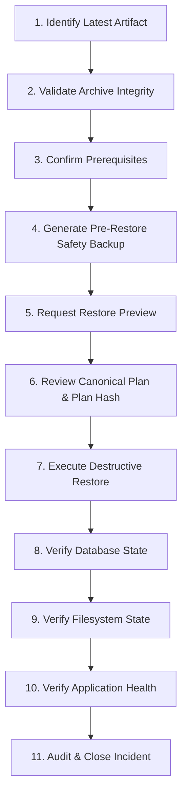

# Backup & Restore Operational Manual & Disaster Recovery Runbook

Ananya ERP features an enterprise-grade backup, scheduling, integrity verification, and staged recovery system.

---

## 1. Architecture & Format Specification

### Archive Format Version 2
Ananya uses streaming archive format version `2`:
- Archives are gzip-compressed tar/record streams packed with SHA-256 checksums computed during generation.
- Format version 2 archives contain a manifest header followed by table records and document file records.
- **Decompression limits & archive validation**: Every archive is validated against `MAX_FILES` (10,000), `MAX_FILE_BYTES` (500 MB per file), `MAX_DECOMPRESSED_BYTES` (2 GB), and path traversal (`..`, absolute paths, null bytes, duplicate storage keys).
- **Encryption**: Optional AES-256-GCM authenticated encryption. Uses scrypt key derivation (`N=16384`, `r=8`, `p=1`) with a cryptographically secure random salt and IV. The authentication tag validates ciphertext integrity before decryption. Passphrases are never stored or logged.

---

## 2. Backup Operations

### 2.1 Scheduled Backups
- Configured in `backup_jobs` table.
- Frequencies supported: `DAILY`, `WEEKLY`, `MONTHLY`.
- Schedules run according to IANA timezone designations (e.g. `Asia/Kolkata`, `UTC`, `America/New_York`) and seamlessly account for Daylight Saving Time (DST) shifts.
- Concurrency protection: Background ticks acquire a PostgreSQL advisory lock (`ananya_backup_job_<jobId>`). If a run is already executing, concurrent runs are skipped and a `backup.skipped` notification is dispatched.

### 2.2 Manual Backups
- Triggered on-demand via the Web UI (**Settings → Backup & Restore**) or API (`POST /backups/artifacts`).
- Supports Full system backups (all tables + document files) or Selective backups.

### 2.3 Scope Selection & Domain Components
- Instead of raw database table names, operators can select high-level domain components (e.g., `Core`, `Inventory`, `Documents`, `Procurement`).
- Component dependencies are resolved automatically before backup generation.

### 2.4 Retention Policy
- Configurable per job via `retentionMaxCount` (number of archives to keep) and `retentionMaxAgeDays` (retention age in days).
- **Retention Protection**: Retention runs inside a transaction-scoped advisory lock (`ananya_backup_retention`). Artifacts referenced by active restore operations or currently active backup runs are strictly protected from pruning.

### 2.5 Storage Requirements & Preflight
- Storage is managed through the `StorageService` abstraction (`STORAGE_DRIVER=local` by default).
- Before creating a backup archive, a filesystem preflight checks available disk space in the temporary working directory with a minimum 100 MiB safety floor.
- If storage is insufficient, the operation fails cleanly without corrupting existing files.

### 2.6 Retry Behavior
- Retry limit configured per job (0–10 attempts).
- Transient errors (e.g., database advisory lock contention, temporary network blips) trigger exponential backoff:
  $$\text{delay} = \min(\text{retryMaxDelaySeconds}, \text{retryInitialDelaySeconds} \times 2^{\text{attempt}-1})$$
- Permanent errors (e.g., corrupt schema, invalid credentials) terminate immediately with `FAILED` without retrying.

---

## 3. Restore Operations

Restore operations are destructive and strictly enforce a **2-step preview and confirmation contract**.

### 3.1 Two-Step Restore Contract
1. **Preview Step (`POST /backups/restore/preview`)**:
   - The archive is unpacked into a temporary sandbox and validated.
   - The backend constructs a canonical restore plan:
     - `archiveChecksum` (SHA-256)
     - `conflictPolicy` (`ABORT`, `SKIP`, `UPDATE`)
     - `tables` to restore
     - `recordsToProcess` count
     - `files` to restore
     - `destructive: true`
   - A SHA-256 hash of the canonical plan (`planHash`) is persisted in `restore_operations` with status `PREVIEWED`.
2. **Execute Step (`POST /backups/restore` or `POST /backups/restore/artifact/:id`)**:
   - Requires `operationId`, `planHash`, and `confirmDestructive: true`.
   - The backend re-hashes the persisted canonical plan and verifies it against the supplied `planHash` (tamper detection).
   - Verifies the uploaded archive content matches `persistedPlan.archiveChecksum`.
   - If `confirmDestructive` is false or hashes mismatch, execution is refused with `400 Bad Request`.

### 3.2 Pre-Restore Safety Backup
- Before touching any database table or storage file, the restore runner automatically triggers a full system safety backup.
- The safety backup ID is linked to the restore operation record (`restore_operations.artifactId`).
- If safety backup creation fails, the restore immediately aborts without touching production state.

### 3.3 Conflict Policies
- `ABORT` (Default): If a primary key conflict occurs during insert, the entire database transaction rolls back.
- `SKIP`: Skips records that already exist by primary key.
- `UPDATE`: Overwrites existing records with archive values.

### 3.4 Filesystem Staging & Rollback
- Document storage files from the archive are extracted into an isolated staging directory first.
- Path traversal and malicious filename validation ensure no files escape the staging directory.
- During file promotion:
  - If a destination file already exists, a backup copy is created (`<key>.backup-<timestamp>-<uuid>`).
  - Staged files are promoted atomically to destination paths.
  - If any file write fails, previous promotions are rolled back from the backup copies, and staging directories are pruned.

---

## 4. Worker Operations & Recovery

- **Heartbeat Coordination**: Active backup runs emit a heartbeat every 5 seconds updating `backup_job_runs.heartbeatAt`.
- **Abandoned Run Detection**: During scheduled ticks or startup, `recoverAbandonedRuns()` identifies runs stuck in `RUNNING` state whose heartbeat expired (> 30s).
- **Recovery Action**:
  - If attempts remaining: marked `RETRY_SCHEDULED` and queued for immediate retry.
  - If attempts exhausted: marked `FAILED` with retry reason `worker restart recovery`.

---

## 5. Granular Permissions (Least Privilege)

The Backup & Restore module uses granular permissions:

| Permission Code | Role / Capability | Endpoints Protected |
| :--- | :--- | :--- |
| `Administration.Backups.Read` | View backups, jobs, metrics, and restore history | `GET /backups/artifacts`, `GET /backups/jobs`, `GET /backups/metrics`, `GET /backups/restores` |
| `Administration.Backups.Create` | Create/edit/pause scheduled backup jobs | `POST /backups/jobs`, `PUT /backups/jobs/:id`, `POST /backups/jobs/:id/pause` |
| `Administration.Backups.Run` | Trigger manual backup or immediate job run | `POST /backups/artifacts`, `POST /backups/jobs/:id/run` |
| `Administration.Backups.Delete` | Delete backup archives or delete scheduled jobs | `DELETE /backups/artifacts/:id`, `DELETE /backups/jobs/:id` |
| `Administration.Backups.Restore.Preview` | Upload archive, validate, and generate restore plan | `POST /backups/restore/preview`, `POST /backups/restore/preview/:id` |
| `Administration.Backups.Restore.Execute` | Execute destructive database/filesystem restore | `POST /backups/restore`, `POST /backups/restore/artifact/:id` |

*Backward compatibility: Users with `Administration.Settings` or super-admin `*` retain full access.*

---

## 6. Notifications & Email Alerts

Automated alerts are dispatched via the in-app notification center and durable mail queue (`email_outbox`).

### Supported Lifecycle Events:
- `backup.started`: Dispatched when scheduled or manual backup begins.
- `backup.succeeded`: Dispatched when archive generation and storage succeed.
- `backup.failed`: Dispatched on permanent failure.
- `backup.retrying`: Dispatched when transient error triggers retry delay.
- `backup.exhausted_retries`: Dispatched when retry ceiling is reached.
- `backup.skipped`: Dispatched when job is skipped due to concurrency lock.
- `restore.started`: Dispatched when restore begins.
- `restore.succeeded`: Dispatched on complete restore verification.
- `restore.failed`: Dispatched when database or file promotion fails.
- `restore.aborted`: Dispatched when restore is canceled or conflict occurs.
- `restore.safety_backup_succeeded`: Confirms pre-restore safety snapshot created.
- `restore.safety_backup_failed`: Alerts that safety snapshot failed; restore halted.

*Email templates are editable in Settings → Email Templates under the "Backup & Restore" category.*

---

## 7. Operational Troubleshooting

### 7.1 Failed Backup
1. Check job runs in **Settings → Backup & Restore → Scheduled Jobs → [Job Details]**.
2. Inspect the error message. Common causes:
   - Disk space: Check disk free space on temporary directory and upload volume.
   - DB lock timeout: Check for heavy migrations or concurrent long transactions.

### 7.2 Repeatedly Retrying Backup
1. Identify `attempt` count and `nextRetryAt` in `backup_job_runs`.
2. Inspect PostgreSQL logs for query timeouts or deadlocks.
3. If necessary, pause the job via the UI or API to stop further retries.

### 7.3 Stale / Abandoned Run
1. If an API process crashed during a backup, the run will remain in `RUNNING`.
2. The next scheduler tick automatically reclaims runs where heartbeat > 30 seconds old.
3. To manually force recovery, trigger `POST /backups/tick` or restart the API container.

### 7.4 Failed Restore
1. Check `restore_operations` record for `recoveryInfo`.
2. If `databaseCommitted: true` but file promotion failed, database changes are already committed. Inspect the linked safety backup (`recoveryInfo.safetyBackupId`) if full rollback is desired.
3. If `databaseCommitted: false`, the database transaction rolled back cleanly and staged files were discarded.

### 7.5 Wrong Encryption Passphrase
1. AES-256-GCM authentication tag verification fails during preview unpack.
2. The system throws `BadRequestException('Decryption failed: invalid passphrase or corrupted archive.')`.
3. Verify the passphrase offline; without the correct passphrase, data cannot be recovered.

---

## 8. Disaster Recovery (DR) Runbook

In a major incident (e.g. data corruption, catastrophic user error, hardware loss), execute this 11-step disaster recovery procedure:



### Step 1: Identify Latest Valid Artifact
- Query `backup_artifacts` where `status = 'COMPLETED'` ordered by `createdAt DESC`.
- Or inspect external storage volume / S3 bucket for the latest `.archive` file.

### Step 2: Validate Artifact Integrity
- Verify the SHA-256 checksum against the recorded checksum in the manifest:
  ```bash
  shasum -a 256 backup-artifact.archive
  ```

### Step 3: Confirm Restore Prerequisites
- Ensure API service is running with appropriate database connectivity.
- Verify temporary filesystem has at least 2x the uncompressed archive size available.
- Ensure no migrations are running.

### Step 4: Create/Verify Safety Backup
- Note: The restore runner automatically creates a safety snapshot. To create an independent manual snapshot prior to starting:
  ```bash
  curl -X POST http://localhost:4000/backups/artifacts \
    -H "Authorization: Bearer $TOKEN" \
    -H "Content-Type: application/json" \
    -d '{"name": "Pre-DR Emergency Snapshot", "type": "FULL"}'
  ```

### Step 5: Preview Restore
- Submit the archive for validation:
  ```bash
  curl -X POST http://localhost:4000/backups/restore/preview \
    -H "Authorization: Bearer $TOKEN" \
    -F "file=@backup-artifact.archive" \
    -F "conflictPolicy=ABORT"
  ```
- Receive `operationId` and `planHash`.

### Step 6: Review Persisted Restore Plan
- Inspect `tables`, `recordsToProcess`, and `files` in the response preview.
- Confirm that the scope matches the expected recovery target.

### Step 7: Execute Restore
- Issue the explicit destructive confirmation call:
  ```bash
  curl -X POST http://localhost:4000/backups/restore \
    -H "Authorization: Bearer $TOKEN" \
    -F "file=@backup-artifact.archive" \
    -F "operationId=$OPERATION_ID" \
    -F "planHash=$PLAN_HASH" \
    -F "confirmDestructive=true" \
    -F "conflictPolicy=ABORT"
  ```

### Step 8: Verify Database State
- Check that key tables have expected row counts.
- Run database sanity check / migration verification:
  ```bash
  pnpm --filter @ananya/database db:status
  ```

### Step 9: Verify Filesystem State
- Verify that document attachments exist in the upload directory (`STORAGE_LOCAL_PATH`).
- Confirm file permissions and non-zero byte sizes.

### Step 10: Verify Application Health
- Navigate to Ananya Web (**Settings → Backup & Restore** and core inventory views).
- Confirm API returns `200 OK` on health checks.

### Step 11: Record & Audit Incident
- Review `restore_operations` row for timestamps and duration.
- Review security audit logs (`security_audit_logs` action: `BACKUP_RESTORED`).
- File a post-incident review report documenting recovery time and root cause.
