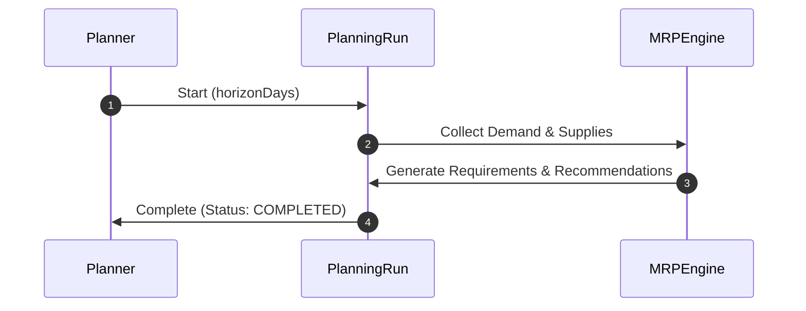

# RFC-0051: Material Requirements Planning

## 1. Purpose

This RFC establishes the Material Requirements Planning (MRP) bounded context in Ananya ERP. MRP functions as the central calculation engine that reconciles operational demand against inventory levels, open purchase orders, and scheduled manufacturing orders to calculate net component shortages and schedule timely replenishments.

## 2. Scope

- Definition of `PlanningRun` aggregate root.
- Execution lifecycle of MRP calculation runs.
- Time-phased planning horizon parameters.
- Read-only ingestion of demand and inventory signals.

## 3. Ubiquitous Language

- **Planning Run**: A discrete execution of the MRP calculation engine over a specified time horizon.
- **Planning Horizon**: The forward-looking time window (in days) evaluated by the MRP run.
- **Net Requirement**: The calculated shortage of a component after factoring available stock and scheduled receipts against gross demand.
- **Gross Requirement**: Total demand for a component across all open sales orders, project BOMs, and forecasts.

## 4. Aggregate Roots

- `PlanningRun`

## 5. Entities

- `PlanningRunLog`

## 6. Value Objects

- `PlanningRunNumber`
- `PlanningHorizon`
- `PlanningRunStatus` (`DRAFT`, `RUNNING`, `COMPLETED`, `CANCELLED`)

## 7. Commands

- `StartPlanningRun`
- `CompletePlanningRun`
- `CancelPlanningRun`

## 8. Queries

- `GetPlanningRunById`
- `GetPlanningRunByNumber`
- `ListPlanningRuns`

## 9. Domain Services

- `MRPEngine`: Coordinates demand collection, net requirement derivation, and recommendation generation.

## 10. Application Services

- `PlanningRunsService`: Manages planning run initialization, lifecycle, and query APIs.

## 11. Repository Contracts

- `PlanningRunRepository`: Method interfaces for `findById`, `findByNumber`, `findMany`, `save`, and `generateNextRunNumber`.

## 12. Domain Invariants

- A completed or cancelled planning run cannot be re-executed or modified.
- Planning runs require a valid forward-looking planning horizon (> 0 days).

## 13. State Machine

```
[ DRAFT ] ──► [ RUNNING ] ──► [ COMPLETED ]
     │              │
     └──────────────┴──────────► [ CANCELLED ]
```

## 14. Sequence Diagram



## 15. Cross-Module Integration

- **Sales / Projects**: Source of gross demand.
- **Inventory / Warehouse**: Source of on-hand balance and safety stock.
- **Procurement / Manufacturing**: Source of scheduled supply receipts.

## 16. Database Schema

- Table `planning_runs` (`id`, `run_number`, `horizon_days`, `status`, `started_by`, `completed_at`, `created_at`, `updated_at`).

## 17. API Design

- `POST /planning-runs`
- `GET /planning-runs`
- `GET /planning-runs/:id`
- `POST /planning-runs/:id/start`
- `POST /planning-runs/:id/complete`
- `POST /planning-runs/:id/cancel`

## 18. UI Workflow

- Planners navigate to `/mrp/runs`, configure planning horizon, click "+ Start Planning Run", and observe run execution log.

## 19. Validation Rules

- `horizonDays` must be a positive integer between 1 and 365.
- `startedBy` must be a non-empty user identifier.

## 20. Future Extensions

- Automated cron-based recurring MRP runs.
