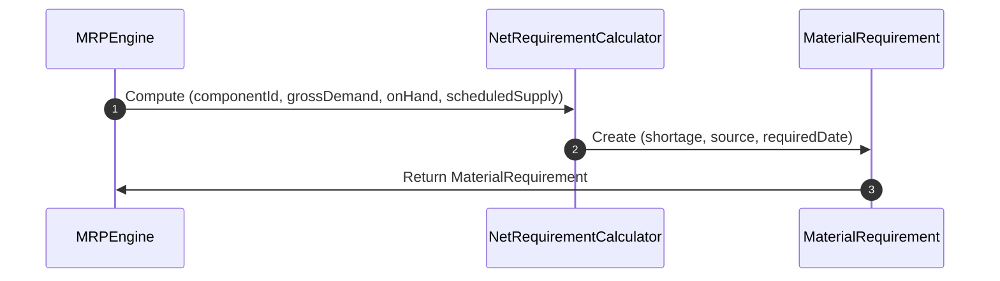

# RFC-0052: Demand & Supply Planning

## 1. Purpose

This RFC specifies the calculation rules for net material requirements in Ananya ERP. Material planning balances component gross requirements against existing stock, safety stock levels, and open purchase/production orders.

## 2. Scope

- Definition of `MaterialRequirement` aggregate root.
- Time-phased net shortage calculation logic.
- Source tracking (Sales Order, Project, Manufacturing Order, Forecast).

## 3. Ubiquitous Language

- **Gross Demand**: Total component quantity needed by a specific required date.
- **Available Stock**: Unreserved on-hand physical inventory.
- **Reserved Stock**: On-hand inventory allocated to active orders.
- **Scheduled Receipt**: Confirmed incoming inventory from active POs or Production Orders.
- **Shortage**: Net deficit quantity computed as `Gross Demand - (Available Stock + Scheduled Receipts)`.

## 4. Aggregate Roots

- `MaterialRequirement`

## 5. Entities

- None

## 6. Value Objects

- `RequirementSource` (`SALES_ORDER`, `MANUFACTURING`, `PROJECT`, `FORECAST`)
- `ShortageQuantity`

## 7. Commands

- `CalculateMaterialRequirements`

## 8. Queries

- `GetMaterialRequirementById`
- `ListMaterialRequirements`

## 9. Domain Services

- `NetRequirementCalculator`: Computes net shortage based on time-phased supply vs demand.

## 10. Application Services

- `MaterialRequirementsService`: Exposes query and projection interfaces.

## 11. Repository Contracts

- `MaterialRequirementRepository`: Methods `findById`, `findMany`, `save`.

## 12. Domain Invariants

- Shortage cannot be negative; if available supply exceeds demand, shortage is zero.
- Required date must fall within the planning horizon.

## 13. State Machine

```
[ CALCULATED ]
```

## 14. Sequence Diagram



## 15. Cross-Module Integration

- Integrates with `@ananya/inventory` for component definitions and balances.
- Integrates with `@ananya/sales` and `@ananya/projects` for demand sources.

## 16. Database Schema

- Table `material_requirements` (`id`, `planning_run_id`, `component_id`, `required_quantity`, `available_quantity`, `reserved_quantity`, `shortage_quantity`, `required_date`, `source`, `source_reference_id`, `created_at`).

## 17. API Design

- `GET /material-requirements`
- `GET /material-requirements/:id`

## 18. UI Workflow

- Planners navigate to `/mrp/materials` to inspect material shortage matrices and filter by component, source, or required date.

## 19. Validation Rules

- Component ID must exist in `@ananya/inventory`.
- Required quantity must be greater than zero.

## 20. Future Extensions

- Dynamic safety stock auto-adjustment based on lead time variance.
