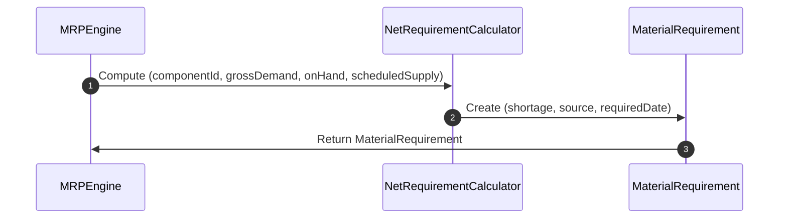

# RFC-0052: Demand & Supply Planning

## 1. Purpose

This RFC specifies the calculation rules for net material requirements in Ananya ERP. Material planning balances component gross requirements against existing stock, safety stock levels, and open purchase/production orders.

## 2. Scope

- Definition of `MaterialRequirement` aggregate root.
- Time-phased net shortage calculation logic.
- Source tracking (Sales Order, Project, Manufacturing Order, Forecast).

## 3. Ubiquitous Language

- **Gross Demand**: Total component quantity needed by a specific required date.
- **Available Stock**: Unreserved on-hand physical inventory.
- **Reserved Stock**: On-hand inventory allocated to active orders.
- **Scheduled Receipt**: Confirmed incoming inventory from active POs or Production Orders.
- **Shortage**: Net deficit quantity computed as `Gross Demand - (Available Stock + Scheduled Receipts)`.

## 4. Aggregate Roots

- `MaterialRequirement`

## 5. Entities

- None

## 6. Value Objects

- `RequirementSource` (`SALES_ORDER`, `MANUFACTURING`, `PROJECT`, `FORECAST`)
- `ShortageQuantity`

## 7. Commands

- `CalculateMaterialRequirements`

## 8. Queries

- `GetMaterialRequirementById`
- `ListMaterialRequirements`

## 9. Domain Services

- `NetRequirementCalculator`: Computes net shortage based on time-phased supply vs demand.

## 10. Application Services

- `MaterialRequirementsService`: Exposes query and projection interfaces.

## 11. Repository Contracts

- `MaterialRequirementRepository`: Methods `findById`, `findMany`, `save`.

## 12. Domain Invariants

- Shortage cannot be negative; if available supply exceeds demand, shortage is zero.
- Required date must fall within the planning horizon.

## 13. State Machine

```
[ CALCULATED ]
```

## 14. Sequence Diagram


```mermaid
sequenceDiagram
    autonumber
    MRPEngine->>NetRequirementCalculator: Compute (componentId, grossDemand, onHand, scheduledSupply)
    NetRequirementCalculator->>MaterialRequirement: Create (shortage, source, requiredDate)
    MaterialRequirement->>MRPEngine: Return MaterialRequirement
```

## 15. Cross-Module Integration

- Integrates with `@ananya/inventory` for component definitions and balances.
- Integrates with `@ananya/sales` and `@ananya/projects` for demand sources.

## 16. Database Schema

- Table `material_requirements` (`id`, `planning_run_id`, `component_id`, `required_quantity`, `available_quantity`, `reserved_quantity`, `shortage_quantity`, `required_date`, `source`, `source_reference_id`, `created_at`).

## 17. API Design

- `GET /material-requirements`
- `GET /material-requirements/:id`

## 18. UI Workflow

- Planners navigate to `/mrp/materials` to inspect material shortage matrices and filter by component, source, or required date.

## 19. Validation Rules

- Component ID must exist in `@ananya/inventory`.
- Required quantity must be greater than zero.

## 20. Future Extensions

- Dynamic safety stock auto-adjustment based on lead time variance.
- Scheduled receipts from open purchase orders and production orders in the net requirement formula.

## 21. Implementation Notes

The MRP engine (`PlanningRunsService.executeMrpCalculation`) applies the netting rules in this order:

1. **Independent demand** is collected from sales-order lines inside the horizon whose
   order status is `APPROVED`, `RELEASED`, `ALLOCATED` or `PARTIALLY_FULFILLED`,
   reduced by each line's fulfilled quantity.
2. **Low-level coding** walks the released BOM graph from every demanded item and
   records the deepest level at which each component appears. A component shared by
   several assemblies is therefore netted once, after every parent level has released
   its dependent demand.
3. **Netting** creates one `MaterialRequirement` per component: `shortage = required −
max(0, available − reserved)`, where available comes from inventory projections and
   reserved from `ACTIVE` reservations of type `WORK_ORDER`, `SALES_ORDER` or `PROJECT`.
4. **Explosion** is driven by the net shortage, not the gross demand. A make item with a
   released BOM produces a production recommendation and passes
   `shortage × quantityPerUnit × (1 + scrapFactorPercent / 100)` to its components; a
   purchased item produces a purchase recommendation.
5. **Cycle handling** detects a component repeated along one BOM path and logs a
   `WARNING` planning message instead of recursing, so malformed data cannot trap a run.

Scheduled receipts (open POs and production orders) are not yet part of the net
requirement formula; only on-hand projections and active reservations are. A completed
run with no requirements records an explicit `INFO` message explaining that no demand
fell inside the horizon, so a valid zero-result plan is distinguishable from a failure.
