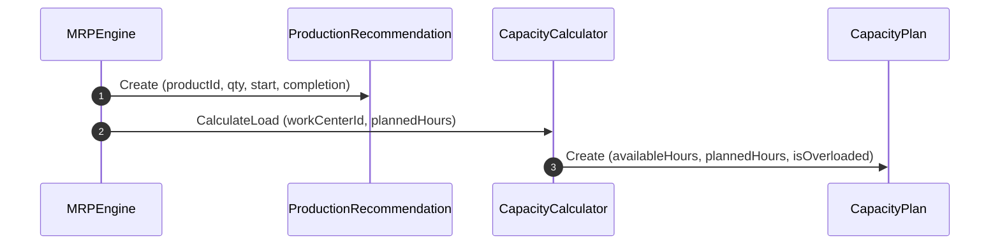

# RFC-0053: Production Planning & Capacity

## 1. Purpose

This RFC defines the production recommendation and capacity planning mechanisms in Ananya ERP. When manufactured items have calculated net shortages, MRP generates production recommendations and evaluates work center capacity to prevent scheduling overloads.

## 2. Scope

- Definition of `ProductionRecommendation` aggregate root.
- Definition of `CapacityPlan` aggregate root.
- Work center capacity utilization calculation.

## 3. Ubiquitous Language

- **Production Recommendation**: A suggested manufacturing run generated by MRP to fulfill a net product shortage.
- **Work Center**: A manufacturing facility, machine group, or assembly station.
- **Available Capacity**: Total operational hours available at a work center in a planning window.
- **Planned Capacity**: Total estimated hours required by scheduled and recommended manufacturing orders.
- **Utilization**: `(Planned Capacity / Available Capacity) * 100%`.

## 4. Aggregate Roots

- `ProductionRecommendation`
- `CapacityPlan`

## 5. Entities

- None

## 6. Value Objects

- `RecommendationStatus` (`PENDING`, `ACCEPTED`, `REJECTED`, `IMPLEMENTED`)

## 7. Commands

- `CreateProductionRecommendation`
- `AcceptProductionRecommendation`
- `RejectProductionRecommendation`
- `CalculateCapacityPlan`

## 8. Queries

- `ListProductionRecommendations`
- `GetProductionRecommendationById`
- `GetCapacityPlans`

## 9. Domain Services

- `CapacityCalculator`: Computes work center load percentages and flags overload conditions.

## 10. Application Services

- `ProductionRecommendationsService`: Manages recommendation status transitions.
- `CapacityPlansService`: Manages capacity plan projections.

## 11. Repository Contracts

- `ProductionRecommendationRepository`
- `CapacityPlanRepository`

## 12. Domain Invariants

- Production recommendation start date must be on or before completion date.
- Capacity utilization > 100% flags `isOverloaded = true`.

## 13. State Machine

```
[ PENDING ] ──► [ ACCEPTED ] ──► [ IMPLEMENTED ]
     │
     └──────────► [ REJECTED ]
```

## 14. Sequence Diagram



## 15. Cross-Module Integration

- Integrates with `@ananya/manufacturing` for BOM routings and work center references.

## 16. Database Schema

- Table `production_recommendations` (`id`, `planning_run_id`, `product_id`, `suggested_quantity`, `suggested_start`, `suggested_completion`, `manufacturing_route`, `status`, `created_at`, `updated_at`).
- Table `capacity_plans` (`id`, `planning_run_id`, `work_center_id`, `work_center_name`, `available_capacity_hours`, `planned_capacity_hours`, `utilization_percentage`, `is_overloaded`, `created_at`).

## 17. API Design

- `GET /production-recommendations`
- `POST /production-recommendations/:id/accept`
- `POST /production-recommendations/:id/reject`
- `GET /capacity-plans`

## 18. UI Workflow

- Planners review `/mrp/production` to accept or reject production recommendations.
- Planners inspect `/mrp/capacity` to view work center utilization bars and overload warnings.

## 19. Validation Rules

- `suggestedQuantity` > 0.
- `workCenterId` must be non-empty.

## 20. Future Extensions

- Automated finite capacity rescheduling and bottleneck optimization algorithms.
