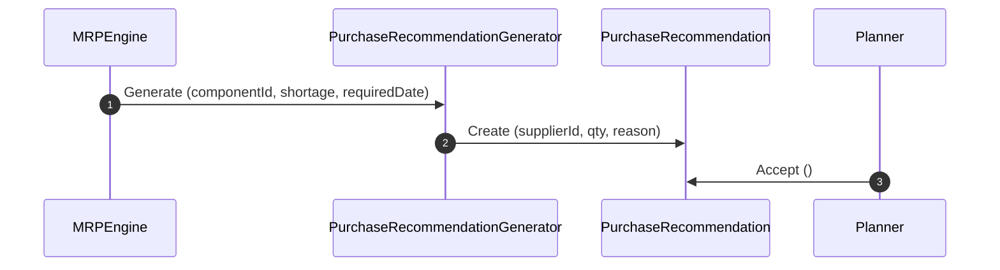

# RFC-0054: Purchase Planning

## 1. Purpose

This RFC specifies purchase planning recommendation generation in Ananya ERP. When raw components or sub-assemblies have net shortages that cannot be produced in-house, MRP generates purchase recommendations indicating suggested quantities, preferred suppliers, and target arrival dates.

## 2. Scope

- Definition of `PurchaseRecommendation` aggregate root.
- Purchase recommendation lifecycle (`PENDING`, `ACCEPTED`, `REJECTED`, `IMPLEMENTED`).
- Preferred supplier mapping and recommendation rationale logging.

## 3. Ubiquitous Language

- **Purchase Recommendation**: A suggested purchase order request generated by MRP to resolve a component shortage.
- **Suggested Quantity**: The recommended quantity to order, accounting for safety stock or minimum order quantities.
- **Recommendation Reason**: Human-readable explanation of why the purchase recommendation was generated.

## 4. Aggregate Roots

- `PurchaseRecommendation`

## 5. Entities

- None

## 6. Value Objects

- `PurchaseRecommendationStatus` (`PENDING`, `ACCEPTED`, `REJECTED`, `IMPLEMENTED`)

## 7. Commands

- `CreatePurchaseRecommendation`
- `AcceptPurchaseRecommendation`
- `RejectPurchaseRecommendation`

## 8. Queries

- `ListPurchaseRecommendations`
- `GetPurchaseRecommendationById`

## 9. Domain Services

- `PurchaseRecommendationGenerator`: Derives order quantities and preferred suppliers from component metadata.

## 10. Application Services

- `PurchaseRecommendationsService`: Handles status progression and query APIs.

## 11. Repository Contracts

- `PurchaseRecommendationRepository`: Methods `findById`, `findMany`, `save`.

## 12. Domain Invariants

- MRP never creates actual Purchase Orders directly in `@ananya/procurement`.
- Accepting a recommendation marks its status as `ACCEPTED` for procurement planners to review and convert into a formal PO.

## 13. State Machine

```
[ PENDING ] ──► [ ACCEPTED ] ──► [ IMPLEMENTED ]
     │
     └──────────► [ REJECTED ]
```

## 14. Sequence Diagram



## 15. Cross-Module Integration

- Integrates with `@ananya/procurement` for supplier references and purchase order conversion.

## 16. Database Schema

- Table `purchase_recommendations` (`id`, `planning_run_id`, `component_id`, `supplier_id`, `suggested_quantity`, `required_date`, `recommendation_reason`, `status`, `created_at`, `updated_at`).

## 17. API Design

- `GET /purchase-recommendations`
- `GET /purchase-recommendations/:id`
- `POST /purchase-recommendations/:id/accept`
- `POST /purchase-recommendations/:id/reject`

## 18. UI Workflow

- Planners review `/mrp/purchases` to view pending recommendations and click "Accept" to forward them to Procurement.

## 19. Validation Rules

- `suggestedQuantity` must be greater than zero.
- `componentId` must be non-empty.

## 20. Future Extensions

- Automated multi-supplier price break optimization during purchase recommendation generation.
