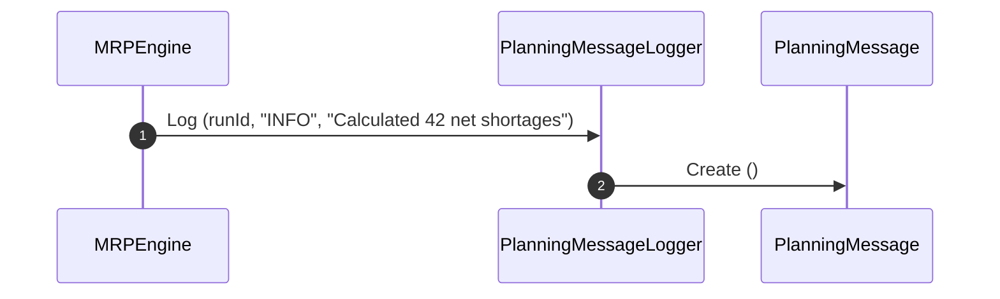

# RFC-0055: Planning Integration

## 1. Purpose
This RFC documents the cross-module integration boundaries, audit logging (`PlanningMessage`), and architecture constraints of the Material Requirements Planning (MRP) bounded context in Ananya ERP.

## 2. Scope
- Definition of `PlanningMessage` audit entity.
- Integration mechanics across Sales, Projects, Inventory, Procurement, Manufacturing, Warehouse, and Finance.
- Strict anti-corruption and read-only boundary enforcement.

## 3. Ubiquitous Language
- **Planning Message**: An informational, warning, or error log message generated during an MRP calculation run.
- **Severity**: Message importance level (`INFO`, `WARNING`, `ERROR`).
- **Read-Only Ingestion**: The architectural constraint that MRP only reads state from operational bounded contexts and never mutates operational state.

## 4. Aggregate Roots
- None (Standalone entity `PlanningMessage`)

## 5. Entities
- `PlanningMessage`

## 6. Value Objects
- `MessageSeverity` (`INFO`, `WARNING`, `ERROR`)

## 7. Commands
- `CreatePlanningMessage`

## 8. Queries
- `ListPlanningMessages`

## 9. Domain Services
- `PlanningMessageLogger`: Formats and persists planning execution logs.

## 10. Application Services
- `PlanningMessagesService`: Exposes query APIs for planning audit logs.

## 11. Repository Contracts
- `PlanningMessageRepository`: Methods `findMany`, `save`.

## 12. Domain Invariants
- Planning messages must be linked to a valid `planningRunId`.
- MRP must NEVER invoke mutating operations on Inventory, Procurement, Manufacturing, Warehouse, or Finance.

## 13. State Machine
```
[ LOGGED ]
```

## 14. Sequence Diagram


## 15. Cross-Module Integration
- **Sales Orders & Projects**: Read-only demand inputs.
- **Inventory & Warehouse**: Read-only stock balance & location inputs.
- **Procurement & Manufacturing**: Read-only scheduled receipts & work center definitions; destination for accepted recommendations.

## 16. Database Schema
- Table `planning_messages` (`id`, `planning_run_id`, `severity`, `message`, `created_at`).

## 17. API Design
- `GET /planning-messages`

## 18. UI Workflow
- Planners view `/mrp/runs/[id]` to inspect detailed execution logs and warnings for a specific planning run.

## 19. Validation Rules
- `planningRunId` and `message` must be non-empty strings.

## 20. Future Extensions
- Real-time SSE/WebSocket streaming of planning run progress and messages.
