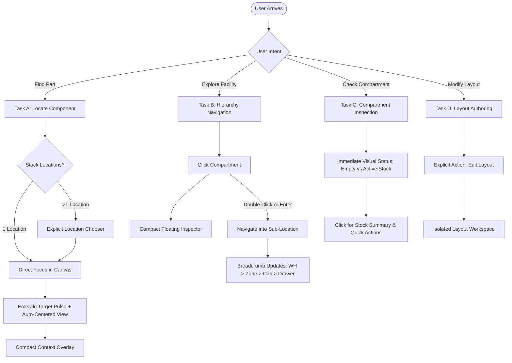

# RFC-0067: Spatial Inventory UX Reset — Visual-First 2D/3D Experience

**Status:** Proposed  
**Author:** Ananya Contributors  
**Created:** 2026-10-02  
**Related RFCs:** [RFC-0062](0062-spatial-inventory-architecture.md), [RFC-0063](0063-spatial-inventory-data-model.md), [RFC-0064](0064-spatial-inventory-visualization.md), [RFC-0065](0065-spatial-inventory-ux.md), [RFC-0066](0066-spatial-inventory-implementation.md)

---

# 1. Executive Summary

Ananya Spatial was conceived to deliver a fast, intuitive visual representation of physical storage locations (warehouses, racks, SMD cabinets, shelves, and bins) so that operators can immediately answer the fundamental question:

> **"I know what component I need; show me exactly where it is in physical space."**

Over successive iterations, the spatial user experience has become excessively data-dense, modal, and fragmented:
1. Spatial viewports are buried beneath master data cards, timestamp blocks, and exhaustive inventory projection tables.
2. The spatial viewport is crowded with competing modes ("Standard", "Provenance", "Occupancy"), multi-color status legends, unmapped staging drawers, and inline CAD-like anchor transform gizmos.
3. Clicking a storage compartment forces a jarring layout shift (re-slicing a 12-column grid to 8 columns) and forces a multi-step click sequence just to step into a drawer.
4. Two separate duplicate viewport wrappers exist (`spatial-view.tsx` and `spatial-3d-view.tsx`), and authoring controls violate repository design rules (e.g., native HTML `<select>` tags in `spatial-anchor-editor.tsx`).

This RFC defines a **UX Reset** to restore visual primacy:
- **Canvas-First Layout**: Dedicated, full-bleed spatial canvas with persistent physical breadcrumbs and a unified 2D/3D view toggle.
- **Contextual, Non-Disruptive Inspector**: A compact floating/docked inspector that shows essentials (Location Code, Kind, Parent Context, and Stock Summary) without reflowing or compressing the spatial canvas.
- **Natural Spatial Navigation**: Click to select; double-click (or single click on a clear chevron) to enter child locations in both 2D and 3D.
- **Decoupled Authoring**: Separation of daily operational browsing from spatial anchor and coordinate configuration.
- **Zero Ledger or Model Changes**: Full preservation of underlying database schemas, inventory projections, QR payloads, authorization rules, and LEDGER transaction semantics.

---

# 2. Evidence-Based Audit of Current Implementation

### 2.1 User Journey Trace & Observed Breakdown

#### Step 1: Opening a Location (`/locations/[id]`)
- **Observed Component Evidence**: `apps/web/app/locations/[id]/page.tsx:328-624`
- **Observed Flow**:
  1. Operator visits `/locations/:id` (e.g., via location search or navigating from warehouse root).
  2. The page renders:
     - `PageHeader` (lines 280-318)
     - 3 KPI `StatCard`s: "Stored Components", "Total Units", "Sub-Locations" (lines 328-350)
     - `SectionCard` "Location Information": 8 `DetailField` items including internal IDs, QR payload strings, and record timestamps (lines 353-410)
     - `SectionCard` "Containing Components & Stock": A massive `DetailTable` rendering all components across all recursive descendants (lines 413-564)
     - `SectionCard` "Sub-Locations & Spatial Layout": Finally, at the bottom of the viewport, the spatial section appears (lines 567-650).
  3. Inside the card header, the user sees:
     - `Map Spatial` button (`Sliders` icon)
     - Compartment count badge
     - View switch buttons: `[2D Spatial] [3D Scene] [List]`
  4. Inside `<SpatialView>` (lines 624-636), the user is greeted by:
     - A duplicate breadcrumbs bar (`SpatialBreadcrumbs`, `spatial-view.tsx:493-500`)
     - An operational metric bar (`spatial-view.tsx:503-560`) repeating "Total Stock", "Occupancy", and "Spatial Mapping"
     - A "Direct Stock at Parent" warning banner (`spatial-view.tsx:563-583`)
     - An inner header (`spatial-view.tsx:596-730`) with ANOTHER `[2D Grid] [3D Scene]` toggle, plus `[Standard] [Provenance] [Occupancy]` mode pills, plus `[Labels]`, plus `[Edit Anchors]`!
- **Impact**: The physical representation is relegated to a minor card at the bottom of a heavy administrative page. The user must scroll through hundreds of pixels of tabular data before seeing any spatial canvas.

#### Step 2: Selecting a Cabinet or Compartment
- **Observed Component Evidence**: `spatial-view.tsx:588-828`, `spatial-cell.tsx:54-150`, `spatial-3d-viewport.tsx:1084-1171`
- **Observed Flow**:
  1. In 2D, the canvas is embedded in an asymmetric 12-column grid (`spatial-view.tsx:588-594`).
  2. When no compartment is selected, the grid occupies 12 columns.
  3. When an operator clicks a drawer (`SpatialCell`), `selectedLocationId` is set, dynamically shrinking the canvas from 12 columns down to 8 columns (`lg:col-span-8`) while mounting `SpatialInspector` in 4 columns (`lg:col-span-4`).
  4. This triggers an abrupt layout reflow: all drawer cells resize, re-wrap, and shift horizontally under the user's cursor.
  5. In 3D, clicking a mesh selects the node, but a persistent 6-dot colored legend (`spatial-3d-viewport.tsx:1085-1171`) clutters the bottom-left corner of the viewport with colors for "Direct Stock", "Sub-compartments", "Mixed", "Empty", "Locate Target", etc.
- **Impact**: Excessive visual vibration and cognitive fatigue. The operator cannot maintain visual focus on the selected bin when the entire canvas shifts.

#### Step 3: Entering a Drawer / Child Location
- **Observed Component Evidence**: `spatial-cell.tsx:54-80`, `spatial-inspector.tsx:122-156`, `spatial-3d-viewport.tsx:745-757`
- **Observed Flow**:
  1. In 2D, double-clicking a cell does nothing (`spatial-cell.tsx` binds only `onClick={onClick}`).
  2. To drill down into a drawer, the operator must:
     - Single-click the cell
     - Wait for the inspector panel to mount on the right
     - Find the small `Enter` button (`CornerDownRight` icon, `spatial-inspector.tsx:124-134`) or `Page` button (`ArrowRight`)
     - Click `Enter` to navigate to `/locations/:childId`.
  3. In 3D, double-tap is detected via an internal 350ms timer (`lastTapRef`, `spatial-3d-viewport.tsx:748`), but there is no visual affordance or hint that double-click exists.
  4. Once navigated, the whole page reloads, re-rendering master data cards and tables.
- **Impact**: Inconsistent interaction models between 2D and 3D. Entering a nested compartment takes 2 clicks and lateral eye-travel to a side panel.

#### Step 4: Locating a Component
- **Observed Component Evidence**: `locate-button.tsx:43-79`, `locate-dialog.tsx:29-33`, `locate.spec.ts:9-120`
- **Observed Flow**:
  1. Operator searches for a component (e.g. `GRM188R71H104KA93`) and clicks `[Locate]`.
  2. If stock exists in multiple locations, `LocateDialog` correctly presents a multi-target chooser with human-readable physical paths and stock quantities.
  3. Clicking a target navigates to `/locations/:parentId?view=spatial&focusLocation=:childId&focusComponent=:compId`.
  4. On arrival at `/locations/:parentId`, the target compartment pulses emerald (`ring-2 ring-emerald-500 animate-pulse` in 2D; camera lerp + emissive pulse in 3D).
  5. However, because `/locations/:parentId` places the spatial canvas below the fold, the pulsing target is often completely out of view!
- **Impact**: The system computes the correct physical coordinates and target highlight, but hides it beneath irrelevant ERP metadata.

#### Step 5: Authoring / Editing a Layout
- **Observed Component Evidence**: `spatial-view.tsx:699-727`, `spatial-anchor-editor.tsx:290-450`, `spatial-mapping-dialog.tsx:50-98`, `app/spatial/page.tsx:261-288`
- **Observed Flow**:
  1. When in 3D mode inside `spatial-view.tsx`, an `[Edit Anchors]` button is exposed in the operational bar.
  2. Clicking this button replaces the operational inspector with `SpatialAnchorEditor` and activates Three.js `TransformControls` (gizmos) inside the operational viewport.
  3. The editor presents raw CAD-level fields:
     - HTML `<select>` tag for Anchor Type (violates `DESIGN.md:75`)
     - Raw millimeters: Position X, Position Y, Position Z (`spatial-anchor-editor.tsx:331-375`)
     - Raw degrees: Rotation X, Rotation Y, Rotation Z (`spatial-anchor-editor.tsx:378-426`)
     - Bounding dimensions in mm: Width, Height, Depth (`spatial-anchor-editor.tsx:428-450`)
  4. Simultaneously, a separate `/spatial` page exists with `SpatialTree` and `SpatialMappingWorkspace`, which in turn opens `SpatialMappingDialog` (a 3-tab modal for model assignment and anchor mapping).
  5. Furthermore, `/spatial-models` has yet another dialog `SpatialAnchorsDialog`.
- **Impact**: Operational screens are contaminated with low-level authoring tools. Non-technical users are confronted with 3D coordinate transforms instead of intuitive physical spatial actions.

---

### 2.2 Summary of Identified Anti-Patterns

| Anti-Pattern | File Evidence | Problem Description | Severity |
| :--- | :--- | :--- | :--- |
| **Buried Canvas** | `apps/web/app/locations/[id]/page.tsx:328-567` | Spatial canvas is placed beneath 3 stat cards, 8 metadata fields, and a massive table of component projections. | **Critical** |
| **Duplicate Viewport Implementations** | `components/spatial/spatial-3d-view.tsx` vs `components/spatial/spatial-view.tsx` | `spatial-3d-view.tsx` (781 lines) is a near-identical clone of `spatial-view.tsx` (852 lines). It is unreferenced except for an export. | **High** |
| **Canvas Layout Shift on Click** | `components/spatial/spatial-view.tsx:588-594` | Canvas shifts from 12-column to 8-column layout whenever a compartment is clicked, causing disruptive layout recalculation. | **High** |
| **Mode Creep & Color Overload** | `components/spatial/spatial-view.tsx:643-685`, `spatial-3d-viewport.tsx:1085-1171` | 3 distinct modes ("Standard", "Provenance", "Occupancy") introduce 7 different colors requiring a permanent floating legend. | **Medium** |
| **Double-Click Inconsistency** | `components/spatial/spatial-cell.tsx:54-80` vs `spatial-3d-viewport.tsx:745-757` | 3D supports double-tap to enter; 2D only supports single-click select, requiring a secondary click in the inspector panel to enter. | **Medium** |
| **Authoring Contamination** | `components/spatial/spatial-view.tsx:699-727`, `spatial-anchor-editor.tsx:321-450` | 3D transform gizmos and millimeter coordinate inputs are mixed directly into the daily operational browsing screen. | **High** |
| **Design Rule Violations** | `components/spatial/spatial-anchor-editor.tsx:300-305` | Uses raw native HTML `<select>` instead of official Shadcn `<Select>` / `<Combobox>` (violates `DESIGN.md:75`). | **Medium** |
| **Duplicated Stats & Breadcrumbs** | `spatial-view.tsx:493-560` vs `locations/[id]/page.tsx:328-410` | The location page and the embedded spatial view both render independent breadcrumb paths and total unit counts. | **Medium** |

---

# 3. Core User Tasks & Interaction Flows

The redesigned Spatial Inventory experience centers strictly on four primary operational tasks:



### Task A: Quick Locate ("Where is this component?")
1. **Trigger**: Click `[Locate]` on a component details page, BOM line, global search match, or scanned QR code.
2. **Resolution**:
   - Single location: Instantly navigates to the parent location canvas with `focusLocation` and `focusComponent`.
   - Multi-location: Opens `LocateDialog` (retained from current verified implementation) displaying physical paths, on-hand counts, and `[Locate]` buttons.
3. **Arrival**:
   - The spatial canvas is immediately visible at the top of the viewport.
   - The camera (3D) or viewport (2D) centers directly on the target compartment.
   - Target pulses with a high-contrast emerald indicator (`ring-2 ring-emerald-500` / emissive pulse).
   - A compact floating card appears at the edge of the canvas showing the component SKU, quantity available, and quick actions (`Issue`, `Transfer`).

### Task B: Spatial Navigation ("Browse from Warehouse down to Drawer")
1. **Top-Level Arrival**: The user opens `/locations/:id` or `/spatial`.
2. **2D Operational Matrix**:
   - Clean grid showing child compartments (e.g. Drawers A1–F10).
   - Single-click: Selects compartment, highlights border, opens floating overlay.
   - Double-click (or keyboard `Enter`): Instantly navigates down into that compartment.
3. **3D Digital Twin**:
   - Camera orbits around the physical unit (cabinet, rack, or room).
   - Single-click: Selects 3D mesh, highlights bounding box, opens floating overlay.
   - Double-click (or clicking `Enter` in the overlay): Smooth camera zoom transition into the child compartment.
4. **Ascending Hierarchy**:
   - Persistent breadcrumb at the top of the canvas: `WH-MAIN > ZONE-LAB > CAB-A > D-A4`.
   - Clicking any ancestor in the breadcrumb immediately navigates up.
   - An explicit `[↑ Up One Level]` button sits adjacent to the breadcrumb for rapid keyboard/mouse navigation.

### Task C: Fast Compartment Inspection
1. Selecting any compartment displays a compact, non-modal floating card.
2. The card shows only:
   - Location Code & Display Name (e.g., `D-A4 (Drawer A4)`)
   - Kind chip (e.g., `Drawer`, `Bin`)
   - Total Units on Hand (if authorized with `Inventory.Read`; otherwise `<Lock /> Protected`)
   - Distinct Component Count (e.g., "1 item" or "3 items")
   - Action buttons: `[Enter Compartment]`, `[Details Page]`.
3. Detailed SKU breakdowns, lot/serial provenance, and transaction history remain in the location details page or behind an explicit `[View Inventory Details]` disclosure.

### Task D: Layout Authoring ("Arrange Drawers / Assign 3D Model")
1. Layout editing is completely removed from ordinary browsing.
2. Users with `Inventory.Update` permission access layout editing via an explicit `[Edit Layout]` action in the header.
3. In authoring mode:
   - The operational inspector is hidden.
   - Visual placement handles or drag-and-drop cell reordering are enabled.
   - Low-level millimeter coordinates and anchor types are collapsed in an "Advanced Coordinates" accordion, avoiding CAD jargon for standard grid setups.

---

# 4. Target Interaction Model

### 4.1 2D View: The Clean Operational Map

```text
┌────────────────────────────────────────────────────────────────────────────────────────┐
│  WH-MAIN  >  ZONE-LAB  >  CAB-A                                    [ ⊞ 2D ] [ ⬡ 3D ]   │
├────────────────────────────────────────────────────────────────────────────────────────┤
│                                                                                        │
│   Row A   ┌──────────┐ ┌──────────┐ ┌──────────┐ ┌──────────┐ ┌──────────┐             │
│           │   A01    │ │   A02    │ │   A03    │ │   A04    │ │   A05    │   ┌─────────┐
│           │ 500 pcs  │ │ 1.2k pcs │ │  Empty   │ │ 3.1k pcs │ │ 250 pcs  │   │Inspector│
│           └──────────┘ └──────────┘ └──────────┘ └──────────┘ └──────────┘   │         │
│   Row B   ┌──────────┐ ┌──────────┐ ┌──────────┐ ┌──────────┐ ┌──────────┐   │ D-A04   │
│           │   B01    │ │   B02    │ │   B03    │ │   B04    │ │   B05    │   │ 3.1k pcs│
│           │ 100 pcs  │ │  Empty   │ │ 800 pcs  │ │  Empty   │ │ 4.5k pcs │   │         │
│           └──────────┘ └──────────┘ └──────────┘ └──────────┘ └──────────┘   │ [Enter] │
│                                                                              └─────────┘
│   [ Filter by SKU or Code... ]                                      [ Fullscreen ⛶ ]   │
└────────────────────────────────────────────────────────────────────────────────────────┘
```

1. **Aesthetic & Density**:
   - Follows `DESIGN.md`: calm, modern, minimal, spacious, zero gradients/glassmorphism.
   - Compartment cells use clear geometric borders:
     - Occupied cells: Neutral card background (`bg-card border-border/80`), dark mono code, emerald dot indicator with unit count.
     - Empty cells: Subtle dashed border (`border-dashed border-border/60 bg-muted/10`), muted mono code, `— Empty`.
     - Selected cell: Solid 2px brand outline (`ring-2 ring-primary border-primary`).
     - Locate target: High-visibility emerald pulse (`ring-2 ring-emerald-500 animate-pulse`).
2. **Interaction Rules**:
   - Single-click: Selects compartment, updates floating inspector. **Canvas does not shift or resize.**
   - Double-click: Directly navigates into the child location.
   - Keyboard: Arrow keys navigate between adjacent grid cells; `Enter` navigates down; `Escape` deselects or navigates up.
3. **No Embedded Analytics**:
   - No multi-color occupancy gauges or complex provenance graphs by default.
   - If parent has direct loose stock (not in drawers), display a clean top banner:
     > `Direct Stock at Cabinet: 120 loose units. [View Direct Items]`

### 4.2 3D View: The Physical Digital Twin

1. **Scene Focus**:
   - True physical arrangement rendered with neutral studio lighting and clean PBR materials matching real laboratory/warehouse environments.
   - Canvas background uses theme-neutral background (`bg-muted/10` in light mode, `#0B0F19` in dark mode), avoiding hard-coded slate palettes.
2. **Direct Selection**:
   - Hovering over a mesh highlights its outline and displays a native tool-tip cursor.
   - Clicking a compartment smoothly highlights the mesh bounding box and opens the floating inspector.
   - Double-clicking a compartment triggers a smooth camera zoom (lerp) toward the compartment followed by navigation into the child location.
3. **Predictable Camera & View Controls**:
   - Minimal floating controls in the top-right corner of the canvas:
     - `[Fit View]` (`Maximize2`): Resets camera to encapsulate all child geometry.
     - `[Reset Orientation]` (`RotateCcw`): Returns camera to the canonical 30° downward isometric view.
   - No floating 6-color legends. Color coding in 3D is restrained:
     - Neutral / Active: Natural material tone
     - Empty: Slightly translucent / muted tone
     - Selected: Blue bounding highlight
     - Locate Target: Pulsing emerald highlight

### 4.3 Shared Interaction Contract (2D & 3D)

Both visual modes strictly mirror the same interaction contract:

```typescript
export interface SpatialNavigationState {
  currentLocationId: string;       // Active container (e.g. Cabinet A)
  selectedChildId: string | null;   // Active selected compartment (e.g. Drawer A4)
  focusComponentId?: string;       // Highlighted component from Locate flow
  viewMode: "2d" | "3d";           // Active visualization projection
}
```

1. **State Preservation across 2D/3D Toggle**:
   - Toggling between `[2D]` and `[3D]` maintains `currentLocationId`, `selectedChildId`, and `focusComponentId`.
   - URL query parameter sync:
     - 2D (Default): `/locations/:id` (or `/locations/:id?focusLocation=:childId`)
     - 3D: `/locations/:id?view=3d` (or `/locations/:id?view=3d&focusLocation=:childId`)
2. **Single Truth for Hierarchy Navigation**:
   - Both modes use `buildSpatialBreadcrumbs(currentLocationId, locations)`.
   - Both modes support deep-linking from QR code scans (`ANANYA:V1:LOCATION:...`).
   - If stock is in multiple locations, `LocateDialog` is always triggered first, requiring unambiguous human operator selection before navigating to canvas.

### 4.4 The Floating Contextual Inspector

Rather than partitioning the screen into a 12-column grid and squishing the canvas, the inspector becomes an **overlaid floating panel** (or collapsible side drawer on desktop):

```text
┌──────────────────────────────────────────────┐
│  DRAWER-A04                       [Page ↗] [✕]│
│  Drawer · In Cabinet A                       │
├──────────────────────────────────────────────┤
│  Stock Summary                               │
│  • 3,120 units on hand (1 component)         │
│  • GRM188R71H104KA93 (100nF 0603)            │
├──────────────────────────────────────────────┤
│  [ Enter Compartment ]   [ Issue / Transfer ]│
└──────────────────────────────────────────────┘
```

- **Compact Footprint**: Fixed width (`320px`), anchored to the top-right of the spatial canvas.
- **Collapsible / Dismissible**: Easily dismissed via `[✕]` or `Escape` key, restoring full view of the canvas.
- **Progressive Disclosure**:
  - Primary: Location Code, Name, Kind, Total Units, and Single Component Name.
  - Secondary (`[View Details]`): Opens full component list, lot/serial details, or transfers to the full `/locations/:id` record.
- **Mobile Responsive**: On mobile viewports (`< 768px`), the inspector renders as a bottom sheet (`Sheet side="bottom"`), allowing one-handed thumb interaction.

---

# 5. Redesigned Screen Hierarchy

### 5.1 Primary Operational View (Dedicated Spatial Canvas)

The spatial experience should have maximum practical height and width:

```text
+------------------------------------------------------------------------------------+
|  Top App Header (Global Search, Organization, User Profile)                        |
+------------------------------------------------------------------------------------+
|  [< Back]  WH-MAIN > ZONE-LAB > CAB-A                [ ⊞ 2D ] [ ⬡ 3D ]  [Edit Layout]  |
+------------------------------------------------------------------------------------+
|                                                                                    |
|                                                                    +-------------+ |
|                                                                    | Floating    | |
|                           SPATIAL CANVAS                           | Inspector   | |
|                                                                    |             | |
|                 (2D Grid Matrix or 3D WebGL Scene)                 |  DRAWER-A04 | |
|                                                                    |  3,120 pcs  | |
|                     Takes 100% of Available Area                   |             | |
|                                                                    |  [ Enter ]  | |
|                                                                    +-------------+ |
|                                                                                    |
|                                                                                    |
|  [ Search drawer or SKU... ]                                      [ Fit ] [ Reset ]|
+------------------------------------------------------------------------------------+
|  Location Record Tabs: [ Overview & Metadata ]  [ Full Stock Ledger ]  [ QR Code ] |
+------------------------------------------------------------------------------------+
```

### 5.2 Layout Separation: Master Record vs. Spatial Canvas
In the current `/locations/[id]/page.tsx`, the spatial canvas is at the bottom of the page. In the revised layout:
1. When `/locations/:id` has child compartments:
   - **The Spatial Canvas is the Hero Element**: Mounted immediately below the breadcrumb header.
   - Master data details (Location ID, Kind, QR payload, Timestamps) and the exhaustive projections table are placed below the canvas in clean, secondary tabs or collapsible sections (`[Overview]`, `[Stock Projections]`, `[Audit Timestamps]`).
2. When `/locations/:id` has NO child compartments (e.g. a terminal bin or empty shelf):
   - The page displays the standard master data card and component stock table, with a clear prompt:
     > `No nested compartments configured. [Create Sub-Compartments or Assign Template]`

### 5.3 Dedicated Layout Authoring Workflow

Layout editing is completely isolated from browsing:

```text
+------------------------------------------------------------------------------------+
|  [ Exit Authoring ]  Editing Layout: Cabinet A (CAB-A)             [ Discard ] [ Save ] |
+------------------------------------------------------------------------------------+
|                                                  | Authoring Inspector             |
|                                                  |---------------------------------|
|                  3D / 2D CANVAS                  | 1. Model Template: SMD Cabinet  |
|                                                  | 2. Compartments: 60 configured  |
|            (Shows Drag/Transform Handles)        |                                 |
|                                                  | v Advanced Coordinates          |
|                                                  |   Position X: 120 mm            |
|                                                  |   Position Y: 450 mm            |
|                                                  |   Position Z: 0 mm              |
+------------------------------------------------------------------------------------+
```

- Activated only via explicit `[Edit Layout]` button (restricted to `Inventory.Update` role).
- Clear, prominent `[Save Changes]` and `[Discard]` actions in the top toolbar with unsaved-change navigation guards.
- Eliminates native HTML `<select>` elements, replacing them with standard Shadcn `<Select>` primitives conforming to `DESIGN.md`.

---

# 6. Feature Matrix: Retain, Simplify, Defer, or Remove

| Feature / Component | Current Location | Verdict | Rationale & Target State |
| :--- | :--- | :--- | :--- |
| **`spatial-3d-view.tsx`** | `components/spatial/` | **Remove** | Complete duplicate of `spatial-view.tsx`. Consolidated into a single `SpatialView` supporting both 2D and 3D. |
| **`SpatialBreadcrumbs`** | `components/spatial/` | **Retain & Elevate** | Proven, robust navigation engine (`spatial-hierarchy.ts`). Becomes the primary header of the spatial view. |
| **`LocateDialog` & Multi-Target Chooser** | `components/spatial/` | **Retain** | Essential for resolving components stored in multiple locations (`locate.spec.ts`). Preserved exactly. |
| **`SpatialGrid` & `SpatialCell`** | `components/spatial/` | **Simplify** | Retain 2D matrix rendering, but add double-click to navigate, remove noisy sub-labels, and use clean emerald dot indicators. |
| **`DynamicSpatial3DViewport`** | `components/spatial/` | **Retain & Polish** | Retain Three.js/R3F WebGL engine. Remove floating 6-color legends, remove hardcoded dark-slate overlays, adopt clean canvas styling. |
| **Three Mode Pills (Standard/Provenance/Occupancy)** | `spatial-view.tsx:643-685` | **Remove from Primary View** | Over-engineered cognitive load. Standard view with subtle occupancy indicator is sufficient for 99% of warehouse operations. |
| **Permanent 3D Color Legend** | `spatial-3d-viewport.tsx:1085-1171` | **Remove** | Visual noise. Semantic states (selected, target, empty) are communicated through self-evident bounding boxes, rings, and tooltips. |
| **Unmapped Drawer Staging Tray** | `spatial-3d-viewport.tsx:1173-1268` | **Simplify** | Replace floating overlay with a clean bottom pill: `3 compartments unmapped in 3D. [View in 2D Grid]`. |
| **Inline 3D Transform Gizmos in Browse Mode** | `spatial-view.tsx:774-816` | **Defer to Edit Layout** | Completely remove CAD gizmos (`TransformControls`) from normal browsing. Available only in dedicated authoring workflow. |
| **Native `<select>` in Anchor Editor** | `spatial-anchor-editor.tsx:300-305` | **Fix** | Replace with official Shadcn `<Select>` component per `DESIGN.md:75`. |
| **Full Projections Table in Locations Page** | `locations/[id]/page.tsx:413-564` | **Defer / Secondary Tab** | Move exhaustive multi-page component list below the spatial canvas into a tabbed section. |

---

# 7. Acceptance Criteria & Quality Attributes

### 7.1 Visual Hierarchy & Clarity
1. **Immediate Canvas Visibility**: On `/locations/:id` (when child compartments exist), the 2D or 3D canvas is visible within the initial viewport (above the fold) without requiring vertical scrolling.
2. **Zero Layout Shift on Selection**: Clicking any compartment in 2D or 3D must NOT alter the dimensions, margins, or grid column span of the spatial canvas.
3. **No Decorative Clutter**: The canvas contains zero permanent multi-color dot legends or competing mode switchers.
4. **Theme Consistency**: The 3D viewport and surrounding overlays dynamically match the active light or dark ERP theme conforming to `DESIGN.md`.

### 7.2 Navigation & Operational Speed
1. **Two-Click Drill-Down**: An operator can drill down into a nested drawer via a direct double-click on the cell/mesh or via a single click on a prominent `[Enter]` button in the floating inspector.
2. **Persistent Physical Breadcrumbs**: Every view presents the full hierarchical path (`WH > Zone > Cab > Drawer`). Clicking any crumb instantly ascends to that parent level.
3. **View Mode Memory**: Switching between 2D and 3D preserves the current location, selection, and locate focus.
4. **Sub-100ms Selection Latency**: Clicking a compartment updates the floating inspector in under 100ms with zero network requests (using preloaded operational view DTO).

### 7.3 Locate Accuracy & Integrity
1. **Deterministic Target Focus**: When navigating from a Locate action, the target compartment is highlighted with an emerald pulse and automatically centered in the viewport.
2. **Unbroken Test Coverage**: All 13 existing spatial test suites (141 tests in `apps/web/lib/spatial/*.spec.ts`) continue to pass without regression.
3. **Zero Ledger Mutations**: All inventory queries continue to read from authoritative `inventory_projections` and `spatial_nodes`. No inventory mutation logic is introduced into UI components.

---

# 8. Incremental Implementation Plan

### Phase 1: Screen Hierarchy & Page Restructuring
- Restructure `apps/web/app/locations/[id]/page.tsx`:
  - Elevate `<SpatialView>` above the administrative metadata cards when sub-locations exist.
  - Move "Containing Components & Stock" table into a clean tabbed section below the canvas.
  - Harmonize view toggles: eliminate the redundant outer `[2D Spatial] [3D Scene]` toggle in favor of the inner unified toggle.

### Phase 2: Consolidated Canvas & Floating Inspector
- Update `apps/web/components/spatial/spatial-view.tsx`:
  - Give the spatial canvas 100% width.
  - Convert `SpatialInspector` into a floating, non-disruptive overlay card anchored to the top-right of the viewport.
  - Implement double-click navigation in `spatial-cell.tsx` and keyboard `Enter` support.
  - Remove the "Standard / Provenance / Occupancy" mode pills and the duplicate operational stats bar.

### Phase 3: 3D Viewport Simplification
- Update `apps/web/components/spatial/spatial-3d-viewport.tsx`:
  - Remove the floating 6-dot color legend (`lines 1085-1171`).
  - Replace the floating "Unmapped Staging Tray Drawer" with a simple status chip.
  - Connect double-click lerp-and-navigate affordance.
  - Align viewport background and overlay controls with `DESIGN.md` light/dark tokens.

### Phase 4: Authoring Decoupling & Component Cleanup
- Remove unused duplicate `apps/web/components/spatial/spatial-3d-view.tsx` (re-export dynamic viewport from `spatial-view.tsx` or `spatial-3d-viewport.tsx`).
- Extract anchor authoring out of the live browsing screen into an explicit modal or dedicated authoring route.
- Fix native HTML `<select>` tags in `spatial-anchor-editor.tsx:305` by replacing with Shadcn `<Select>`.
- Run full type-checking, linting, and vitest suites across `@ananya/web`.
